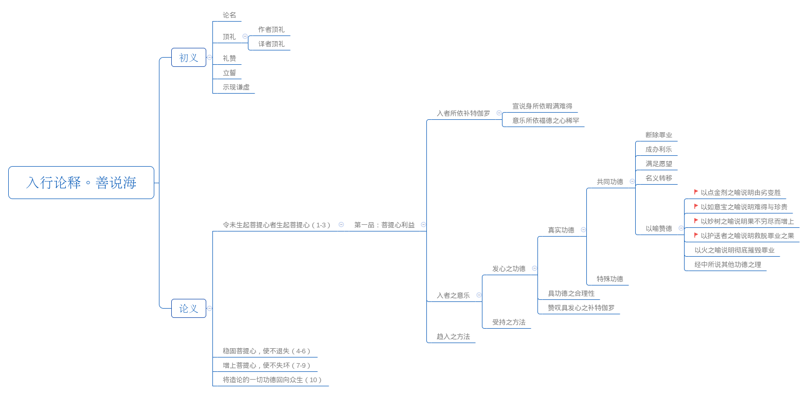

# 第九讲



以喻赞德部分以六个比喻来赞颂菩提心的功德：

1. 以点金剂的比喻，说明依靠菩提心的功德，我们恶劣的身体可变成如佛陀般殊胜的身体。
2. 以如意宝的比喻来宣说菩提心非常珍贵。
3. 以如意树的比喻宣讲依靠菩提心能使自己的善根越来越增上，无穷无尽。
4. 如同依靠护送者能脱离危险一样，依靠菩提心能压服一切罪业。
5. 以末劫火的比喻来说明菩提心是断除一切罪恶的根本。
6. 其他经典中所宣菩提心的道理。

以喻赞德部分，和之前所讲的四方面的内容：“依靠菩提心能断除罪业、成办自他一切利乐、满足众生的一切愿望，以及获得菩提心时能够名义转换”，以及后续要讲的特殊功德合在一起宣讲了发菩提心的功德，使初学者生起修学菩提心和利益众生的意乐。

<!-- TOC -->

- [第九讲](#第九讲)
    - [1. 以点金剂之喻说明由劣变胜](#1-以点金剂之喻说明由劣变胜)
        - [1.1 颂词内容](#11-颂词内容)
        - [1.2 要点分析](#12-要点分析)
            - [1.2.1 为什么说身体是不净的](#121-为什么说身体是不净的)
            - [1.2.2 菩提心如何将不净身转变为清净佛陀身](#122-菩提心如何将不净身转变为清净佛陀身)
            - [1.2.3 菩提心利益的范围](#123-菩提心利益的范围)
            - [1.2.4 点金剂这样的比喻真实无虚](#124-点金剂这样的比喻真实无虚)
    - [2. 以如意宝之喻说明难得与珍贵](#2-以如意宝之喻说明难得与珍贵)
        - [2.1 颂词内容](#21-颂词内容)
        - [2.2 要点分析](#22-要点分析)
            - [2.2.1 菩提心之珍贵](#221-菩提心之珍贵)
    - [3. 以妙树之喻说明果不穷尽而增上](#3-以妙树之喻说明果不穷尽而增上)
        - [3.1 颂词内容](#31-颂词内容)
        - [3.2 要点分析](#32-要点分析)
            - [3.2.1 随福德分善根、随解脱分善根的善根为什么会穷尽](#321-随福德分善根随解脱分善根的善根为什么会穷尽)
            - [3.2.2 菩提心的善根为什么无穷](#322-菩提心的善根为什么无穷)
    - [4. 以护送者之喻说明救脱罪业之果](#4-以护送者之喻说明救脱罪业之果)
        - [4.1 颂词内容](#41-颂词内容)
        - [4.2 要点分析](#42-要点分析)
    - [问答](#问答)

<!-- /TOC -->

## 1. 以点金剂之喻说明由劣变胜

### 1.1 颂词内容
```
犹如最胜冶金料，垢身得此将转成，
无价之宝佛陀身，故应坚持菩提心。
```

相续中生起菩提心，犹如获得殊胜的点金剂，将依不净种子而产生的身体，马上就能转成无垢的清净佛身，所以我们一定要坚持不懈、稳固受持具有这种能力的菩提心。

### 1.2 要点分析

#### 1.2.1 为什么说身体是不净的

我们的身体是由三十六种不净物组成，无论是血肉、骨头、皮肤，还是鼻涕、眼泪，里里外外都是不净的东西，不管是漂亮的人还是丑陋的人，身体的本质同样都是不净的。

#### 1.2.2 菩提心如何将不净身转变为清净佛陀身

依靠菩提心的功德，就像以点金剂能使铁物变成黄金一样，我们这种不净的身体，也能变成非常清净的佛身。

> 善说海：就像是依靠最上等的冶金原料（普通金属也能变成金子）一样，不清净的这个身体依靠得受菩提心可以转变成无价之宝的佛陀身。

因为如果真正生起了无伪的菩提心，则说明已经步入了小资粮道，按照无垢光尊者《大圆满心性休息》中的观点，从小资粮道开始，就算真正入了大乘道。

虽然我们现在的智慧还不能超越声闻缘觉，但是从生起菩提心的那一刻起，我们的种性从小资道开始已经胜过了小乘行人及一般的凡夫。这样，这个身体与具足相好的佛身没什么差别，也就变成了非常珍贵、非常难得的一种身体。

因此从这个角度看，如果自己的相续中没有真正的利他心，即便表面上不管别人怎样赞叹，自己认为如何如何了不起，实际上这没什么了不起的，如果真正生起了菩提心，不管外表上的行为怎样，即使穿得再破烂、长相再丑陋，也是人、非人、天人等所有众生供养、恭敬、承事的对境，因为真正的大乘行人，心相续中必须要有利他的菩提心，而且菩提心永不退失，这种人即使表面上是屠夫、妓女或乞丐，属于世间最低劣、最下贱的种姓，也能依靠他们的行业能够度化无边无量的众生。

善说海：我们一定要坚持不懈、稳固受持具有这种能力的菩提心。

#### 1.2.3 菩提心利益的范围

对比世间的利他心，菩提心的利益范围相当广。

- 世间人的利他心范围相对比较狭窄，他们只能对一部分人，如亲朋好友、儿女父母等有慈爱之心，这种心就连动物也有，故不算是真正的菩提心。

    > 引用美国曾有位著名的心理学教授做过一个试验、曲恰堪布在讲《现观庄严论》“道智”的时候批评了洛若寺的金旺堪布、以及歌手丛飞这三个案例，告诫我们后学者这种狭隘的利他心不是真正的菩提心。

修菩提心时，首先要从母亲开始，然后是自己关系最好的人，慢慢将这种范围逐渐扩大，因为凡夫人执著的“我所”范围非常狭窄，在修菩提心的时候，必须先从小范围修起，才能逐渐将普天下的众生都视为父母，只有这样，菩提心利益的范围才能慢慢扩大。

因此上师希望我们能共同发愿，将真正的菩提心融入自心，懂得菩提心的意义后，在实际行动中运用起来。因为一旦发起了真实的菩提心，我们不清净的身体就会变得跟佛身没有差别，所以，作为大乘佛法的修行者，我们应当坚定不移、认真稳妥、时时刻刻地修学菩提心。

#### 1.2.4 点金剂这样的比喻真实无虚

善说海：“《华严经》：‘以一两水银类之金能使千两铁变成金为喻，如是发心水银界善根以普皆回向遍知之智所摄持，即能灭尽一切业惑障之铁物，诸法亦成遍知之妙色，然而一切业惑之铁不能灭尽为一切智智而发菩提心之金。’“，一两水银类之金”就是点金剂。犹如点金剂般的菩提心，是以利益众生的遍知智慧所摄持的，依靠它，能灭尽一切业和烦恼的不清净铁物，反过来说，就像铁物不可能灭除点金剂一样，我们相续中的业和烦恼，如贪心、嗔心、嫉妒、傲慢等，根本不可能摧毁这种菩提心。

作为业力深重的凡夫人也可以发菩提心，但前提是心胸必须要宽广，否则我们对自己都没有有信心，觉得帮不了任何人，每天都是心烦意乱的，这样很难生起菩提心，生起了菩提心，真正发愿要度化众生，而且也没有“我再也不度化众生了”的想法，那你的相续中就有了菩提心。

菩提心并不是要时时刻刻挂在心上、念在嘴里，因为任何一个戒体，在没有遇到违品毁坏之前，一直都会在相续中存在。

## 2. 以如意宝之喻说明难得与珍贵

### 2.1 颂词内容

```
众生导师以慧观，彻见彼心极珍贵，
诸欲出离三界者，宜善坚持菩提心。
```

众生导师以无碍的智慧进行观察，彻见菩提心就像如意宝一样珍贵，凡是想超出三界轮回的人，一定要想尽办法坚定行持菩提心。

众生导师指以释迦牟尼佛为主的一切佛陀。

颂词中虽没有“如意宝”这几个字，但以“极珍贵”来体现的，印度、藏地各大讲义中对此颂都是以如意宝为喻进行宣说的。

### 2.2 要点分析

#### 2.2.1 菩提心之珍贵

上师从三个方面宣说菩提心之珍贵：

- 以商主为喻宣说

    善说海：”能将一切众生带到解脱城享受功德宝珠的唯一商主就是无与伦比的佛陀，佛智周遍所知万法，除此之外其他众生无法衡量。“

    在古印度，商主经常带领商人到海中取宝，商主会通过智慧鉴别真宝、假宝，以挑取真正的如意宝。得到了如意宝以后，它能遣除众生的疾病、灾难、困难、阻碍，赐予名声、财富、地位等一切世间的悉地（利益）。这种如意宝，唯有具智慧的商主才能得到。
    
    同样，三界导师佛陀经过漫长的发菩提心、积累资粮获得了彻见万法真相的智慧，依靠这种广大无比、不可思议的智慧进行观察，最终发现想要直接或间接消除众生的各种痛苦，必须依靠如意宝般的妙药，而这个妙药，就是佛陀于不同根基众生前宣说的八万四千法门为主的显密教法，在这所有的教法当中，犹如醍醐般的精华就是菩提心。

    因此，菩提心是非常珍贵的，在所有的佛法中，利他的菩提心最珍贵、最难得，任何能让我们发起菩提心的人或法本都值得最尊重。

- 以宁玛巴的寺院重视宣讲《入菩萨行论》宣说菩提心之珍贵

   按照华智仁波切的传统，宁玛巴的寺院每年都要讲一遍《入菩萨行论》。为什么唯对《入菩萨行论》如此重视，因为菩提心珍贵，学习《入菩萨行论》确实是世间生活及修行生涯中最有价值的一件事。

- 以唯有菩提心能解脱轮回痛苦宣说菩提心之珍贵

    上师引用《法华经》：“三界无安，犹如火宅。”整个三界没有任何快乐，变苦、行苦、苦苦等每天都在折磨逼迫着我们，暂且不说佛教中形容的痛苦，世间上的战争、灾难、恐怖分子袭击、瘟疫、传染病等痛苦也非常难忍。对一个大乘修行人而言，如果愿意离开这个火坑般的轮回，最好的办法就是修持菩提心，否则，离开了菩提心而想以其他的方法解脱轮回，这是相当困难的。

    善说海：”佛陀以无量的智慧认真全面观察诸法时，彻底照见此菩提心最为难得，功德巨大，弥足珍贵。《华严经》：’诸宝之中如意宝堪为宝王，同理三世中遍知智慧照见法界对境，诸人天与诸声闻缘觉之有漏无漏善根皆不及发菩提心如意宝王之价。‘”

    所以，菩提心是佛所宣说的功德相当大的一个修行方法。
    
    善说海：”因此，想要远离痛苦的所有众生，理当坚定不移善加受持菩提心。“    

## 3. 以妙树之喻说明果不穷尽而增上

### 3.1 颂词内容

```
其余善行如芭蕉，果实生已终枯槁，
菩提心树恒生果，非仅不尽反增茂。
```

世间上的随福德分善根、小乘的随解脱分善根就像芭蕉树一样，生完一次果后就会枯干，没有再生果的机会，但大乘菩提心的善根就像天界或劫初时的如意树一样，果实会一直不断地产生，用之不尽，且越享用越增长。

### 3.2 要点分析

#### 3.2.1 随福德分善根、随解脱分善根的善根为什么会穷尽

#### 3.2.2 菩提心的善根为什么无穷

〖没有被菩提心摄持的其他所有善根如同芭蕉树一般生果以后自然穷尽，而菩提心的妙树恒常都会生长果实，非但不会穷尽，反而会蒸蒸日上。〗

## 4. 以护送者之喻说明救脱罪业之果

### 4.1 颂词内容

```
如人虽犯极重罪，然依勇士得除畏，
若有速令解脱者，畏罪之人何不依。
```

如同有人虽然犯了特别严重的罪，但依靠勇者的保护，可以遣除相续中的畏惧，同样，菩提心能令人在很快的时间中获得解脱，有罪业的人又为何不去依止呢？

### 4.2 要点分析

***

## 问答

1. 为什么有了菩提心的摄持，我们平时积累的念佛、放生等善根就永不会穷尽？请结合比喻说明。

2. 作为一名佛教徒，你对佛教的慈悲观有什么样的认识？谈谈自己的感想。