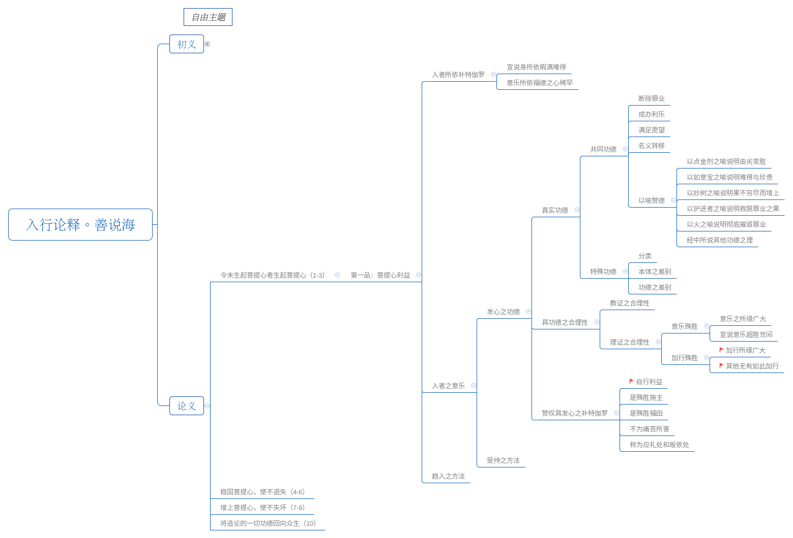

# 第十三讲



## 1. 加行所缘广大

### 1.1 颂词1

```
珍贵菩提心，众生安乐因，
除苦妙甘霖，其福何能量？
```

菩提心殊胜珍贵、就像如意宝般，是人天一切众生获得无上的胜妙安乐的根本因，是遣除所有痛苦的胜妙甘露，这样的无量功德，即便佛陀的智慧也难以衡量。

### 1.2 要点分析

#### 1.2.1 为什么说除苦妙甘霖

>《窍诀书》：寒冷的时候出现一缕温暖的阳光，酷热的时候出现一丝凉爽的微风，这些全部是佛菩萨的加持。

>《佛子行》：一切的快乐全部是利他而产生，所有的痛苦全部是自我执著而产生。

#### 1.2.2 即便佛陀的智慧也难以衡量所表达的意义

菩提心的福德也是无量无边的，即便佛陀的智慧也难以衡量。当然，佛陀具有无边的智慧，如果连佛智都不能衡量，那是否佛陀不是遍知呢？不是这个意思,这一点，大慈大悲的佛陀以尽所有智、如所有智完全照见了菩提心的功德没有边界，并在佛经中宣说。

善说海：堪为一切众生安乐之因、遣除有情痛苦重疾之妙药的珍宝菩提心，她的福德怎么能衡量得出来呢？《吉祥施请问经》中云：“菩提心福德，倘若有形色，遍满虚空界，亦将超胜彼。”大乘菩提心的福德、功德，如果有形相，整个虚空也无法容纳。

#### 1.2.3 刹那菩提心的功德也无量

龙猛菩萨在《菩提心释》：“若人一刹那，修持菩提心，所生诸福德，佛亦难衡量。”意思是说，如果一个人在一刹那间如理如实地修持菩提心，它所带来的功德，就连遍知佛陀也很难以衡量，而这样的功德，我们凡夫俗子——被业力烦恼所捆缚的众生，也是可以获得的。

上师：修行一定要有一种方便方法，否则，仅凭自己的愚痴见解固执己见地修，也不一定有特别大的力量。我们若能依靠大乘的这种方便方法（以菩提心摄持），不一定需要苦行，也不一定需要特别漫长的时间，在做任何事情的过程中，都可以积累许许多多的功德。想在短暂人生中将释迦牟尼佛有八万四千法门全部修完，是不现实的。所以，最好的办法是多多少少安排出自己的一些时间，好好地修持菩提心。

龙猛菩萨被称为“第二大佛陀”，所以也是可信的。

### 1.3 颂词2

```
仅思利众生，福胜供诸佛，
何况勤精进，利乐诸有情。
```

从愿菩提心的角度讲，仅仅是发愿利益众生的功德，超出任何一种供养诸佛的功德，从行菩提心的角度讲，在实际行动中真正去布施、持戒、安忍等，跟众生打交道，按大乘佛法的教言进行修持，这个功德更大。

### 1.4 要点分析

#### 1.4.1 菩提心的功德

三处教证：

- 《三摩地王经》中云：“俱胝那由他刹土，所有无量诸供品，恒时以此供圣士，不及慈心之一分。”，在无数的刹土中，以无量的供品，于恒常无边的时间中在诸佛菩萨和高僧大德面前供养，这个功德与修慈心（让众生获得快乐）供养的功德相比，不及后者的一分。
- 佛陀在《大宝积经》中讲了不可思议的三种功德，其中第一个就是修持菩提心的功德。
- 《勇施请问经》里面也有：“于恒河沙数诸佛圣者面前，以无量无边的供品合掌而供养，与瞬间修菩提心的功德比较起来，修菩提心的功德更大。”

修菩提心不是几天的事情，希望我们时时刻刻修持，做任何一件事情前都发菩提心，这不仅是佛教的精神，也是普世的价值观，因为强调利他精神的国家、民族才是有希望的。

对于很多人菩提心不稳的情况，我们一方面要时时刻刻提醒自己，另一方面要听受很多上师的教言，这样一来，菩提心才会稳固起来。

## 2. 其他无有如此加行

### 2.1 颂词1

```
众生欲除苦，反行痛苦因，
愚人虽求乐，毁乐如灭仇。
```

一切众生都希望摆脱一切痛苦，消除疾病、瘟疫、战乱、灾难等，但所做所谓仍然是在造这些痛苦的因，是因为在在因果取舍方面非常愚痴，才会这样像消灭敌人一样，将快乐的因和快乐的果全部摧毁。

> 有些人想发财就去抢劫、偷盗，结果不但得不到财物，自己反而被关进监狱，即生痛苦、来世也痛苦；有些人想遣除自己的贫困，就通过一些非法的行为来谋取，但后来也不能如愿以偿；有些人为了暂时的口腹之欲，吃一顿饭就杀害无量的众生，结果身体产生一些病变，得绝症而亡，或纵然即生中没有现前果报，来世却要以自己的生命偿还，感受种种痛苦。

这些只是表面上的快乐，只会使自己陷入一个永远不能自拔的泥坑之中，感受无量的痛苦。颂词一针见血地指出了现在人类在因果取舍方面极其愚痴，在没有开显取舍因果的智慧之前，人类会一直处于这样的痛苦中，无法解脱。

### 2.2 颂词2

```
于诸乏乐者，多苦诸众生，
足以众安乐，断彼一切苦，
更复尽其痴，宁有等此善！
安得似此友！岂有如此福！
```

对于乏少安乐、多具痛苦的这些众生，怀着大慈心用一切快乐来满足他们，以大悲心解除他们的所有痛苦，以大智慧遣除他们对苦乐之因一无所知的愚痴，哪有能与此相提并论的善业？哪有能这般利济帮助的亲友？哪有能依之生起如此福德的事呢？

### 2.2.1 要点分析

#### 2.2.1.1 菩提心是最好的善业

菩提心能使无量的众生得到安乐，这一点是从三个方面来阐述的：菩提心具有大慈心、大悲心、大智慧。

- 所谓“大慈心”，通过布施、持戒等满足无量众生，让他们获得暂时和究竟的快乐。
- 所谓的“大悲心”，就是愿众生离开痛苦的一种心态。
- 所谓“大智慧”，我们应以大智慧帮助众生遣除他们相续中无明黑暗的愚痴。

既能让众生得到快乐，又能让众生断除一切痛苦，还能将其相续中的愚痴全部瓦解，这样的心态，无疑是最好的善业。

#### 2.2.1.2 菩提心是最好的亲友

亲友的作用是在你困难的时候，帮助你解决困难，快乐的时候，增上你的快乐。但在世间这一切都是有条件的，而菩提心却恰恰相反，只要法融入心，所具有的福德就具有一切快乐的因，能遣除一切痛苦，功德能不断增上。

## 3. 自行利益

### 3.1 颂词内容

```
若人酬恩施，尚且应称赞，
何况未受托，菩萨自乐为。
```

世间都崇尚知恩图报，不忘恩负义，菩萨的利益众生，没有受到任何人的嘱托劝请，这种行为更加值得赞叹。

### 3.2 要点分析

#### 3.2.1 菩萨自乐为

菩萨因为大乘的善根习气成熟，看见无量无边的众生在轮回中受如是的痛苦，自然对他们生起极大的悲心，因而利益无边众生。

> 就像释迦牟尼佛在因地时，提婆达多经常要破坏他的一些善行，当时世尊不但不生气，反而会尽量地帮助他、饶益他，这类公案在《广传》中特别多。

所以，我们学习大乘佛法的时候，不管出家人还是在家人，首先要处理好最基本的人际关系，杜绝自私自利心，通过前辈高僧大德们的事迹，了解他们通过什么样的利他菩提心帮助无量众生而获得成就，最后度化天下众生。

## 问答

1. 解释颂词：“众生欲除苦，反行痛苦因，愚人虽求乐，毁乐如灭仇。”

2. 有人想：“佛陀具有彻知万法的智慧，若不能衡量菩提心的福德，那就不是一切智智了。”对此你是怎么认为的？

3. 为什么说即便是乞丐妓女，只要相续中具有菩提心，也值得我们恭敬顶礼？

4. 短暂的人生中，我们依靠什么样的方便方法，可以迅速积累资粮？倘若不依这一方便，其他方法能否让我们获得究竟的解脱？为什么？

5. 有些高僧大德来到自己所在的城市弘法、放生时，作为一名居士，你当如何对待才合理？

6. 众生所想与所行是怎样背道而驰的？请举例说明。

7. 有些人贪污腐败、杀生吃肉等造了很多恶业，但他的生活仍然逍遥自在、非常快乐，这样的话，是否说明因果不存在？请具体分析。

    现在造的恶业并不是马上就成熟果报，但总有一天，也许是今生、也许是来世，必定会有果报显现。

8. 为什么说菩提心是最大的善业、最好的亲人？

    亲友有什么作用呢，会在你困难的时候，帮助你解决困难；快乐的时候，增上你的快乐，但在世间这一切都是有条件的，而菩提心却恰恰相反，所具有的福德具有一切快乐的因，能遣除一切痛苦。

9. 如果没有菩提心，直接修大圆满、大手印，能不能获得成就？为什么？

    显宗还是密宗，都需要菩提心的摄持，否则不过是形象上的善业，因为，高僧大德们所抉择的大法，都需要在对基本法理通达的基础上修持才可以产生它的功德，假如连最基本的出离心、菩提心都没有，不会平白无故获得成就。

10. 当代的战争、灾难、洪水、沙尘暴，究其根源，到底是什么造成的？

11. 请与世间人的知恩报恩对比，说明菩萨更应值得赞叹。