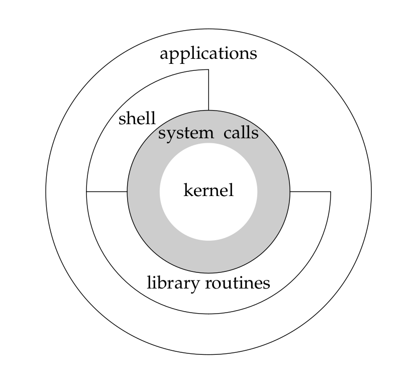
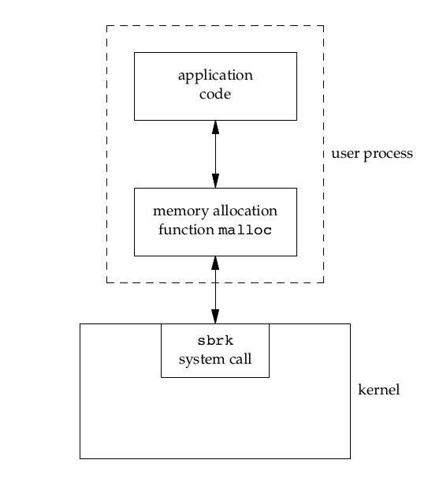
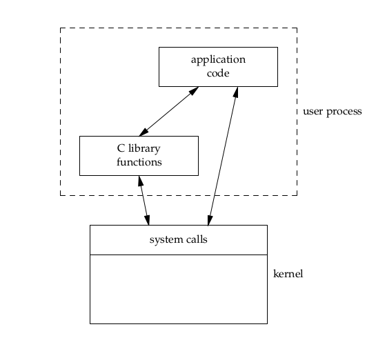

[TOC]
# 第一章 UNIX 基础

## UNIX架构：内核与系统调用

- 内核(kernel): 严格意义上, 将操作系统定义为一种软件, 它控制计算机硬件资源, 提供程序运行环境(相对较小, 位于环境的中心)
- 系统调用(system call): 内核的接口
- 关系: 公用函数库(library routines)构建在系统调用接口之上, 应用软件(applications,shell)既可以使用公用函数库, 也可以使用系统调用

## 登陆

### 登录名
口令文件/etc/passwd
```
登录名:加密口令:数值用户 ID: 数值组 ID: 注释字段:起始目录:shell
```
> 备注：加密口令已经转移到另一个文件

### shell
一个命令行解释器, 它读取用户输入, 然后执行命令
>备注：Linux 默认shell是Bourne-again shell(bash)

## 文件和目录

### 文件系统
目录和文件组成的一种层次接口, 目录的起点称为根(root), 其名字是\\

### 目录(directory)
是一个包含许多目录项的文件，每个目录项都包含一个文件名，以及该文件的属性信息(文件类型，大小，所有者，文件权限，最后修改时间)

stat和fstat函数用于返回包含所有文件信息的结构体

### 文件名
不能出现斜线/和空操作符null

> 备注：创建目录时, 会自动创建两个文件名, 当前目录"." 以及父目录".."

### 路径名
一个或多个以斜线分割的文件名序列.以斜线开头的是绝对路径(absolute pathname), 否则是相对路径(relative pathname)

[ls1.c](../examples/intro/ls1.c)
```cpp
#include "apue.h"
#include <dirent.h>

/*可编译执行*/
/*apue.h, 包含某些标准头文件, 声明了很多常量及库函数*/

int
main(int argc, char *argv[])
{
    DIR *dp;
    struct dirent *dirp;

    /*需要至少一个参数*/
    if (argc != 2)
        /*apue.h自定义函数*/
        err_quit("usage: ls directory_name");

    /*赋值后判断, opendir返回指向 DIR 结构体的指针，argv[0]是程序本身*/
    if ((dp = opendir(argv[1])) == NULL)
        /*apue.h自定义函数err_sys */
        err_sys("can't open %s", argv[1]);

    /*循环中读取dirent并判断其是否为空，空则跳出循环，非空则取出dirent的d_name元素*/
    while ((dirp = readdir(dp)) != NULL)
        /*取出每个目录的名字*/
        printf("%s\n", dirp->d_name);

    /*关闭目录*/
    closedir(dp);

    /*终止程序, 0正常结束, 1-255出错*/
    exit(0);
}
```

### 工作目录
每个进程都有一个，默认是当前目录，进程可以通过chdir函数更改工作目录

### 起始目录
登陆时，工作目录被设置为起始目录(home),每个帐户的起始目录在/etc/passwd中配置

## 输入和输出

### 文件描述符
一个小的非负整数, 内核使用它标识一个特定进程正在访问的文件. 当内核打开或创建一个新文件时, 返回一个文件描述符, 在读写的时候使用

### stdin，stdout，stderr
每当运行一个新程序时, 所有的shell都为其打开三个文件描述符，即stdin，stdout，stderr

### 不用缓冲的I/O函数
- open
- read
- write
- lseek
- close
>备注：open在 fcntl.h中声明，read、write、lseek、close在 unistd.h中声明

[mycat.c](../examples/intro/mycat.c)
```cpp
#include "apue.h"

/*缓冲区大小, 常量*/
#define	BUFFSIZE	4096

int
main(void)
{
	int		n;
	char	buf[BUFFSIZE];

	/*STDIN_FILENO/STDOUT_FILENO (标准输入文件描述符0/标准输出文件描述符1)在 unistd.h中声明 */

	/*从标准输入读, read返回读得的字节数, 读到末端返回0, 发生错误返回-1*/
	while ((n = read(STDIN_FILENO, buf, BUFFSIZE)) > 0)
		/*写到标准输入*/
		if (write(STDOUT_FILENO, buf, n) != n)
			err_sys("write error");

	/*发生错误*/
	if (n < 0)
		err_sys("read error");

	exit(0);
}
```

### 标准I/O
封装了不用缓冲 I/O 函数的带缓冲, 可以无需担心如何选取最佳的缓冲区大小，简化了对输入行的处理
- fget 读一个完整的行
- read 读指定的字节数
- printf 格式化输出
- getc 读一个字节
- putc 将一个字节写到stdout

[getcputc.c](../examples/intro/getcputc.c)
```cpp
#include "apue.h"

/*stdin/stdout(标准输入文件/标准输出文件*)、EOF在stdio.h中声明*/

int
main(void)
{
	int		c;

	/*从标准输入中读入一个字符*/
	while ((c = getc(stdin)) != EOF)
		/*输出到标准输出*/
		if (putc(c, stdout) == EOF)
			err_sys("output error");

	/*输入错误*/
	if (ferror(stdin))
		err_sys("input error");

	exit(0);
}
```

## 程序和进程

### 程序
可执行文件，使用exec函数可以让内核将程序读入存储器，并执行

### 进程和进程ID
进程：程序的执行实例

进程ID：非负整数，进程的唯一标识符，可使用getpid获取

[hello.c](../examples/hello.c)
```c
#include "apue.h"

int
main(void)
{
	/*getpid得到进程pid*/
	printf("hello world from process ID %ld\n", (long)getpid());
	exit(0);
}
```

### 进程控制
主要通过三个函数控制
- fork 创建子进程
- exec(六种变体) 执行制定的命令
- waitpid 父进程等待子进程执行完成，期间父进程挂起
>备注：
>1. fork+exec组合, 是某些操作系统所称的产生(spawn)一个新的进程
>2. execlp(exec的变体之一所需的参数以null结束，所以当时欧诺个fgets读取一行到buf时，需要将buf中最后一个换行符替换为null)
>3. UNIX中，父进程和子进程逻辑上相互隔离
>4. 如果父进程希望等待子进程结束后再执行剩余部分，就需要waitpid

[shell1.c](./examples/shell1.c)
```cpp
#include "apue.h"
#include <sys/wait.h>

/*fork创建一个新进程, 它被调用一次(由父进程调用), 返回两次(在父进程中返回子进程的进程ID, 在子进程中返回0)*/
int
main(void)
{
	char	buf[MAXLINE];	/*MAXLINE 在 apue.h 中声明，常量*/
	pid_t	pid;
	int		status;

	printf("%% ");	/*打印提示符 (打印 % 需要 %% )*/

	/*fgets读入一行(默认以换行符结束), 每一行命令会产生一个子进程用于执行，
  当输入文件结束符(Ctrl+D)时，fgets返回null，这时循环终止*/
	while (fgets(buf, MAXLINE, stdin) != NULL) {
		/*去掉换行符，execlp函数需要的参数以null而不是换行符结束*/
		if (buf[strlen(buf) - 1] == '\n')
			buf[strlen(buf) - 1] = 0;

		/*创建子进程进程执行读入的命令*/
		if ((pid = fork()) < 0) {
			err_sys("fork error");
		}
		/*对于子进程, fork返回的pid=0(父进程fork返回的pid>0)*/
		else if (pid == 0) {		/*开始执行子进程*/
			/*调用execlp以执行从标准输入读入的命令*/
			execlp(buf, buf, (char *)0);
			err_ret("couldn't execute: %s", buf);
			/*子进程退出*/
			exit(127);
		}
		/*子进程执行后，父进程,等待子进程终止*/
		/*pid为子进程id, status为子进程终止状态(用于判断其是如何终止的)*/
		if ((pid = waitpid(pid, &status, 0)) < 0)
			err_sys("waitpid error");
    /*子进程结束后，执行父进程剩余部分*/
		printf("%% ");
	}
	exit(0);
}
```

### 线程和线程ID
通常进程只有一个线程，同一时刻只执行一组机器指令.进程允许拥有多个线程，这样也能利用多处理器系统的并行处理能力

进程内的所有线程共享地址空间/文件描述符/栈以及与进程相关的属性(所以各线程在访问共享数据时需要采取同步措施以避免不一致性)

线程也用ID标示，但是只在进程内有用

## 出错处理
UNIX 函数出错的时候, 常常返回一个负值, 而整型变量errno通常被设置为含有附加信息的一个值

### errno
errno.h中, 声明了符号errno以及可以赋予它的各种常量,如：
- EACCES 权限问题
- ENOENT 文件不存在

#### 可多线程存取errno
```c
extern int *__errno_location(void);
#define errno (*__errno_location())
```

#### 对于errno两条规则：
1. 如果没有出错, 其值则不会被一个例程清除, 因此, 仅当函数的返回值指明出错时, 才检验其值
2. 任一函数都不会将errno值设置为0, 在errno中声明的所有常量都不为0

#### 打印出错信息
- strerror 将errno的值映射为一个错误信息字串，并返回该字串的指针
```c
#include <string.h>
char *strerror(int errno);
```

- perror 基于errno的值，在stderr上产生出错信息，然后返回。它的参数通常是程序名，这是UNIX的惯例
```c
#include <stdio.h>
char *perror(conat char *msg);
```

### 出错恢复
errno.h中定义的各种出错分为致命性和非致命性两类
致命性出错: 无法执行恢复动作, 最多只能在屏幕上打印一条出错信息, 或写入日志, 然后终止，包括：
- ENOMEM 内存不足，通常出现OOM

非致命性出错: 可以较为妥善地处理，如和资源相关的非致命性错误包括
- EAGAIN 资源暂时不可用
- ENFILE 多次打开文件
- ENOBUFS 缓冲区不可用
- ENOLCK 不可被锁定
- ENOSPC 硬盘空间不足
- ENOSR 没有流资源
- EWOULDBLOCK 操作被阻塞，可能与EAGAIN的值相同
- 一部分ENOMEM

>备注：一般恢复操作就是稍后再试、断开重连以及释放内存，或使用指数补偿算法，在每次重复中等待更长时间

## 用户标识

### 用户ID
用户ID(user ID), 数值, 系统中标识各个不同的用户, 每个用户唯一
> 备注：root帐户的ID为0

### 组ID

#### /etc/group
组文件将组名映射为数字 ID

口令文件包含: 登录名 = 用户 ID 的映射

组文件包含: 组名 = 组ID 的映射

### 打印用户ID和组ID
- getuid() 获取当前用户ID
- getgid() 获取当前用户所在的组ID

[uidgit.c](../examples/intro/uidgid.c)
```c
#include "apue.h"

int
main(void)
{
	printf("uid = %d, gid = %d\n", getuid(), getgid());
	exit(0);
}
```

### 附加组ID
允许一个用户属于多个组, 最多16个.

## 信号
信号(signal): 通知进程已发生某种情况的一种技术,比如，一个进程执行除法操作, 其除数为0, 则将名为SIGFPE的信号发给该进程

### 产生信号的方法
- 中断键 通常是delete或ctrl+c
- 退出键 通常是ctrl+\\
- 调用名为kill的函数，在一个进程中调用次函数，就可向另一个进程发送一个信号
>备注：向一个进程发送信号时，我们必须是该进程的所有者或者是超级用户

### 进程处理信号
- 忽略该信号
- 按系统默认方式处理
- 提供一个函数，信号发生时则调用该函数(捕捉信号)

### 信号捕捉
使用signal()函数，由其制定当产生SIGINT信号时要调用的的函数名

[shell2.c](../examples/intro/shell2.c)
```c
#include "apue.h"
#include <sys/wait.h>

/*声明信号处理函数*/
static void    sig_int(int);

int
main(void)
{
    char    buf[MAXLINE];    /*MAXLINE 在 apue.h 中声明，常量*/
    pid_t    pid;
    int        status;


    /*signal函数, 指定SIGINT 到处理函数 sig_int*/
    /*机制, 类似于直接注册到了进程, 观察是否异常发生后捕获处理*/
    if (signal(SIGINT, sig_int) == SIG_ERR)
        err_sys("signal error");

    printf("%% ");

    while (fgets(buf, MAXLINE, stdin) != NULL) {

        if ((pid = fork()) < 0) {

        } else if (pid == 0) {        /*child*/

        }

        /*parent*/
        if ((pid = waitpid(pid, &status, 0)) < 0)
            err_sys("waitpid error");
        printf("%% ");
    }
    exit(0);
}


/*信号处理函数, 当检测到中断键输入时，打印*/
void
sig_int(int signo)
{
    printf("interrupt\n%% ");
}
```

## 时间值
UNIX系统两种不同的时间值
- 日历时间, time_t, 从1970年1月1日00:00:00以来的国际标准时间UTC所经过的秒数
- 进程时间, clock_t, CPU时间, 度量进程使用的中央处理器资源, 以始终滴答计算

> 备注：UNIX系统使用三个进程时间用于度量一个进程的执行时间
> - 时钟时间, 总时间, real
> - 用户cpu时间, 执行用户指令耗时, user
> - 系统cpu时间, 执行内核程序耗时, sys

## 系统调用和库函数
所有操作系统都提供多种服务的入口点(系统调用), 程序由此向内核请求服务

UNIX所使用的技术是为每个系统调用在标准 C 库中设置一个具有同样名字的函数. 用户进程用标准 C 调用序列来调用这些函数, 然后函数又用系统所要求的技术调用相应的内核服务

### 系统调用与库函数
- 系统调用: 最小接口, 单一职责, 不可替换
- C库函数: 复杂功能, 可替换, 可自行定义



### 应用
应用程序可以调用系统调用，也可以调用库函数


