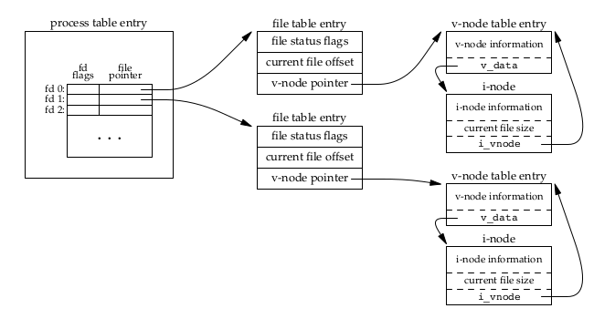
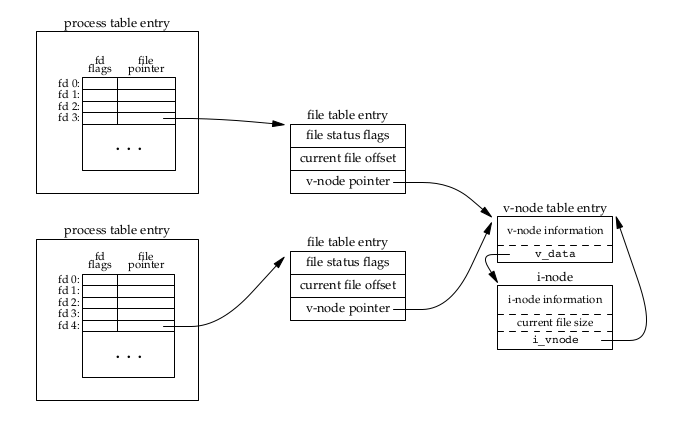
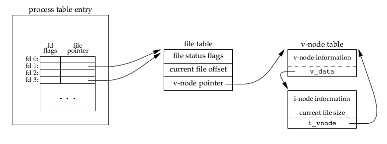

[TOC]
# 第三章 文件I/O
UNIX系统中大多数文件IO只需要五个函数(POSIX和Single UNIX Specification定义，不带缓冲，对应内核中同名的系统调用)
- open
- read
- write
- lseek
- close

>备注：在 stdio.h 中提供的通用文件操作File结构体中，成员变量 short \_file就是Unix使用的文件描述符；结构体内除了必须的一些缓冲区、文件打开标志等东西，还包括了以函数指针的方式提供的“成员函数”，这些成员函数统称为带缓冲的I/O函数

## 文件描述符
对于每个运行中的进程，都维护了一个文件描述符表，文件描述符是一个非负整数，当打开一个文件的时候，内核会向进程返回一个文件描述符。
- STDIN_FILENO、STDOUT_FILENO、STDERR_FILENO分别对应标准输入、标准输出、标准错误三个文件操作符
- 文件操作符的变化范围时0--OPEN_MAX(Linux 下为1048576)

## open 函数
```c
#include <fcntl.h>
int open(const char *pathname, int oflag,.../*mode_t mode*/)
int openat(int fd, const char *path, int oflag, ...);
返回值：若成功则返回文件描述符，若出错则返回-1
```
- pathname 参数在 open 中只能是绝对路径，在 openat 中可以时相对路径
- fd 代表给文件分配文件描述符
- ...表明从余下的参数的数量及类型根据具体的调用有所不同
- filename时要打开或创建文件的名字
- oflag为选项，可以指定为以下常量
```
O_RDONLY        只读
O_WRONLY        只写
O_RDWR          可读写
O_EXEC          只可执行
O_SEARCH        只可被查询
O_NONBLOCK      非阻塞
O_APPEND        每次写操作时都追加到文件的尾端
O_CREAT         若不存在就创建，需要第三个参数 mode_t 指定新文件的访问权限
O_TRUNC         如果存在，且为只写或可读写，则将其长度截断为0
O_EXCL          指定O_CREAT时，如果文件已经存在会报错
O_SHLOCK        以原子方式获取共享的锁
O_EXLOCK        以原子方式获取排它锁
O_NOFOLLOW      如果参数pathname 所指的文件为符号连接, 则会令打开文件失败
O_SYMLINK       允许打开符号链接
O_EVTONLY       描述符要求仅限于事件通知
O_CLOEXEC       将文件标记为close-on-exec，也就是执行时关闭文件
O_SYNC          等待完成写操作(数据和属性)
O_DSYNC         等待完成些操作(只数据)
O_RSYNC         同步读操作和写操作
O_FSYNC         等待完成写操作(FreeBSD和Mac OS X)
O_ASYNC         异步写操作(FreeBSD和Mac OS X)
```
>备注：如果 openat 的 pathname 指定相对路径，fd 参数指定为 AT_FDCWD 那么，路径名就在当前工作目录下获取

## create 函数
```c
#include <fcntl.h>
int creat(const char *path, mode_t mode);

The creat() function is the same as:
    open(path, O_CREAT | O_TRUNC | O_WRONLY, mode);
```
其实把open和creat函数对比，可以发现，creat功能以及完全被open函数替代了，实际上这是一个历史遗留产物，而且由于creat函数有着诸多的限制，实际开发中极少使用到。从creat函数说明页极少的说明也可以看出官方也并不推荐使用creat。

## close 函数
```
#include <unistd.h>
int close(int fd);
返回值：若成功返回0，失败返回-1
参数fd传入文件标识符
```
当进程终止时，内核会自动关闭所有打开的文件。需要显示关闭时，推荐使用close函数

## lseek 函数 (文件偏移)
```c
#include <unistd.h>
off_t lseek(int fd, off_t offset, int whence);
返回值：成功返回新的偏移量，出错则返回-1
```
- whence可以被设置为SEEK_SET、SEEK_CUR、SEEK_END
|whence值|描述|
|:--|:--|
|SEEK_SET|指该文件的偏移量设置为距文件开始处offset个字节|
|SEEK_CUR|指将该文件的偏移量设置为其当前值加offset|
|SEEK_END|指将该文件的偏移量设置为文件长度加offset|

## read 函数
```c
ssize_t read(int fd, void *buf, size_t nbyte);
ssize_t pread(int fd, void *buf, size_t nbyte, off_t offset);
ssize_t readv(int fd, const struct iovec *iov, int iovcnt);
返回值：若成功，返回读取的字节数；若读到文件末尾，返回0；若出错返回-1
```
- void \* 是通用指针，可以将任意类型的buf交给 read
- nbyte通常和buf的大小一致

## write 函数
```c
#include <unistd.h>
ssize_t write(int fd, const void *buf, size_t nbyte);
ssize_t pwrite(int fd, const void *buf, size_t nbyte, off_t offset);
ssize_t writev(int fd, const struct iovec *iov, int iovcnt);
返回值：若成功则返回已写入字节数，出错则返回-1
```
- void \* 是通用指针，可以将任意类型的buf交给write
- nbyte通常和buf的大小一致
- write出错的常见原因是：磁盘已满，或者超过给定进程的文件长度
- 对于普通文件，些操作从文件的当前偏移量处开始
- 如果open时指定了O_APPEND选项，则在每次写操作前，内核都会将文件偏移量设置在文件的当前结尾处。写成功后，将文件偏移量增加实际的写的字节处

## I/O 效率

## 文件共享
内核使用三个数据结构表示打开的文件
- 进程表

  每一个进程都有一个进程表，记录该进程打开的文件(记录文件描述符(fd)，文件描述符标记(fd_flag)以及指向文件表的指针)

- 文件表

  内核将所有打开文件操作记录在文件表中(记录文件状态标志(可读、可写、可读写、同步或非阻塞)，当前文件的偏移量，以及指向文件inode节点的指针)
  >备注：文件状态标志就是open函数的oflag参数

- inode

  inode记录文件的属性，同时记录此文件的数据所在的 block 号码

>备注：UNIX使用vnode节点指向inode，vnode还包含文件的类型和操作文件的函数指针，文件表节点指向vnode节点

当一个进程打开多个文件时状态如图3.7



当多个进程打开一个文件时状态如图3.8



## 原子操作
如果两个进程(或线程)用下面的方式同时对文件进行lseek和write操作，可能出现其中一个进程写入的内容被另一个进程覆盖的问题
```c
if (lseek(fd, 0L, 2) < 0) /*seek到文件末尾，进程(或线程)有可能完成seek后就中断，然后切换到其他进程(或线程)执行seek，这就导致了前一个进程(或线程)seek失败*/
  err_sys("lseek error");
if (write(fd, buf, 100) != 100) /*seek在文件末尾追加100byte的内容*/
  err_sys("write error");
```
为解决这个问题，UNIX提供两种方式对文件写操作进行保护(即原子操作)
- 使用O_APPEND
- 使用pread和pwirte函数 (源自Single Unix Specification定义)

### pread
pread相当于顺序调用lseed和read，但是
- 调用pread时，无法中断其定位和读操作
- 不更新文件指针
>这样做保证了lseed和read操作的连续性

### pwrite
有和pread相似的特点
>备注：使用open函数时指定O_CREAT和O_EXCL选项也具有原子性的特点

## dup 和 dup2
为指定fd的进程表节点创建副本节点，并初始化fd_flag为0，即执行时仍打开文件
```c
#include <unisted.h>
int dup(int fd);
int dup2(int fd, int value);
返回值：若成功，返回副本节点的fd；若失败，返回-1
```
- dup将确保返回的fd是当前可用中的最小的那个
- dup2将指定副本节点的fd为value
- 如果value已经被其他文件使用，则关闭文件并释放原value节点，再创建副本
- 如果fd等于value，则dup2返回value，不会关闭文件


## sync,fsync 和 fdatasync
Unix系统在内核设置了高速缓冲区，这些函数用户将缓冲区内的数据写入磁盘
```c
#include <unistd.h>
int fsync(int fd);
int fdatasync(int fd); /*FreeBSD,Mac OS X没有实现*/
#返回值：若成功则返回0，若出错则返回-1
void sync(void);
```
- sync只是将所有修改过的块缓冲区排入写队列，然后返回，并不等待实际写操作结束，通常update守护进程会周期的调用sync函数，这就保证了定期清理块缓冲区
- fsync对指定文件起作用，会等待清理结束，并同步更新文件的属性
- fdatasync只会影响文件的数据部分，不会更新文件的属性

## fcntl 函数
修改指定已打开文件的属性
```c
#include <fcntl.h>
int fcntl(int fd, int cmd, .../* int arg */)
返回值:成功则依赖于cmd，若出错则返回-1
```

### fcntl 函数的功能
- 复制一个现有的fd(cmd=F_DUPFD 或 F_DUPFD_CLOEXEC)
- 取得/设置fd_flag(cmd=F_GETFD 或 F_SETFD)
- 取得/设置文件状态标志（cmd=F_GETFL 或 F_SETFL）
- 取得/设置异步I/O时文件的所有权（cmd=F_GETOWN 或 F_SETOWN）
- 取得/设置记录锁(cmd=F_GETLK 或 F_SETLK 或 SETLKW)

### cmd 参数
- F_DUPFD         功能类似dup函数
- F_DUPFD_CLOEXEC 创建指定fd的进程表节点的副本，并设置fd_flag为FD_CLOSEXEC
- F_GETFD         获得指定fd的fd_flag
- F_SETFD         设置指定fd的fd_flag为第三个参数的值
- F_GETFL         获得指定fd的文件状态标志
- F_SETFL         设置指定fd的文件状态标志为第三个参数的值
- F_GETOWN        取得当前正在接收SIGIO或者SIGURG信号的进程id或进程组id，进程组id返回的是负值(arg被忽略)
- F_SETOWN        设置将接收SIGIO和SIGURG信号的进程id或进程组id，进程id和进程组id通过第三个参数arg传入（只能传一个，要么进程id，要么进程组id），arg为正值表示传入的是进程id，arg为负值则传入的是进程组id
- F_GETLK         取得文件的锁定状态，如果被锁定了，则将锁定信息重写到第三个参数arg(struct flock)，如果未被锁定状态，则除了struct flock的l_type被设置为F_UNLCK外，其他成员不变  
- F_SETLK         通过第三个参数arg（struct flock*）锁定文件，如果read lock和write lock设置失败，则返回EACCES  or  EAGAIN
  >备注：struct flock*
  ```c
    struct flock {  
        short  l_type; /* F_RDLCK, F_WRLCK, or F_UNLCK */  
        short  l_whence; /* SEEK_SET, SEEK_CUR, or SEEK_END */  
        off_t  l_start;  /* offset in bytes, relative to l_whence */  
        off_t  l_len; /* length, in bytes; 0 means lock to EOF */  
        pid_t  l_pid; /* returned with F_GETLK */  
    };  
  ```

- F_SETLKW        类似F_SETLK，不同的是当设置锁发生阻塞时，它会等待(W是wait的意思)，直至设置锁完成

### 返回值
- cmd 为 F_DUPFD     返回新的fd
- cmd 为 F_GETFD     返回fd_flag
- cmd 为 F_GETFL     返回文件状态标志
- cmd 为 F_GETOWN    返回进程ID(正数)或进程组ID(负数)

## ioctl 函数
IO设备控制函数，用于一些底层设备参数的设置和获取，ioctl函数可以控制一些特殊字符设备文件
```c
#include <unistd.h>     /* System V */
#include <sys/ioctl.h>  /* BSD and Linux */
int ioctl(int fd, int request, ...);
失败则返回-1，成功则返回其他值
```

## /dev/fd
在大多数的Unix实现中，都提供了/dev/fd文件夹，里面有若干个文件，打开这些文件，等同于复制文件描述符，实际上由于Linux系统和Unix系统很多不同的实现，在操作这个设备文件的时候需要非常小心，在实际开发中我们有更好的方式来复制文件描述符，正如原著所说，/dev/fd文件夹更多的被使用在shell脚本中。
