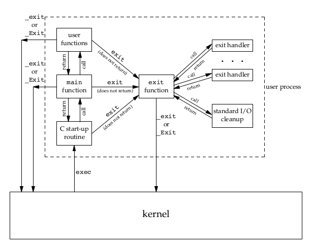
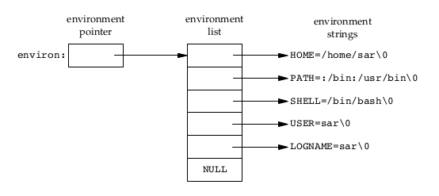

[TOC]
# 第7章 进程环境

## main 函数
```c
int main(int argc, char *argv[])
```

## 结束进程
UNIX 提供8中进程终止的行为
- 从 main 函数返回
- exit 函数
- \_exit 或者 \_Exit 函数
- 最后一个线程退出
- 最后一个线程调用 pthread_exit 函数
- 调用 abort
- 接收到一个信号
- 最后一个线程对取消请求作出相应

### exit 函数
- \_exit 或者 \_Exit 函数直接返回内核
- exit 执行清理，然后返回到内核
  - 调用 atexit 函数，注册清理函数
  - Flush 所有打开的输出流
  - 关闭所有流
  - Unlink 所有使用tmpfile打开的临时文件
```c
#include <stdlib.h>
void exit(int status);
void _Exit(int status);

#include <unistd.h>
void _exit(int status);
```

### atexit 函数
atexit 函数可以注册32个函数在exit执行的时候自动调用
- 函数以FILO的方式注册和执行
```c
int atexit(void (*func)(void));
返回值：成功返回0，失败返回非0值
```



### 退出状态
- 在 exit 函数的参数可以指定退出状态
- 如果 main 的返回值是 int，并显式 return 一个返回值，那么该进程的退出状态就是0
- 如果 exit 函数不带参数，或 main 函数执行return不带返回值，或者没有执行return，那么就不会定义返回状态

## 命令行参数
可以使用两种方式处理命令行参数
```c
for (i = 0; i < argc; i++)
```
```c
for (i = 0; argv[i] != NULL; i++)
```

## 环境列表
系统提供 environ 全局变量指向存储环境变量的指针数组，可以使用 for循环取得环境变量
```c
extern char **environ;
for (ptr = environ; *ptr != 0; ptr++)
```


## C程序的存储空间布局
- 正文段： 主要用于执行的部分，而且由于正文段的频繁读取执行，所以正文段一般都是只读的，防止误操作导致破坏或者被恶意程序窃取
- 初始化数据段： 这一段实际上是在C语言中以明确的语句初始化的变量。例如：int i = 0
- 未初始化数据段： 也叫作bss段，也就是语句中没有明确赋予初值的变量
- 栈： 自动变量以及函数调用的场景信息都被放在这里，栈具有先进后出的特性，非常适合函数调用和变量分配空间，回收空间的行为，并且，这些都是由系统自动管理的
- 堆： 堆通常用于用户自行分配空间，也就是开发者通常的malloc分配

## 共享库
C 语言使用动态链接库和静态链接库的形式共享代码(封装在共享库中)
>备注：编译过程分为预处理、代码生成、汇编和链接四阶段，共享库在链接阶段加载进二进制文件；静态链接将共享库拷贝到二进制文件中，运行时则不在依赖共享库文件，而动态链接则将对共享库的实际加载推迟到二进制文件运行的时候

## 存储空间分配
malloc 函数族实际都是调用sbrk系统调用，sbrk系统调用实质上是更改进程内存区域段的大小，但是不管内存的具体分配，所以malloc函数族是在逻辑层面上分配内存，当我们使用free回收内存时，依旧保留在进程的堆空间中的，并不是归还给系统
```c
#include <stdlib.h>
void *malloc(size_t size);
void *calloc(size_t count, size_t size);
void *realloc(void *ptr, size_t size);
返回值：成功返回非空指针，失败返回NULL
void free(void *ptr);
```
- malloc 分配一个指定 size 的连续空间，并返回地址
- calloc 分配一个指定 N * size 的连续空间，并返回地址
- realloc 在指定地址 ptr 上分配指定 size 的连续空间，可以修改 ptr 所在的内存空间
- free 释放指定地址的空间
>备注：jemalloc和tcmalloc在实际开发中可以有效的提升内存管理的效率，替换malloc函数族

## 环境变量
根据指定的name获取/设置环境变量的值
```c
#include <stdlib.h>
char *getenv(const char *name);
返回值: 成功返回name所对应的环境变量值的指针
int putenv(char *string);
int setenv(const char *name, const char *value, int overwrite);
返回值: 成功返回0，失败返回非0
int unsetenv(const char *name);
返回值: 成功返回0，失败返回-1
```
- getenv函数接收一个name指针，返回name=value中对应的value字符串指针
- putenv将name=value形式的字符串string放到环境列表中，如果name存在则删除原先的定义
- setenv将name设置为value，overwrite参数控制是否重写(overwrite非0时允许重写)
- unsetenv则删除name对应的环境变量
>备注：
putenv函数的字符串指针直接被放到了环境表中，所以不能修改或者释放这个字符串，所以不应该使用栈或者堆分配的字符串作为参数，而setenv函数则没有这个问题

## 跳转
setjmp 将程序当前位置保存在jmp_buf结构中，直接调用setjmp将返回0
longjmp 跳转到 jmp_buf 指定的位置，并设置setjmp函数的返回值为val
```c
#include <setjmp.h>
int setjmp(jmp_buf env);
返回值：直接调用返回0，通过longjmp调用返回val值
void longjmp(jmp_buf env, int val);
```

## 资源限制
每个进程都有固定的资源限制，系统提供了两个函数用于查询一些限制
```c
#include <sys/resource.h>
int getrlimit(int resource, struct rlimit *rlp);
int setrlimit(int resource, const struct rlimit *rlp);
```

### resource 参数
| resource     | 描述     |
|:--|:--|
| RLIMIT_AS       | 进程可用内存的最大值       |
| RLIMIT_CORE       | 核心文件的最大值       |
| RLIMIT_CPU       | 可使用CPU时间片的最大值       |
| RLIMIT_DATA       | 初始化/为初始化数据和堆数据段的最大数量       |
| RLIMIT_FSIZE       | 可创建文件的最大数量       |
| RLIMIT_MEMLOCK       | 可锁定内存的最大数量       |
| RLIMIT_MSGQUEUE       | 消息队列可使用最大内存       |
| RLIMIT_NICE       | 进程nice值的限制       |
| RLIMIT_NOFILE       | 最多可打开文件数       |
| RLIMIT_NPROC       | 每个UID 最多可打开子进程的数量       |
| RLIMIT_NPTS       | 最多可打开伪终端数量       |
| RLIMIT_RSS       | 最大RSS(驻留内存)大小       |
| RLIMIT_SBSIZE       | 可占用 socket 缓冲区的大小       |
| RLIMIT_SIGPENDING       | 信号队列的最大长度       |
| RLIMIT_STACK       | 栈的最大尺寸       |
| RLIMIT_SWAP       | 用户可以使用交换空间的最大值(以字节为单位)       |
| RLIMIT_VMEM       | RLIMIT_AS 的别名       |

### rlimit 结构体
```c
struct rlimit {
    rlim_t  rlim_cur;       /* current (soft) limit */
    rlim_t  rlim_max;       /* hard limit */
};
```
>备注: 实际上进程只能调小自身限额，而不能提高限额，只有root权限才能提升限额，所以一般很少用setrlimit设置，而且资源限制影响和其他的进程属性一样是随着进程派生继承的。
