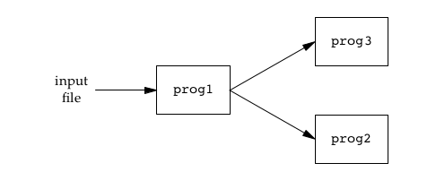
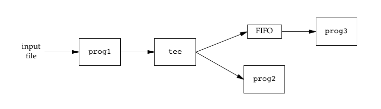
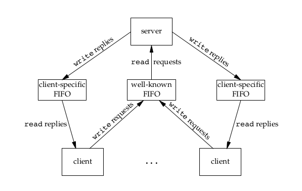

[TOC]
# 第15章 进程间通信
目前只有一些经典的IPC方式能做到移植使用：管道、FIFO、消息队列、信号量、共享存储。还有基于套接字技术的网络IPC。

## 管道
管道具有一下特征
- 半双工，数据只能单向传递
- 管道只能在具有公共父(或祖先)进程的两个进程间使用

### pipe 函数
pipe 函数用于创建管道
```c
#include <unistd.h>
int pipe(int fds[2]);
返回值:成功返回0，出错返回-1
```
- fds 包含两个描述符，fd\[0] 作为读取的一端， fd\[1] 作为写入的一段；一般先创建管道，然后将 fd\[0] 和 fd\[1] 分给两个进程，通过调用write 和 read 来实现通信
- 创建管道后， fd\[1] 如果关闭，读 fd\[0] 缓冲区中所有数据都读取后，read 返回0，代表文件结束
- 创建管道后， fd\[0] 如果关闭，写 fd\[1] 会产生 SIGPIPE 信号，如果忽略该信号或捕获该信号并从信号处理函数返回，则 write 返回-1， errno 设置为 EPIPE

[pipe1.c](../examples/ipc1/pipe1.c)

```c
#include "include/apue.h"

int main(int argc, char *argv[])
{
    int n;
    int fd[2];
    pid_t pid;
    char line[MAXLINE];
    /* 调用write 和 read 前，不用 open 或 create 了 */
    if (pipe(fd) < 0)
    err_sys("pipe error");
    if ((pid = fork()) < 0)
    err_sys("fork error");
    else if (pid == 0) {
    close(fd[0]);
    write(fd[1], "hello world\n", 12);
    } else {
    close(fd[1]);
    n = read(fd[0], line, MAXLINE);
    write(STDOUT_FILENO, line, n);
    }
    exit(0);
}
```

## popen 和 pclose 函数
除了 pipe 函数，更常见的做法时创建一个连接到其他进程的管道，然后读其输出或向其输入

popen 用于创建管道，它首先执行fork，然后在子进程中调用exec执行指定的命令，并且通过 mode 参数决定管道是被允许对子进程的stdout进行读操作还是被允许对子进程的stdin进行写操作
```c
#include <stdio.h>
FILE *popen(const char *command, const char *mode);
返回值：若成功，返回文件指针；若出错，返回NULL
int pclose(FILE *stream);
返回值：若成功，返回子进程的终止状态；若出错，返回-1
```
- mode 参数为 r 时，popen 返回的 FILE 指针指向了子进程的stdout，这样可以通过 FILE 指针对管道进行读操作；当 mode 为 w 时，FILE 指针指向了子进程的stdin，这样可以通过 FILE 指针对管道进行写操作
- pclose 函数关闭管道，并且等待子进程终止，最后返回子进程的终止状态

[pipe1.c](../examples/ipc1/popen1.c)

```c
#include "apue.h"
#include <sys/wait.h>

int
main(void)
{
	char	line[MAXLINE];
	FILE	*fpin;
	/* 打开一个读管道*/
	if ((fpin = popen("command", "r")) == NULL)
		err_sys("popen error");
	for ( ; ; ) {
		fputs("prompt> ", stdout);
		fflush(stdout);
		if (fgets(line, MAXLINE, fpin) == NULL)	/* 从管道的stdout读数据 */
			break;
		if (fputs(line, stdout) == EOF)
			err_sys("fputs error to pipe");
	}
	if (pclose(fpin) == -1)
		err_sys("pclose error");
	putchar('\n');
	exit(0);
}
```

## 协同进程
当某个进程既产生其他进程的输入，又读取其他进程的输出时，就成了协同进程，如grep more 等管道命令既可以从stdin读数据，也可以向stdout写数据。

如下面的例子，父进程和子进程通信时各自关闭不需要的管道，子进程使用dup2函数将管道的读写端移到标准输出，在调用execl时，子进程的stdio就和父进程的stdio通过管道对接

[add2.c](../examples/ipc1/add2.c)
```c
#include "apue.h"

int
main(void)
{
	int		n, int1, int2;
	char	line[MAXLINE];
	/* 阻塞，等待读取 stdin，格式化后赋值给int1 int2，然后将 int1+int2 的结果写入 stdout */
	while ((n = read(STDIN_FILENO, line, MAXLINE)) > 0) {
		line[n] = 0;		/* null terminate */
		if (sscanf(line, "%d%d", &int1, &int2) == 2) {
			sprintf(line, "%d\n", int1 + int2);
			n = strlen(line);
			if (write(STDOUT_FILENO, line, n) != n)
				err_sys("write error");
		} else {
			if (write(STDOUT_FILENO, "invalid args\n", 13) != 13)
				err_sys("write error");
		}
	}
	exit(0);
}

```

[pipe4.c](../examples/ipc1/pipe4.c)

```c
#include "apue.h"

static void	sig_pipe(int);		/* our signal handler */

int
main(void)
{
	int		n, fd1[2], fd2[2];
	pid_t	pid;
	char	line[MAXLINE];

    /* 子进程被kill后，再向管道写入数据时，父进程处理SIGPIPE信号 */
	if (signal(SIGPIPE, sig_pipe) == SIG_ERR)
		err_sys("signal error");

	/* 创建两个管道 fd1 和 fd2 */
	if (pipe(fd1) < 0 || pipe(fd2) < 0)
		err_sys("pipe error");

	if ((pid = fork()) < 0) {
		err_sys("fork error");
	} else if (pid > 0) {							/* 父进程 */
		/* 关闭 fd1 的读端和 fd2 的写端*/
		close(fd1[0]);
		close(fd2[1]);

		/* 读取 stdin */
		while (fgets(line, MAXLINE, stdin) != NULL) {
			n = strlen(line);
			/* 将父进程的 stdin 通过 fd1 写入到子进程的 stdin  */
			if (write(fd1[1], line, n) != n){
				err_sys("write error to pipe");
			}
			/*
			else{
			 // write 成功则打印
				write(STDOUT_FILENO, "write fd1\n", 9);
			}*/
			/* 通过 fd2 读取子进程的 stdout  */
			if ((n = read(fd2[0], line, MAXLINE)) < 0){
				err_sys("read error from pipe");
			}
			/*
			else{
			 	//read 成功则打印
				write(STDOUT_FILENO, "read fd2\n", 8);
			}*/
			if (n == 0) {
				err_msg("child closed pipe");
				break;
			}
			line[n] = 0;	/* null terminate */
			/* 将从 fd2 读取的数据(子进程的stdout)写入父进程的 stdout */
			if (fputs(line, stdout) == EOF)
				err_sys("fputs error");
		}

		if (ferror(stdin))
			err_sys("fgets error on stdin");
		exit(0);
	} else {									/* 子进程 */
		/* 关闭 fd2 的读端和 fd1 的写端*/
		close(fd1[1]);
		close(fd2[0]);
		/* 子进程将fd1的读端当做stdin */
		if (fd1[0] != STDIN_FILENO) {
			if (dup2(fd1[0], STDIN_FILENO) != STDIN_FILENO)
				err_sys("dup2 error to stdin");
			close(fd1[0]);
		}

		/* 子进程将fd2的写端当做stdout */
		if (fd2[1] != STDOUT_FILENO) {
			if (dup2(fd2[1], STDOUT_FILENO) != STDOUT_FILENO)
				err_sys("dup2 error to stdout");
			close(fd2[1]);
		}
		/* 执行命令，从 fd1 读取数据，将结果写入 fd2 */
		if (execl("./add2", "add2", (char *)0) < 0)
			err_sys("execl error");
	}
	exit(0);
}

static void
sig_pipe(int signo)
{
	printf("SIGPIPE caught\n");
	exit(1);
}

```

## FIFO
队列也被成为命名管道，未命名的管道只能在两个相关进程使用，而命名管道就可以被进程使用。

### mkfifo 和 mkfifo 函数
这两个函数都用来创建命名管道
```c
#include <sys/stat.h>
int mkfifo(const char *path, mode_t mode);
int mkfifoat(int fd, const char *path, mode_t mode);
返回值：成功返回0；出错返回-1
```
- mode 参数和 open 函数一致
- 如果 mkdfifoat 的 path 参数是绝对路径，则 fd 参数会被忽略掉; 如果 path 是相对路径，fd 就需要是一个打开的目录的文件描述符；如果 path 是相对路径，fd 是 AT_FDCWD,那么路径名就是当前工作目录
- mkfifo 和 mkfifoat 创建的命名管道，要用 open 来打开
- 以读方式 open 命名管道时，如果不指定 O_NONBLOCK, open 函数会被阻塞，直到其他进程以写的方式 open 这个命名管道；如果 open 的时候指定 O_NONBLOCK ，open 函数立即返回
- 如果以写方式 open 一个从来没有被读方式 open 的命名管道，open 函数返回 -1，并将 errno 设置为 ENXIO
- 如果以 write 一个从来没有被以读方式 open 的命名管道，会产生信号 SIGPIPE

### FIFO 的用途
- 用 FIFO 复制输出流，这过程中需要对经过过滤的输入流进行两次处理：如下图所示



使用 tee 命令可以实现这个过程(tee 命令可将stdin输出到其stdout的同时，也输出到其命令行参数指定的文件中)，如下面的shell脚本
```
# prog3 在后台运行，等待数据从管道 fifo1 输入
mkfifo fifo1
prog3 < fifo1 &
# input 文件 通过 tee 命令同时输出到 fifo1 和 prog2
prog1 < infil | tee fifo1 | prog2
```
这个脚本运行的流程如下图所示：



- 使用 FIFO 进行客户端进程-服务器进程通信

由服务器端进程以读写的方式打开一个管道，所有客户端都通过写这个管道来请求服务；因为这个管道有多个进程在写，所以每个客户端发送的请求长度要小于PIPE_BUF字节，这样就能避免客户进程的多次写之间出现交叉。

但是，服务器进程不能使用这个管道向客户端应答，因为客户端不可能直到何时去读取这些响应以及何时响应其他客户进程；服务器进程应该为每个客户端进程都建立一条管道，通过这个管道响应客户端，这样做可以使客户端专用的管道遗留在文件系统中，此外服务器进程还需要处理SIGPIPE信号，以便在客户端进程终止后服务器端进程清理不需要的管道。如下图所示：



## XSI IPC 的共同点
消息队列、信号量以及共享内存是 XSI 提供的 IPC 机制

### 标识符和键
XSI IPC在内核中存在着IPC结构，它们都用一个非负整数作为标识符，这点很像文件描述符，但是文件描述符永远是当前最小的开始，比如，第一个文件描述符必然是从3开始，然后这个文件描述符删除后，再次打开一个文件，文件描述符仍然是3，而IPC结构则不会减少，会变成4，然后不断增加直到整数的最大值，然后又回转到0。

标识符是IPC结构的内部名称，为了能全局使用，需要有一个键作为外部名称，无论何时创建IPC结构，都应当指定一个键名，这个键的数据结构是基本系统数据类型key_t。

有很多种方法使客户端进程和服务器进程在同一个IPC结构汇聚：
- 服务器进程指定 IPC_PRIVATE 键创建一个新的IPC结构。返回的标识符被存放在一个文件中，客户端进程读取这个文件来参与IPC结构
- 在一个公用头文件中定义一个统一的标识符，然后服务端根据这个标识符创建新的IPC结构，但是很有可能导致冲突，这种情况下 msgget semget shmget 函数用于出错返回，服务器进程必须处理这一错误，删除以存在的 IPC 结构，然后尝试再创建一次
- 客户端和服务端进程可以认同一个路径名和项目ID。接着调用 ftok 函数用这两个值生成一个键，然后再创建一个IPC结构
```c
#include <sys/ipc.h>
key_t ftok(const char *path, int id);
返回值:成功返回键；出错返回(key_t)-1
```
- path参数必须是一个现有的文件，当产生键的时候，只会使用id参数低八位

### 权限结构
每个IPC结构都关联了一个 ipc_perm 结构，这个结构体关联了权限和所有者
```c
struct ipc_perm{
    uid_t    uid;    /* [XSI] 所有者有效uid */
    gid_t    gid;    /* [XSI] 所有者有效gid */
    uid_t    cuid;    /* [XSI] 创建者有效uid */
    gid_t    cgid;    /* [XSI] 创建者有效gid */
    mode_t   mode;    /* [XSI] XSI IPC 读写权限 */  
}
```
- 在创建的时候，这些字段都要被赋值，之后，如果想要修改这些字段，则必须是保证具有root权限或者是创建者
- 不一定每个UNIX实现都为XSI IPC读写权限定义了常量，权限及其对应位如下：
|  权限  |  位  |
| :--  | :--  |
| 用户读  | 0400  |
| 用户写  | 0200  |
| 组读  | 0040  |
| 组写  | 0020  |
| 其他读  | 0004  |
| 其他写  | 0002  |

## 消息队列
消息队列，正如其名称一样，是消息的链表形式，它由内核存储维护。并且和XSI IPC结构一样，由消息队列标识符标识(简称队列ID)

每一个消息队列都关联一个 msqid_ds 结构体，这个结构描述队列的当前状态
```c
struct __msqid_ds {
    struct __ipc_perm   msg_perm; /* [XSI] 消息队列权限*/
    msgqnum_t    msg_qnum;      /* [XSI] 队列中消息数量 */
    msglen_t    msg_qbytes;     /* [XSI] 队列中最大字节数 */
    pid_t       msg_lspid;      /* [XSI] 最后调用 msgsnd() 的pid */
    pid_t       msg_lrpid;      /* [XSI] 最后调用 msgrcv() 的pid */
    time_t      msg_stime;      /* [XSI] 最后调用 msgsnd() 的时间 */
    time_t      msg_rtime;      /* [XSI] 最后调用 msgrcv() 的时间 */
    time_t      msg_ctime;      /* [XSI] 最后调用 msgctl() 的时间 */
}
```
创建新队列的时候，会初始化 msqid_ds 结构体：
- msg_perm.cuid 和 msg_perm.uid 设为调用者的有效用户标志
- msg_perm.cgid 和 msg_perm.gid设为调用者的有效用户组标志
- msg_perm.mode 的低9位设为 msgget 函数的 flag 参数的低9位
- msg_qnum msg_lspid msg_lrpid msg_stime msg_rtime 初始化的时候都设置为0
- msg_ctime 初始化的时候设置为当前时间
- msg_qbytes 初始化的时候设置为系统限制值

### msgget 函数
打开一个现有的队列或创建一个新的队列
```c
#include <sys/msg.h>
int msgget(key_t key, int flag);
返回值:成功返回消息队列ID，出错返回-1
```
- key 值可以使用 IPC_PRIVATE ，也可以使用 ftok 函数生成
- msgget 函数返回的队列ID(msqid)用于 msgsnd msgrcv msgctl 函数
- flag 设置 msgget 函数的行为
|  flag 参数值  |  描述  |
|:--|:--|
|  IPC_CREAT  |  当key值不是 IPC_PRIVATE 时，创建新的消息队列  |
|  IPC_EXCL  |  与IPC_CREAT一同使用，表示如果要创建的消息队列已经存在，返回-1，errno 被设置为EEXIST  |

### msgctl 函数
用于执行对消息队列的控制
```c
#include <sys/msg.h>
int msgctl(int msqid, int cmd, struct msqid_ds *buf);
返回值:成功返回0，出错返回-1
```
- cmd 参数指定 msgctl 函数的行为
|  cmd 参数值  |  描述  |
|:--|:--|
|  IPC_STAT  |  获取 msqid_ds 结构体，使用 buf 指针指向该结构体  |
|  IPC_SET  |  将字段 msg_perm.uid msg_perm.gid msg_perm.mode 和 msg_qbytes 从 buf 指向的结构复制到与这个队列相关的 msqid_ds 结构体中  |
|  IPC_RMID  |  删除消息队列，清理队列中数据，这种删除立即生效。仍在使用这个消息队列的其他进程在他们下一次试图对此队列进行操作时，将得到EIDRM错误  |
>备注：IPC_SET和IPC_RMID 只能被root进程，以及有效uid 为 msg_perm.cuid 或 msg_perm.uid 的进程执行

### msgsnd 函数
将数据添加到消息队列末尾
```c
#include <sys/msg.h>
int msgsnd(int msqid, const void *ptr, size_t nbytes, int flag);
返回值:成功返回0，出错返回-1
```
- msqid 消息队列ID
- ptr 是指向消息缓冲区的指针，可定义为下面的结构
```c
struct msg{
    long mtype;  /* 消息类型，必须 > 0 */
    char mtext[512]; /* 消息文本 */
}
```
- nbytes 消息的大小
- flag 参数可以设置为 0 和 IPC_NOWAIT
|  cmd 参数值  |  描述  |
|:--|:--|
|  0  |  表示忽略  |
|  IPC_NOWAIT  |  表示若消息队列已满，或队列中的字节数已达到系统限制值，则调用 msgsnd 立即返回 EAGAIN ；如果没有使用 IPC_NOWAIT， 调用 msgsnd 会阻塞到有空间可以容纳要发送的消息，或从系统中删除此队列，或捕捉到一个信号(应该是EAGAIN)，并从信号处理函数返回  |

### msgrcv 函数
msgrcv从队列中获得消息，当消息从队列内取出后，相应的消息就从队列中删除
```c
#include <sys/msg.h>
ssize_t msgrcv(int msqid, void *ptr, size_t nbytes, long type, int flag);
返回值:成功返回0，出错返回-1
```
- msqid 消息队列ID
- ptr 是指向消息缓冲区的指针, 和 msgsnd 一致
- nbytes 消息的大小
- type 指定消息的类型， type 等于0 则返回队列的最早的一个消息;type 大于0则返回调用 msgsnd是 msg.mtype 指定的的第一个消息; type 小于0,则返回其类型小于或等于mtype参数的绝对值的最小的一个消息
- flag 参数可以设置为 0 IPC_NOWAIT MSG_NOERROR,
|  cmd 参数值  |  描述  |
|:--|:--|
|  0  |  表示忽略  |
|  IPC_NOWAIT  |  表示 msgrcv 不被阻塞，这样，如果没有指定类型的消息可用，msgrcv 返回-1，errno 设置为 ENOMSG；如果不设置 IPC_NOWAIT， 调用 msgrcv 会阻塞到直到有指定类型的消息可用，或从系统中山除了此队列(返回-1，errno 设置为EIDRM)，或捕捉到一个信号并从信号处理函数返回(返回-1，errno 设置为EINTR) |
|  MSG_NOERROR  |  如果函数取得的消息长度大于 nbytes ，将消息截断，只返回 nbytes 长度的部分，剩下的部分被丢弃了。如果不指定这个参数，消息太长时则返回E2BIG ，而消息则留在队列中不被取出。  |

## XSI 信号量
信号量是一个计数器，针对多个进程提供对共享数据对象的访问。信号量的使用主要是用来保护共享资源的，使得资源在一个时刻只会被一个进程（线程）拥有。

信号量的使用方法：
1. 测试控制该资源的信号量
2. 如果信号量为正，则进程可以使用该资源，这种情况下，信号量会减一，表示已经使用了一个资源。
3. 如果信号量为0，则进程进入休眠状态，知道信号量变为正，进程将会唤醒。

信号量常用的形式为二进制信号量，用于控制单个资源，初始值为1

XSI 信号量要复杂的多
- XSI 信号量 不是单个非负值，必须定义为含有一个或多个信号量值的集合
- XSI 信号量 的创建(semget)是独立于初始化(semctl)的，导致这一过程不能原子化
- XSI 信号量 不会因为程序终止而被释放

### semid_ds 结构体
内核为每个信号量集合维护着一个 semid_ds 结构体
```c
struct semid_ds {
 struct ipc_perm sem_perm;  /* 权限结构 */
 time_t          sem_otime; /* 最后调用semop函数的时间 */
 time_t          sem_ctime; /* 最后修改时间 */
 unsigned long   sem_nsems; /* 集合中信号量数量 */
};
```
创建新信号量的时候，会初始化 semid_ds 结构体：
- sem_perm.cuid 和 sem_perm.uid 设为调用者的有效用户标志
- sem_perm.cgid 和 sem_perm.gid设为调用者的有效用户组标志
- sem_perm.mode 的低9位设为 semget 函数的 semflg 参数的低9位
- sem_otime 初始化的时候都设置为0
- sem_ctime 初始化的时候设置为当前时间
- sem_nsems 初始化的时候和调用 semget 时 指定的 nsems 参数一致

### semget 函数
用于获得信号量ID
```c
#include <sys/sem.h>
int semget(key_t key, int nsems, int semflg);
返回值：成功返回信号量ID；出错返回-1
```
- key 值可以使用 IPC_PRIVATE ，也可以使用 ftok 函数生成
- nsems 指定集合中的信号量数
- semflg 设置 semget 的行为
|  flag 参数值  |  描述  |
|:--|:--|
|  IPC_CREAT  |  当key值不是 IPC_PRIVATE 时，创建新的信号量集  |
|  IPC_EXCL  |  与IPC_CREAT一同使用，表示如果要创建的信号量集已经存在，返回-1，errno 被设置为EEXIST  |

### semctl 函数
用来执行对信号量集的控制
```c
#include <sys/sem.h>
int semctl(int semid, int semnum, int cmd, .../* union semun arg */);
返回值：成功返回信号量0或对应值；出错返回-1
```
- semid 指定信号量集
- semnum 指定该信号量集合中的一个成员，取值从 0 到 nsems-1
- arg 参数是可选的，这个union是否使用取决于 cmd 参数
```c
union semun {
 int             val;    /* Value for SETVAL */
 struct semid_ds *buf;    /* Buffer for IPC_STAT, IPC_SET */
 unsigned short  *array;  /* Array for GETALL, SETALL */
 struct seminfo  *__buf;  /* Buffer for IPC_INFO (Linux-specific) */
};
```
- cmd 参数用于指定semctl函数的行为
|  cmd 参数值  |  描述  |
|:--|:--|
|  IPC_STAT  |  获取 semid_ds 结构体，使用 buf 指针指向该结构体  |
|  IPC_SET  |  将字段 sem_perm.uid sem_perm.gid sem_perm.mode 从 buf 指向的结构复制到与这个队列相关的 msqid_ds 结构体中  |
|  IPC_RMID  |  删除信号量集合，清理其中数据，这种删除立即生效。仍在使用这个信号量集的其他进程在他们下一次试图对此队列进行操作时，将得到EIDRM错误  |
|  GETALL  |  用于读取信号量集中的所有信号量的值  |
|  GETNCNT  |  返回正在等待资源的进程数目  |
|  GETPID  |  返回最后一个执行semop操作的进程的PID  |
|  GETVAL  |  返回信号量集中的一个单个的信号量的值  |
|  GETZCNT  |  返回这在等待完全空闲的资源的进程数目  |
|  SETALL  |  设置信号量集中的所有的信号量的值  |
|  SETVAL  |  设置信号量集中的一个单独的信号量的值  |
>备注：
>1.IPC_SET和IPC_RMID 只能被root进程，以及有效uid 为 sem_perm.cuid 或 sem_perm.uid 的进程执行
>2.除了GETALL意外的所有GET命令，semctl 函数都返回对应值，其他命令成功则返回0；出错，则设置errno，并返回-1

### semop 函数
操作一个或一组信号
```c
#include <sys/sem.h>
int semop(int semid, struct sembuf *sops, size_t nsops);
返回值：成功返回信号量ID；出错返回-1
```
- semid 指定信号集ID
- nsops 指定 sembuf 结构体数组元素的个数
- sops 指向 sembuf 结构体数组， sembuf 结构体用于描述要操作的信号量和进行的操作
```c
struct sembuf{
    unsigned short sem_num; /* 信号量集中的信号量的编号 */
    short sem_op; /* 指定sem_num的信号量相关的资源的操作 */
    short sem_flg; /* 信号量操作的标志 */
};
```
- sem_num 操作信号在信号集中的编号，第一个信号的编号是0
- sem_op 如果其值为正数，该值会加到现有的信号内含值中，通常用于释放所控资源的使用权；如果sem_op的值为负数，而其绝对值又大于信号的现值，操作将会阻塞，直到信号值大于或等于sem_op的绝对值，通常用于获取资源的使用权；如果sem_op的值为0，则操作将暂时阻塞，直到信号的值变为0
- sem_flg 信号操作标志，可能的选择有两种
|  sem_flg值  |  描述  |
|:--|:--|
|  IPC_NOWAIT  |  对信号的操作不能满足时，semop()不会阻塞，并立即返回，同时设定错误信息  |
|  SEM_UNDO  |  程序结束时(不论正常或不正常)，保证信号值会被重设为semop()调用前的值。这样做的目的在于避免程序因为在异常情况下结束时未将锁定的资源解锁，而造成该资源死锁  |

## 共享存储
XSI 共享存储机制允许两个或更多进程共享一个给定的内存，这是最快速的IPC，但是很容以导致资源竞争，一般使用信号量来处理共享存储资源竞争问题。

### shmid_ds 结构体
内核为每个共享内存维护 shmid_ds 结构体，用来描述共享内存
```c
struct shmid_ds {
  struct ipc_perm shm_perm;    /* 权限结构 */
  size_t          shm_segsz;   /* 共享内存的字节数，Linux 最大 32768，最小 1 */
  time_t          shm_atime;   /* 最后连接时间 */
  time_t          shm_dtime;   /* 最后分离时间 */
  time_t          shm_ctime;   /* 最后变更时间 */
  pid_t           shm_cpid;    /* 创建者PID */
  pid_t           shm_lpid;    /* 最后连接/分离的PID */
  shmatt_t        shm_nattch;  /* 当前连接该共享内存的进程数，Linux 系统最多有4096个共享内存，进程最多也可以连接4096个 */
  ...
};
```

创建新共享内存的时候，会初始化 shmid_ds 结构体：
- shm_perm.cuid 和 shm_perm.uid 设为调用者的有效用户标志
- shm_perm.cgid 和 shm_perm.gid设为调用者的有效用户组标志
- shm_perm.mode 的低9位设为 shmget 函数的 semflg 参数的低9位
- shm_ctime 初始化的时候都设置为当前时间
- shm_lpid, shm_nattch, shm_atime, 和 shm_dtime 初始化的时候设置为0
- shm_segsz 初始化的时候和调用 shmget 时 指定的 size 参数一致

### shmget 函数
创建或打开共享内存
```c
int shmget(key_t key, size_t size, int shmflg);
返回值：成功返回共享内存ID；出错返回-1
```
- key 值可以使用 IPC_PRIVATE ，也可以使用 ftok 函数生成
- size 大于0时指定新建共享内存的大小，等于0时只获取共享内存
- shmflg 设置 shmget 的行为
|  shmflg 参数值  |  描述  |
|:--|:--|
|  0  |  只获取共享内存  |
|  IPC_CREAT  |  当key值不是 IPC_PRIVATE 时，创建新的共享内存或获取已有的共享内存  |
|  IPC_EXCL  |  与IPC_CREAT一同使用，表示如果要创建的共享内存已经存在，返回-1，errno 被设置为EEXIST  |


### shmctl 函数
```c
int shmctl(int shmid, int cmd, struct shmid_ds *buf);
```
- cmd 参数指定 msgctl 函数的行为
|  cmd 参数值  |  描述  |
|:--|:--|
|  IPC_STAT  |  获取 shmid_ds 结构体，使用 buf 指针指向该结构体  |
|  IPC_SET  |  将把buf所指的shmid_ds结构中的uid、gid、mode复制到共享内存的shmid_ds结构内  |
|  IPC_RMID  |  删除共享内存，这种删除立即生效。仍在使用这个消息队列的其他进程在他们下一次试图对此队列进行操作时，将得到EIDRM错误  |
|  SHM_LOCK  |  对共享内存加锁  |
|  SHM_UNLOCK  |  解锁共享内存  |
>备注：IPC_SET和IPC_RMID 只能被root进程，以及有效uid 为 msg_perm.cuid 或 msg_perm.uid 的进程执行；SHM_LOCK 和 SHM_UNLOCK 是 Linux 和 Solaris特有的，只能由root用户执行

### shmat 函数
将共享内存连接到进程
```c
void *shmat(int shmid, const void *shmaddr, int shmflg);
返回值：成功返回指向共享内存的指针；出错返回-1
```
- shmid 指定共享内存ID
- shmaddr 指定共享内存出现在进程内存地址的什么位置：指定为0让内核自己决定一个合适的地址位置；addr非0，且 shmflg 没有设置为 SHM_RND，则连接到 addr 指定的地址上； addr 非0，且 shmflg 设置了 SHM_RND，则地址为离addr最近的2的乘方位(低边界地址取证)
- shmflg SHM_RDONLY：为只读模式，其他为读写模式， SHM_EXEC (Linux 特有的) 为共享内存可执行

### shmdt 函数
将共享内存从进程中分离
```c
int shmdt(const void *shmaddr);
返回值成功返回0；出错返回-1
```
- shmaddr 指定共享内存出现在进程内存地址的什么位置

## POSIX 信号量
相比XSI标准规定的IPC方式，POSIX的方式更加简洁好用，且更高性能。
>备注：POSIX 信号量的删除操作是异步的，相比 XSI 信号量，删除请求发出后，其他进程对信号量的操作仍正常进行，直到没有进程在使用该信号量

POSIX 信号量有两种类型：命名的和匿名的，他们两者的区别就像是命名管道和匿名管道一样，命名信号量就能全局使用，而匿名信号量只能在同一内存区域内使用

### sem_open 函数
```c
#include <semaphore.h>
sem_t *sem_open(const char *name, int oflag, ... /* mode_t mode, unsigned int value */);
返回值：成功返回信号量指针；出错返回 SEM_FAILED
```
- name 指定现有的信号量为信号量命名，命名规则如下
|  序号  |  规则描述  |
|:--|:--|
|  1  |  第一个字符应该位 /  |
|  2  |  除了第一个字符以外，不能再有其他 /，以免和和路径混淆  |
|  3  |  name 长度不能超过 _POSIX_NAME_MAX  |

- oflag 参数指定 sem_open 函数的行为
|  oflag  |  描述  |
|:--|:--|
|  0  |  使用 name 指定的信号量  |
|  O_CREAT  |  如果命名信号量不存在，则创建，否则使用 name 指定的；这时需要使用 mode 和 value  |
|  O_EXCL  |  和 O_CREAT 一起使用，表示如果 name 指定的信号量存在，则返回-1，返回-1，errno 被设置为EEXIST  |

- mode 参数指定信号量的访问权限
- value 参数指定信号量初始值，取值在 0 -- SEM_VALUE_MAX 之间

### sem_close 函数
完成信号量操作时，需要调用 sem_close 释放和信号量相关的资源。

如果进程直接退出，内核自动关闭任何打开的信号量。
```c
#include <semaphore.h>
int sem_close(sem_t *sem);
返回值：成功返回0；出错返回-1
```

### sem_unlink 函数
请求删除信号量，如果该信号量没有被打开，则立即销毁，否则等到所有相关操作都调用 sem_close 释放和信号量相关的资源后删除信号量
```c
#include <semaphore.h>
int sem_unlink(const char *name);
返回值：成功返回0；出错返回-1
```
>备注: XSI 信号量和 POSIX 信号量之间没有太大差别，采用二进制信号量还是采用信号量计数由如何初始化和使用信号量决定，如果信号量只有0和1，那么他就是二进制信号量，这时，当二进制信号量为1，他就是解锁的，为0是锁定的

### sem_wait 函数
sem_wait 实现信号量减1操作。使用 sem_wait 函数时，如果信号量是0，代表已经有使用该信号量锁定的资源，这时函数调用发生阻塞；成功减1或被信号中断才返回
```c
#include <semaphore.h>
int sem_wait(sem_t *sem);
返回值：成功返回0；出错返回-1
```

### sem_trywait 函数
sem_trywait 是 sem_wait的不阻塞版本，即当信号量是0时，调用 sem_trywait 不会发生阻塞，返回-1并将 errno 设置为 EAGAIN
```c
#include <semaphore.h>
int sem_trywait(sem_t *sem);
返回值：成功返回0；出错返回-1
```

### sem_timedwait 函数
sem_timedwait 为 sem_wait 增加超时机制，当阻塞时间超过 tsptr 指定的时间后，函数调用解除阻塞状态，返回-1并设置errno为 ETIMEDOUT
```c
#include <semaphore.h>
#include <time.h>
int sem_timedwait(sem_t *restrict sem, const struct timespec *restrict tsptr);
返回值：成功返回0；出错返回-1
```

### sem_post 函数
sem_post 实现信号量增1操作，用于解锁资源时
```c
#include <semaphore.h>
int sem_post(sem_t *sem);
返回值：成功返回0；出错返回-1
```

### sem_init 函数
sem_init 用于创建一个匿名信号量
```c
#include <semaphore.h>
int sem_init(sem_t *sem, int pshared, unsigned int value);
返回值：成功返回0；出错返回-1
```
- sem 用来指向 sem_init 创建的信号量
- pshared 参数指定是否允许被多进程共享，如果是则将其设置为非0值
- value 指定信号量的初始值

### sem_destory 函数
信号量使用完毕后，使用 sem_destory 清理
```c
#include <semaphore.h>
int sem_destory(sem_t *sem);
返回值：成功返回0；出错返回-1
```

### sem_getvalue 函数
sem_getvalue 用来查询信号量值
```c
#include <semaphore.h>
int sem_getvalue(sem_t *restrict sem, int *restrict valp);
返回值：成功返回0；出错返回-1
```
- valp 指向查询结果
>备注：在多任务环境下使用信号量时，建议使用额外的同步机制来保证 sem_getvalue 和 实际的值一致
