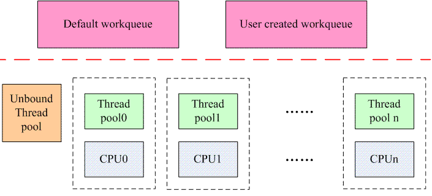

# CMWQ 概述

## 为何需要 CMWQ

### 传统 workqueue 存在的问题

传统的 workqueue 在使用中存在下列问题：

1. 内核线程数量太多，例如明明可以使用 default workqueue ，偏偏自己创建属于自己的 workqueue ，这样一来，对于那些比较大型的系统（  CPU 个数比较多 ），很可能内核启动结束后就耗尽了 PID space（ default 最大值是65535 ），导致用户空间程序无法启动。而且系统内过多的 task 和会对整体性能造成负面影响。

2. single-threaded workqueue 完全没有并发的概念，所有 work 都是排队执行，如果有需要长时间执行的任务，其他任务就只能等待；普通 workqueue 的并发处理仍然不是很好，因为虽然创建了 thread pool，但是 thread pool 的数目是固定的：每个 oneline 的 cpu 上运行一个，而且是严格的绑定关系，也就是说传统 workqueue 上的线程池分割了每个线程，线程之间不能互通有无，例如 cpu0 上的 worker thread 由于处理 work 而进入阻塞状态，那么该 worker thread 处理的 work queue 中的其他 work 都阻塞住，不能转移到其他 cpu 上的 worker thread 去，更有甚者，cpu0 上随后挂入的 work 也接受同样的命运（ 在某个 cpu 上 schedule 的 work 一定会运行在那个 cpu 上 ），不能去其他空闲的 worker thread 上执行。

3. 众多 work 因为在同一个 CPU 上的 work thread 上执行，从而竞争该 work thread 的锁，最终导致死锁。

4. 二元化的线程池机制。基本上 workqueue 也是 thread pool 的一种，但是创建的线程数目是二元化的设定：要么是 1，要么是 number of CPU ，但是，有些场景中，创建 number of CPU 太多，而创建一个线程又太少，这时候，勉强使用了 single threaded workqueue，但是不得不接受串行处理 work，使用 multi threaded workqueue 吧，占用资源太多。二元化的线程池机制让用户无所适从。 

### CMWQ 是如何解决问题

#### 设计原则

CMWQ 设计的时候遵循下面两个原则：

- 和传统 workqueue 接口兼容。
- 明确的划分了 workqueue 的前端接口和后端实现机制。CMWQ 的整体架构如下：
 
    
    
    CMWQ 提出了 worker pool 的概念（ 其实就是一种 thread pool ），也就是说，系统中存在若干 worker pool，和所有 workqueue 共享，用户可以创建 workqueue（ 不创建 worker pool ）并通过 flag 来约束挂入该 workqueue 上 work 的处理方式。workqueue 会根据其 flag 将 work 交付给系统中某个 worker pool 处理。例如如果该 workqueue 是 bounded 类型并且设定了 high priority，那么挂入该 workqueue 的 work 将由 per cpu 的 highpri worker-pool 来处理。

让所有的 workqueue 共享系统中的 worker pool ，即减少了资源的浪费（ 没有创建那么多的 kernel thread ），又保证了灵活的并发性（ worker pool 会根据情况灵活的创建 thread 来处理 work ）。
    
#### 如何解决线程数目过多的问题

在 CMWQ 中，用户可以根据自己的需求创建 workqueue ，但是已经和后端的 worker pool 是否创建 worker 线程无关了，是否创建新的 work 线程是由 worker  worker pool 来决定。系统中的 worker pool 包括两种： 

- 和特定 CPU 绑定的 worker pool 。这种 worker pool 有两种，一种叫做 normal worker pool ，另外一种叫做 high priority  worker pool ，分别用来管理普通的 worker thread 和高优先级的 worker thread ，而这两种 thread 分别用来处理普通的和高优先级的 work 。这种类型的 worker pool 数目是固定的，和系统中 cpu 的数目相关，如果系统有 n 个 cpu ，如果都是 online 的，那么会创建 2n 个 worker pool 。
- unbound worker pool ，可以运行在任意的 cpu 上。这种 thread pool 是动态创建的，是和 thread pool 的属性相关，包括该 thread pool 创建 worker thread 的优先级（ nice value ），可以运行的 cpu 链表等。如果系统中已经有了相同属性的 thread pool，那么不需要创建新的 worker pool ，否则需要创建。

至此，创建 workqueue 和创建 worker thread 已经解除关联，用户创建 workqueue 仅仅是选择一个或者多个 worker pool 而已，对于 bound thread pool ，每个 cpu 有两个 thread pool ，关系是固定的，对于 unbound thread pool ，有可能根据属性动态创建 thread pool 。

缺省情况下，创建 thread pool 的时候会创建一个 worker thread 来处理 work ，随着 work 的提交以及 work 的执行情况，thread pool 会动态创建 worker thread ，策略如下：

- 当thread pool中处于运行状态的 worker thread 等于0，并且有需要处理的 work 的时候，thread pool 就会创建新的 worker 线程。
- 当 worker 线程处于 idle 的时候，不会立刻销毁它，而是保持一段时间，如果这时候有创建新的 worker 的需求的时候，那么直接 wakeup idle 的 worker 即可。
- 一段时间过去仍然没有事情处理，那么该 worker thread 会被销毁。

这样的设计平衡了并发性和系统资源消耗

#### 如何解决并发问题

假设有 A B C D 四个 work 在某个 cpu 上运行，缺省的情况下，thread pool 会创建一个 worker 来处理这四个 work 。在传统的 workqueue 中， A B C D 四个 work 毫无疑问是串行在 cpu 上执行，假设 B work 阻塞了，那么 C D 都是无法执行下去，一直要等到 B 解除阻塞并执行完毕。

对于 CMWQ ，当 B work 阻塞了，thread pool 可以感知到这一事件，这时候它会创建一个新的 worker thread 来处理 C D 这两个 work ，从而解决了并发的问题。由于解决了并发问题，实际上也解决了由于竞争一个 execution context 而引入的各种问题（例如 dead lock）。

## CMWQ API

work_struct 结构体、创建和调度 work 保持不变

### 创建 workqueue

改由 alloc_workqueue 宏来创建 workqueue，定义如下：
```c
#define alloc_workqueue(fmt, flags, max_active, args...)        \
    __alloc_workqueue_key((fmt), (flags), (max_active),  NULL, NULL, ##args)

#define alloc_ordered_workqueue(fmt, flags, args...)            \
    alloc_workqueue(fmt, WQ_UNBOUND | __WQ_ORDERED | (flags), 1, ##args)

#define create_freezable_workqueue(name)                \
    alloc_workqueue("%s", WQ_FREEZABLE | WQ_UNBOUND | WQ_MEM_RECLAIM, 1, (name))

#define create_workqueue(name)                        \
    alloc_workqueue("%s", WQ_MEM_RECLAIM, 1, (name))

#define create_singlethread_workqueue(name)                \
    alloc_ordered_workqueue("%s", WQ_MEM_RECLAIM, name) 
```
- WQ_UNBOUND flag 表示 workqueue 不会将 work 绑定在特定的 CPU 上，此时 workqueue 需要关联一个系统中的 unbound worker thread pool 。
- WQ_FREEZABLE flag 表示在系统 Hibernation 或者 suspend 的时候，有一个步骤就是冻结用户空间的进程以及标注 freezable 的内核线程（包括 workqueue 的 worker thread ）。标记 WQ_FREEZABLE 的 workqueue 需要参与到进程冻结的过程中，worker thread 被冻结的时候，会处理完当前所有的 work，一旦冻结完成，那么就不会启动新的 work 的执行，直到进程被解冻。
- WQ_MEM_RECLAIM flag 表示系统会为 workqueue 创建一个用于紧急处理的 rescuer thread ，如果 workqueue 中一个 worker thread 阻塞，需要创建一个新的 worker thread 处理其他 work，可是当因为内存资源紧张而导致无法创建 worker thread ， 使用这个 rescuer thread 处理其他 work 。
- WQ_HIGHPRI flag 说明挂入该 workqueue 的 work 具有高优先级，需要高优先级的 worker thread 来处理。
- WQ_CPU_INTENSIVE flag 说明挂入该 workqueue 的 work 需要长期占用 CPU ，这类 workqueue 通常绑定特定的 CPU ，和其他 workqueue 区分开，以免影响其他 worker thread 的并发执行。
- max_active 参数指定一个 workqueue 能够创建的最大 worker thread 数
- alloc_ordered_workqueue 宏创建的 workqueue 和传统 workqueue 有同样的机制，且这个 workqueue 是 unbound 类型的。这个宏用来兼容传统 create_workqueue API。
