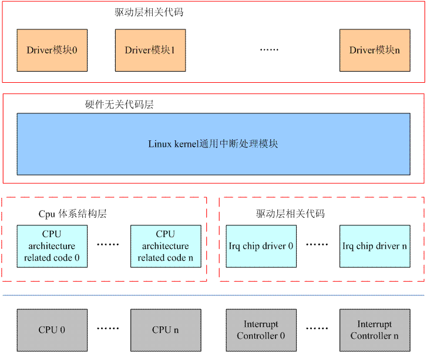

# Linux 中断子系统综述

## 硬件

中断硬件系统包含三种硬件：外设、中断控制器、CPU

- 外设提供 irq request line，在发生中断事件时，通过irq request line 上的电气信号向 CPU 系统请求处理。
- 外设的 irq request line 和 CPU 核心数会越来越多，这导致了不可能所有 irq request line 都连接到所有的 CPU 上，这时 CPU 就需要 interrupt controller 负责连接所有外设的 irq request line
- 不同的 interrupt controller 可以分别连接不同的外设，这些 interrupt controller 间一般以级联的方式连接
- interrupt controller 负责处理中断的优先级
- 对于 ARM 平台的 CPU 而言，inq request line 分为 IRQ 信号线和 FIQ 信号线两种

###  HW 中断系统的逻辑 block 图

- 多个 interrupt controller 组成树状结构
- 接口层面分为中断接口和控制接口

    - ARM 平台下，中断接口就是一个硬件的信号线，通过电平信号传递中断事件
    - Interrupt Controller 一般会开放一些寄存器让 CPU 访问，以便控制 Interrupt Controller 的状态，这些寄存器通过控制接口与 CPU 连接
    
### 多个 Interrupt controller 和多个 cpu 之间的拓扑结构

现在的 Interrupt controller 多数是支持多个 CPU core 的（例如 GIC 等）。以 GIC 为例，最多可以支持 1024 个 irq request line，如果某台机器上所有外设的 irq request line 少于 1024 个，硬件平台中用一个 GIC 就可以控制所有中断，并通过控制该 GIC 的寄存器可以将所有的外设中断分发给连接在该 interrupt controller 上的 CPU。如果  irq request line 太多，需要两个以上 GIC，一般采用两种方案：

- 将两个 GIC 分为 root GIC 和 secondary GIC， root GIC 直接连接到所有 CPU 上， secondary GIC 连接到 root GIC 的某个 SPI 上。

    - 优点：对于软件而言，这是比较简单的设计，secondary GIC 的 cpu interface 的设定是固定不变的，永远是从一个固定的 CPU interface 输出到 root GIC
    - 缺点：secondary GIC 的 PPI 和 SGI 都被架空。此外，在这种设定下，所有连接在 secondary GIC 上的外设中断要送达的 target CPU 是统一处理的，要么送去 CPU0，要么 CPU5，不能单独控制。

- 假设当前有 8 个 CPU 核心，可以让 GIC1 连接 CPU0-CPU4， GIC2 连接 CPU5-CPU7，由两个 GIC 分工处理不同外设的中断信号。但是这样的设计体现不出 8 核系统性能优势

### Interrupt controller 把中断事件送给哪个 CPU

解决这个问题更多是分析由硬件实现还是由软件实现，复杂的逻辑如果由硬件实现，那么就意味着更多的晶体管，更多的功耗。所以普遍的做法是：

- 硬件层面为 Interrupt Controller 支持的每一个中断设定一个 target cpu 的控制接口（以寄存器形式出现，例如 GIC，这个寄存器就是Interrupt processor target register）系统有多个 cpu，这个控制接口就有多少个  bit，每个 bit 代表一个CPU。
- 软件层面实现中断分配的控制逻辑，例如系统有两个 cpu core，某中断想轮流由两个 CPU 处理。那么当CPU0相应该中断进入 interrupt handler 的时候，可以将 Interrupt processor target register 中本 CPU 对应的 bit 设定为0，另外一个 CPU 的 bit 设定为1。这样，在下次中断发生的时候，interupt controller 就把中断送给了 CPU1。对于 CPU1 而言，在执行该中断的 handler 的时候，将 Interrupt processor target register 中 CPU0 的 bit 为设置为 1，disable 本 CPU 的比特位，这样在下次中断发生的时候，interupt controller 就把中断送给了 CPU0。

## 中断子系统相关的软件框架

- Linux kernel 通用中断处理模块与硬件无关，无论是哪种 CPU，哪种 controller，其中断处理的过程都有一些相同的内容，这些相同的内容被抽象出来此外，各个外设的驱动代码中，也希望能用一个统一的接口实现 irq 相关的管理（不和具体的中断硬件系统以及 CPU 体系结构相关）这些“通用”的代码组成了 linux kernel interrupt subsystem 的核心部分。
- CPU architecture 相关的中断处理。和系统使用的具体的CPU architecture相关。
- Interrupt controller 驱动代码。和系统使用的 Interrupt controller 相关。
- 普通外设的驱动。这些驱动将使用Linux kernel 通用中断处理模块的 API 来实现自己的驱动逻辑。

 
