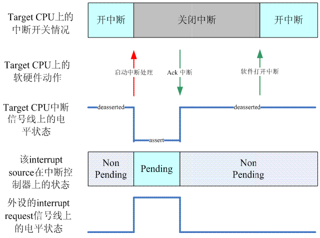
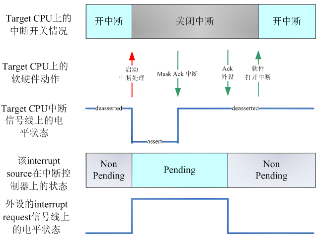

# High level irq event handler

## 前言

当外设触发一次中断后，一般过程如下： 

1. 具体 CPU architecture 相关的模块会进行现场保护，然后调用 machine driver 对应的中断处理 handler
2. machine driver 对应的中断处理 handler 中会根据硬件的信息获取 HW interrupt ID，并且通过 irq domain 模块翻译成 IRQ number 
3. 调用该 IRQ number 对应的 high level irq event handler，在这个 high level 的 handler 中，会通过和 interupt controller 交互，进行中断处理的 flow control（处理中断的嵌套、抢占等），当然最终会遍历该中断描述符的 IRQ action list，调用外设的 specific handler 来处理该中断 
4. 具体 CPU architecture 相关的模块会进行现场恢复

这里主要描述第三步，也就是 linux中断子系统的 high level irq event handler。

## 如何进入 high level irq event handler

### 从具体 CPU architecture 的中断处理到 machine 相关的处理模块

直接从 CPU 的中断处理跳转到通用中断处理模块是不可能的，中断处理不可能越过 interrupt controller 这个层次。一般而言，通用中断处理模块会提供一些通用的中断代码处理库，然后由 interrupt controller 这个层次的代码调用这些通用中断处理的完成整个的中断处理过程。“ interrupt controller 这个层次的代码”是和硬件中断系统设计相关的，例如：系统中有多少个 interrupt contrller ，每个 interrupt controller 是如何控制的？它们是如何级联的？我们称这些相关的驱动模块为 machine interrupt driver 。 

以 ARM 为例，如果配置了 CONFIG_MULTI_IRQ_HANDLER ，ARM 中断处理则直接跳转到一个叫做 handle_arch_irq 函数
```
    .macro    irq_handler
#ifdef CONFIG_MULTI_IRQ_HANDLER
    ldr    r1, =handle_arch_irq
    mov    r0, sp
    adr    lr, BSYM(9997f)
    ldr    pc, [r1]
#else
    arch_irq_handler_default
#endif
9997:
    .endm
```

如果系统中只有一个类型的 interrupt controller （可能是多个 interrupt controller ，例如使用两个级联的GIC），那么 handle_arch_irq 可以在 interrupt controller 初始化的时候设定
```c
……
if (gic_nr == 0) {
        set_handle_irq(gic_handle_irq);
}
……
```
- gic_nr 是GIC的编号，linux kernel 初始化过程中，每发现一个 GIC，都是会指向 GIC driver 的初始化函数的，不过对于第一个 GIC，gic_nr 等于0，对于第二个 GIC，gic_nr 等于 1。当然 handle_arch_irq 这个函数指针不是 per CPU 的变量，是全部 CPU 共享的，因此，初始化一次就 OK 了

使用多种类型的 interrupt controller 的时候（例如 HW 系统使用了 S3C2451 这样的 SOC，这时候，系统有两种 interrupt controller ，一种是 GPIO type ，另外一种是 SOC 上的 interrupt controller ），则不适合在 interrupt controller 中进行设定，这时候，可以考虑在 machine driver 中设定。在这种情况下，handle_arch_irq 这个函数是在 setup_arch 函数中根据 machine driver 设定，具体如下：
```c
handle_arch_irq = mdesc->handle_irq;
```

```c
DT_MACHINE_START(XXX, "XXX")
    ……
	.handle_irq = gic_handle_irq,
    ……
MACHINE_END
```

关于 CONFIG_MULTI_IRQ_HANDLER 配置项，可以理解为系统中有多个 irq handler，可以在run time的时候指定。为何要 run time 的时候，从多个 handler 中选择一个呢？ HW interrupt block 难道不是固定的吗？有一种猜想：一个 kernel 的 image 支持多个 HW platform，对于不同的 HW platform，在运行时检查 HW platform 的类型，设定不同的 irq handle。

### interrupt controller 相关的代码

以两个级联的 GIC 为例
```c
static asmlinkage void __exception_irq_entry gic_handle_irq(struct pt_regs *regs)
{
    u32 irqstat, irqnr;
    struct gic_chip_data *gic = &gic_data[0];               /* 获取 root GIC 的硬件描述符 */
    void __iomem *cpu_base = gic_data_cpu_base(gic);        /* 获取 root GIC mapping 到 CPU 地址空间的信息 */

    do {
        irqstat = readl_relaxed(cpu_base + GIC_CPU_INTACK); /* 获取 HW interrupt ID */
        irqnr = irqstat & ~0x1c00;

        if (likely(irqnr > 15 && irqnr < 1021)) {           /* SPI 和 PPI 的处理 */
            irqnr = irq_find_mapping(gic->domain, irqnr);   /* 将 HW interrupt ID 转成 IRQ number */
            handle_IRQ(irqnr, regs);                        /* 处理 irqnr 指定的中断 */
            continue;
        }
        if (irqnr < 16) {                                   /* IPI 类型的中断处理 */
            writel_relaxed(irqstat, cpu_base + GIC_CPU_EOI);
#ifdef CONFIG_SMP
            handle_IPI(irqnr, regs);
#endif
            continue;
        }
        break;
    } while (1);
} 
```

gic_handle_irq 调用 arm 的 handle_IRQ 函数来处理中断

handle_IRQ 函数通用中断处理模块的 generic_handle_irq 函数处理，首先获取中断描述符 desc，然后通过 desc->handle_irq 函数指针调用设置好的函数
```c
int generic_handle_irq(unsigned int irq)
{
    struct irq_desc *desc = irq_to_desc(irq); /* 通过 IRQ number获取该irq的描述符 */

    if (!desc)
        return -EINVAL;
    generic_handle_irq_desc(irq, desc);       /* 调用 high level irq handler 来处理该 IRQ */
    return 0;
}

static inline void generic_handle_irq_desc(unsigned int irq, struct irq_desc *desc)
{
    desc->handle_irq(irq, desc);
} 
```

## 理解 high level irq event handler 需要的知识准备

### 自动探测 IRQ

一个硬件驱动可以通过下面的方法进行自动探测可用的 IRQ number：
```c
unsigned long mask;
int irq;

mask = probe_irq_on();      /* 启动 IRQ number自动探测 */
...                         /* 触发一次中断 */
irq = probe_irq_off(mask);  /* 结束 IRQ number自动探测 */
```
如果能够自动探测到可用的 IRQ number，上面程序中的 irq (probe_irq_off 的返回值)就是自动探测的结果。后续程序可以通过 request_irq 或 request_threaded_irq 注册 ISR。

probe_irq_on 函数主要的目的是返回一个 32 bit 的掩码，通过该掩码可以知道可用的 IRQ number 有哪些
```c
unsigned long probe_irq_on(void)
{
	struct irq_desc *desc;
	unsigned long mask = 0;
	int i;
    
    ……
    
    for_each_irq_desc_reverse(i, desc) { /* 将 nr_irqs-1 到 0 的所有 IRQ number 转换成 desc */
        raw_spin_lock_irq(&desc->lock);
        /*
         * 可用的 ISR number 需要具足两个条件：
         * 1. IRQ number 未被注册 ISR ，即 desc->action 为空
         * 2. 该中断描述符允许自动探测，即 desc->status_use_accessors 没有设置 _IRQ_NOPROBE 位
         */
        if (!desc->action && irq_settings_can_probe(desc)) { 
            desc->istate |= IRQS_AUTODETECT | IRQS_WAITING;  /* 将备选 desc 的 internal state 设置为 IRQS_AUTODETECT | IRQS_WAITING，即正处于自动探测状态 */
            if (irq_startup(desc, false))
                desc->istate |= IRQS_PENDING;
        }
        raw_spin_unlock_irq(&desc->lock);
    } 
    msleep(100);

    for_each_irq_desc(i, desc) {
        raw_spin_lock_irq(&desc->lock);

        if (desc->istate & IRQS_AUTODETECT) {
            if (!(desc->istate & IRQS_WAITING)) {   /* desc->istate 只设置 IRQS_AUTODETECT 而没有设置 IRQS_WAITING 表示该 IRQ number 可能因为 spurious interrupts 导致不可用 */
                desc->istate &= ~IRQS_AUTODETECT;
                irq_shutdown(desc);                 /* 清除 IRQ number 对应 desc 的 IRQS_AUTODETECT 位，然后关闭 */
            } else
                if (i < 32)         
                    mask |= 1 << i; /* mask 用来标识可用的 IRQ number */
        }
        raw_spin_unlock_irq(&desc->lock);
    }

    return mask;
} 
```
- msleep(100) 时，系统可以执行其他执行单元，因为在等待过程中，系统依然允许，触发各种中断。在各种 high level irq event handler 中，总会有如下的代码，以清除desc->istate 的 IRQS_WAITING状态：
```c
desc->istate &= ~(IRQS_REPLAY | IRQS_WAITING); 
```
- mask 最多只能标识 0-31 号 IRQ number，因为它是32 bit的value

```c
int probe_irq_off(unsigned long val)
{
    int i, irq_found = 0, nr_of_irqs = 0;
    struct irq_desc *desc;

    for_each_irq_desc(i, desc) {
        raw_spin_lock_irq(&desc->lock);

        if (desc->istate & IRQS_AUTODETECT) {       /* 只扫描设置 IRQS_AUTODETECT 位的描述符 */
            if (!(desc->istate & IRQS_WAITING)) {   /* desc->istate 清除了 IRQS_WAITING 位，表示该 desc 对应的 irq number 为可用的 irq number */
                if (!nr_of_irqs)
                    irq_found = i;  /* 返回第一个可用 irq number */
                nr_of_irqs++;
            }
            desc->istate &= ~IRQS_AUTODETECT;
            irq_shutdown(desc);                     /* 无论是否是可用 IRQ number，其对应的 desc 清除 IRQS_AUTODETECT 位，然后关闭 */                             
        }
        raw_spin_unlock_irq(&desc->lock);
    }
    mutex_unlock(&probing_active);

    if (nr_of_irqs > 1)                             /* 如果找到多个的 IRQ number，表示探测失败，将可用 IRQ number 个数置为负数并返回 */
        irq_found = -irq_found;

    return irq_found;
} 
```
>备注：因为之前触发了一次中断，在该中断的 high level handler 执行时会清除硬件对应的 desc->istate 的 IRQS_WAITING 位，所以以此为依据判定该 desc 对应的 IRQ number 可用

### 中断触发的类型

中断触发的类型分为电平触发（level trigger）和边缘触发（edge trigger）：

- 电平触发的中断很简单、直接，CPU 检测到硬件事件（例如有数据来时，外设IRQ 信号线上的电平状态会发生改变）时会进入中断状态，然后对指定外设 IRQ 信号线上的电平信号进行 assert 操作（把该信号设置为 active 状态），CPU ack 该中断后，外设 IRQ 信号线电平信号消失。
- 边缘触发的中断，CPU 通过检测外设 IRQ 信号线上上升沿或者下降沿的电平改变来进入/退出中断状态，由于这个状态不是一个持续的状态，如果软件处理不好，容易丢失中断。

### resend 中断

边缘触发的中断因为容易丢失，所以需要检查 desc->istate 的 IRQS_PENDING 位是否设置，如果设置，则需要清除该位并设置 IRQS_REPLAY 位，然后调用 irq chip 的 irq_retrigger callback 重新触发一次中断

电平触发的中断不存在需要 resend 的问题

Linux 中 resend 中断代码如下：
```c
void check_irq_resend(struct irq_desc *desc, unsigned int irq)
{
    /* 电平中断不存在resend的问题 */
    if (irq_settings_is_level(desc)) {
        desc->istate &= ~IRQS_PENDING;
        return;
    }
    /* 如果已经设定resend的flag，退出就OK了，这个应该和 irq 的 disable enable 能多层嵌套相关  */
    if (desc->istate & IRQS_REPLAY)
        return;
    /* 如果有pending的flag则进行处理 */           
    if (desc->istate & IRQS_PENDING) {
        desc->istate &= ~IRQS_PENDING;
        desc->istate |= IRQS_REPLAY;    /* 设置retrigger标志 */

        if (!desc->irq_data.chip->irq_retrigger ||
            !desc->irq_data.chip->irq_retrigger(&desc->irq_data)) { /* 调用底层irq chip的callback */
#ifdef CONFIG_HARDIRQS_SW_RESEND    /* 设置 CONFIG_HARDIRQS_SW_RESEND 宏则使用softirq 来重新触发中断 */
            ...
#endif
        }
    }
} 
```

high level irq event handler 执行时，会清除掉 IRQS_REPLAY 状态，表示该中断已经被retrigger，一次resend interrupt的过程结束。
```c
desc->istate &= ~(IRQS_REPLAY | IRQS_WAITING); 
```

### unhandled interrupt 和 spurious interrupt

high level irq-events handler 的最后一般调用 handle_irq_event -> handle_irq_event_percpu 来处理中断。handle_irq_event_percpu 的最后通过调用 note_interrupt 处理 unhandled interrupt 和 spurious interrupt：
```c
rqreturn_t
handle_irq_event_percpu(struct irq_desc *desc, struct irqaction *action)
{
    ……

    if (!noirqdebug)
        note_interrupt(irq, desc, retval);
    return retval;
} 
```
- noirqdebug 可以在 command line 参数中打开或关闭

unhandle interrupt 和 spurious interrupt 一般由硬件异常引起，当硬件处于异常状态的时候往往是非常短的时间触发非常多次的中断，而 CPU 不可能处理每一次这样的中断（这就是 unhandle interrupt ）

unhandle interrupt 和  spurious interrupt 有两种可能的现象：

- 设备没有为该中断注册 ISR
- 设备为该中断注册了 ISR，但是该 ISR 否认自己是因为中断发生而被触发

对于 unhandle interrupt 和 spurious interrupt，Linux 内核采取这样的策略：如果该 IRQ 触发了100,000次，但是99,900 次没有处理，在这种条件下，就 disable 这个 interrupt request line。

irq_desc 中的 irq_count last_unhandled irqs_unhandled 用来控制这个异常操作：

- irq_count： 记录发生的中断的次数，每100,000则回滚 
- last_unhandled： 上一次没有处理的 IRQ 的时间点
- irqs_unhandled： 记录没有处理的次数

具体 unhandle interrupt 处理逻辑如下：
```c
void note_interrupt(unsigned int irq, struct irq_desc *desc,  irqreturn_t action_ret)
{
    if (desc->istate & IRQS_POLL_INPROGRESS ||  irq_settings_is_polled(desc))
        return;

    if (bad_action_ret(action_ret)) {       /* 报告错误，这些是由于 specific handler 的返回错误导致的 */
        report_bad_irq(irq, desc, action_ret);
        return;
    }
  
    if (action_ret & IRQ_WAKE_THREAD)       /* 和中断处理线程化相关 */
        ...

    if (unlikely(action_ret == IRQ_NONE)) {                     /* action_ret == IRQ_NONE 表示中断未被处理 */
        if (time_after(jiffies, desc->last_unhandled + HZ/10))  /* 两次 unhandle interrupt 发生间隔大于 10 jiffies，视为忽略掉该 unhandle interrupt，初始化 irqs_unhandled 计数器 */
            desc->irqs_unhandled = 1;
        else                                                    /* 只有当两次 unhandle interrupt 发生 10 个 jiffies 内，该 unhandle interrput 才需要处理（irqs_unhandled 计数加一） */
            desc->irqs_unhandled++;
        desc->last_unhandled = jiffies;                         /* 保存本次 unhandled interrupt 对应的 jiffies 时间 */
    }

    if (unlikely(try_misrouted_irq(irq, desc, action_ret))) {   /* 是否启动 Misrouted IRQ fixup */
        int ok = misrouted_irq(irq);
        if (action_ret == IRQ_NONE)
            desc->irqs_unhandled -= ok;
    }

    desc->irq_count++;
    if (likely(desc->irq_count < 100000))           /* 中断发生不到 100000 次，直接返回 */
        return;

    desc->irq_count = 0;                            /* 中断发生满 100000 次，回滚 irq_count 计数器 */
    if (unlikely(desc->irqs_unhandled > 99900)) {   /* interrupt unhandle 次数达到 99900，disable 该 IRQ line */

        __report_bad_irq(irq, desc, action_ret);    /* 报告错误 */

        desc->istate |= IRQS_SPURIOUS_DISABLED;
        desc->depth++;
        irq_disable(desc);

        mod_timer(&poll_spurious_irq_timer,
              jiffies + POLL_SPURIOUS_IRQ_INTERVAL); /* 启动 timer，轮询整个系统中的 handler 来处理这个中断 */
    }
    desc->irqs_unhandled = 0;
} 
```
- poll_spurious_irq_timer 的 callback 函数定义如下：
    ```c
    static void poll_spurious_irqs(unsigned long dummy)
    {
        struct irq_desc *desc;
        int i;

        if (atomic_inc_return(&irq_poll_active) != 1)   /* 确保系统中只有一个执行单元进入临界区 */
            goto out;
        irq_poll_cpu = smp_processor_id();              /* 记录当前正在 polling 的 CPU */

        for_each_irq_desc(i, desc) {                    /* 遍历所有的中断描述符 */
            unsigned int state;

            if (!i)                                     /* 跳过 0 号中断描述符。对于 X86，这是timer的中断 */
                continue;

            /* Racy but it doesn't matter */
            state = desc->istate;
            barrier();                                  /* 插入 barrier 以确保以下操作顺序不会因编译器优化而百变 */
            if (!(state & IRQS_SPURIOUS_DISABLED))      /* desc->istate 没有设置 IRQS_SPURIOUS_DISABLED 位，则跳过 */
                continue;

            local_irq_disable();                        /* 关闭 CPU 上所有中断线路 */
            try_one_irq(i, desc, true);                 /* 尝试处理中断 */
            local_irq_enable();                         /* 重启 CPU 上所有中断线路 */
        }
    out:
        atomic_dec(&irq_poll_active);
        mod_timer(&poll_spurious_irq_timer,             /* 一旦触发了该 timer，就停不下来 */
            jiffies + POLL_SPURIOUS_IRQ_INTERVAL);
    }     
    ```

## 和 high level irq event handler 相关的硬件描述

### CPU layer 和 Interrupt controller 之间的接口

从逻辑层面上看，CPU和interrupt controller之间的接口包括：

- 触发中断的signal：
    
    ARM CPU 下包括 nIRQ 和 nFIQ 信号线，linux kernel 的中断子系统，只使用其中一个信号线（例如 ARM，只使用 nIRQ 信号线）。从 CPU 层面看，其逻辑动作非常的简单，不区分优先级，触发中断的那个信号线一旦assert，并且 CPU 没有mask中断，那么软件就会转到一个异常向量执行，完毕后返回现场。

- Ack 中断的 signal：

    对于 ARM＋GIC，这个信号就是通过总线读一次 GIC 的 IAR（Interrupt Acknowledge Register）寄存器。CPU 的 ack 中断信号会标识 CPU 开启启动中断服务程序（ISR）去处理该中断，同时也就是获取了发生中断的 HW interrupt ID，总而言之，ack 中断后，CPU 获取了足够开启执行中断处理的信息。
    
- 结束中断（EOI，end of interrupt）的signal：

    这个 signal 用来标识 CPU 已经完成了对该中断的处理（ISR 执行完毕）。信号的物理形态和 ack 中断信号类似。

- 控制总线和数据总线接口：

    通过这些接口，CPU 可以访问（读写）interrupt controller 的寄存器。

### Interrupt controller 和 Peripheral device 之间的接口 

Interrupt controller 和 Peripheral device 之间的接口都是一个 IRQ line。外设通过这个信号线上的电平或者边缘通过 interrupt controller 向 CPU 申请中断服务。 

## 几种典型的 high level irq event handler

设定 high level irq event handler 时需要注意，不是外设使用电平触发就选用 handle_level_irq，选择什么样的 high level irq event handler 是由 Interrupt controller 的行为以及外设电平触发方式决定。

### 边缘触发的 handler

handle_edge_irq 的硬件中断系统行为如下



以上升沿为例描述边缘中断为例：

1. 当 interrupt controller 检测到了上升沿信号，会将该上升沿状态（pending）锁存在寄存器中，并向 CPU 发送触发中断信号。
    
    此时外设和 interrupt controller 之间的 IRQ line 保持在高电平，在中断控制器上处于 pending 状态，这意味着 interrupt controller 不能检测到新的中断信号；CPU 和 interrupt controller 之间的中断信号线处于低电平，状态为 assert；CPU 中断系统关闭；
    
2. 通过执行 irq_chip 的 irq_ack callback 函数，CPU 向中断控制器发出 ACK 中断信号

    此时 CPU 和 interrupt controller 之间的中断信号线处于高电平，状态为 deasserted，此时开始执行 ISR；外设和 interrupt controller 之间的 IRQ line 处于在低电平，中断控制器解除 pending 状态，可以检测新的中断信号。
    
3. 软件重启 CPU 中断系统。

>备注：
> 1. ARM＋GIC组成的系统不符合这个类型。因为调用 high level handler 之前，中断处理程序需要通过读取 IAR 寄存器获得 HW interrpt ID 并转换成 IRQ number ，因此实际上，对于 GIC 的 irq chip ，它是无法提供本场景中的 irq_ack 函数。
> 2. 大部分的 GPIO type 的interrupt controller 符合上面的条件，它们会提供 pending 状态寄存器，读可以获取 pending 状态，而向 pending 状态寄存器写1可以 ack 该中断，让 interrupt controller 可以继续触发下一次中断。

handle_edge_irq 代码如下:
```c
void handle_edge_irq(unsigned int irq, struct irq_desc *desc)
{
    raw_spin_lock(&desc->lock);                             /* 防止其他 CPU 访问该 desc ，在 执行 ISR 前释放自旋锁 */

    desc->istate &= ~(IRQS_REPLAY | IRQS_WAITING);          /* 清除 IRQS_REPLAY 和 IRQS_WAITING 位 */

    /*
     * 以下三+add种情况，标记 IRQS_PENDING， Mask ACK 中断，然后退出：
     * 1. 该中断事件已经被其他的 CPU 处理
     * 2. 该 IRQ number 被其他执行单元 disable
     * 3. 该 IRQ number 没有注册 ISR
     * add. 中断没有被轮询
     */
    if (unlikely(irqd_irq_disabled(&desc->irq_data) ||      
             irqd_irq_inprogress(&desc->irq_data) ||
             !desc->action)) {
        if (!irq_check_poll(desc)) {
            desc->istate |= IRQS_PENDING;
            mask_ack_irq(desc);     /* irq chip 屏蔽中断源，此时中断控制器能响应中断，但是不转发给CPU。如果不 mask，事情会变得很复杂 */
            goto out_unlock;
        }
    }
    kstat_incr_irqs_this_cpu(irq, desc);                    /* 更新该IRQ统计信息 */


    desc->irq_data.chip->irq_ack(&desc->irq_data);          /* ACK 中断 */

    do {
        /* 
         * 执行 ISR 时是不持有 desc->lock 的，所以其他执行单元可能会释放该 ISR，因此 desc->action 可能为空.
         * 此时需要屏蔽（mask） 中断源，然后退出 high level irq event handler
         */
        if (unlikely(!desc->action)) {
            mask_irq(desc);
            goto out_unlock;
        }

        /* 
         * 执行 ISR 时是不持有 desc->lock 的，如果此时再触发中断，其他执行单元会处理该中断，导致 IRQ line 在中断控制器上重新处于 pending 状态。
         * 此时需要将中断源解除屏蔽（unmask），这样后续的中断可以继续触发，由其他的CPU处理
         */
        if (unlikely(desc->istate & IRQS_PENDING)) { 
            if (!irqd_irq_disabled(&desc->irq_data) &&
                irqd_irq_masked(&desc->irq_data))
                unmask_irq(desc);
        }

        handle_irq_event(desc);    /* 清除 IRQS_PENDING 状态，设置 IRQD_IRQ_INPROGRESS 状态，然后执行 ISR，处理完成清除 IRQD_IRQ_INPROGRESS 状态 */

    } while ((desc->istate & IRQS_PENDING) &&
         !irqd_irq_disabled(&desc->irq_data)); /* IRQS_PENDING 位清除或 IRQ number disable，则结束处理*/

out_unlock:
    raw_spin_unlock(&desc->lock); 
} 
```

### 电平触发的 handler

handle_level_irq 的硬件中断系统行为如下：



以高电平触发中断为例：

1. 当中断控制器检测到了高电平信号，向 CPU 发送触发中断信号。
    
    此时外设和中断控制器之间的 IRQ line 保持在高电平，在中断控制器上处于 pending 状态，这意味着中断控制器不能检测到新的中断信号；CPU 和中断控制器之间的中断信号线处于低电平，状态为 assert；CPU 中断关闭。
    
2. CPU 向中断控制器发送 Mask ACK 中断信号。

    Mask 信号会使中断控制器能响应中断，但是不会通知 CPU 处理处理；ACK 信号使 CPU 和中断控制器之间的中断信号线处于高电平，状态改为 deasserted，但是不会改变外设和中断控制器之间的 IRQ line 的电频状态。此时开始执行 ISR。
    
3. ISR 向外设发送 ACK 信号
    
    此时外设和中断控制器之间的 IRQ line 的变为低电平，中断控制器解除 pending 状态，可以继续触发中断
    
4. 软件重启 CPU 中断系统


```c
void handle_level_irq(unsigned int irq, struct irq_desc *desc)
{
    raw_spin_lock(&desc->lock);
    mask_ack_irq(desc);                                     /* 向中断控制器发送 Mask ACK 中断信号 */

    if (unlikely(irqd_irq_inprogress(&desc->irq_data)))     /* 该中断事件已经被其他的 CPU 处理 */
        if (!irq_check_poll(desc))
            goto out_unlock;

    desc->istate &= ~(IRQS_REPLAY | IRQS_WAITING);  /* 和 retrigger 中断以及自动探测 IRQ 相关 */
    kstat_incr_irqs_this_cpu(irq, desc);

    /* 
     * 如果其他执行单元 disable 了 IRQ number 或没有注册 ISR，mark 为 Pending, 然后退出。
     * 当其他执行单元离开临界区，enable 该中断的时候，软件会检测pending状态并resend该中断。
     */
    if (unlikely(!desc->action || irqd_irq_disabled(&desc->irq_data))) {
        desc->istate |= IRQS_PENDING;
        goto out_unlock;
    }

    handle_irq_event(desc);

    cond_unmask_irq(desc);      /* 在非线程化中断处理环境下，直接 unmask 中断控制器 */

out_unlock:
    raw_spin_unlock(&desc->lock);
} 
```