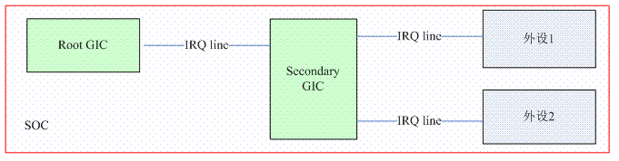

# request_irq 函数

## linux 实时性分析以及中断线程化

### 非抢占式linux内核的实时性


上图描述了非抢占式内核任务调度的流程：

1. 起始：高优先级任务 P0（橙色 block）因为要等待中断而进入阻塞状态，此时调度低优先级任务 P1（紫色 block）执行。P1 运行过程中，执行了某个系统调用，从用户空间切换到内核空间，执行临界区的代码
2. T0 时刻：P0 等待的中断触发，此时 P1 仍然处在临界区，因而不能处理 P0 等待的中断
3. T1 时刻：P1 退出临界区，此时 CPU 进入中断处理
4. T2 时刻：开始执行 ISR
5. T3 时刻：P0 进入 runable 状态，然后 ISR 完成执行，然后回到 P1 的系统调用现场，此时不存在抢占点，需要等待 P1 执行完系统调用
6. T4 时刻：P1 执行玩系统调用，切环回用户空间时抢占点出现，此时调度执行 P0

T0 -- T2 之间，被称为中断延迟（interrupt latency），此期间系统需要确定 HW interrupt ID，获取 IRQ number，ack 或 mask 中断，调用 ISR等。延迟时长取决于两点：

- HW 造成的延时（中断控制器识别外设的中断事件并向 CPU 发送触发中断信号）。
- 软件原因，如内核代码中由于要保护临界区而关闭中断引起的延时。

T3 -- T4 之间，被称为任务响应时间（Task Response Time）。

### 抢占式 linux 内核的实时性

CONFIG_PREEMPT 选项打开后，linux kernel就支持了内核代码的抢占


上图描述了抢占式内核任务调度的流程，T4 时刻之前，情况和非抢占式内核一样，T4 时刻的区别在于：

    对于抢占式内核而言，即便是从中断上下文返回内核空间的进程上下文，只要内核代码不在临界区内，就可以发生调度，让最高优先级的任务调度执行。

    非抢占式 linux 内核，进程通过系统调用进入内核空间，在切环回用户空间前，不可以被其他用户空间进程抢占。

无论抢占式内核还是非抢占式内核，中断上下文都拥有最高的权限，以抢占进程上下文（无论是内核态还是用户态），甚至可以抢占其他的中断上下文。

相对非抢占式内核，抢占式内核会使平均任务响应时间更短，这种情况下，两个因素会影响任务响应时间：

- 为了同步，内核中总有些代码需要持有自旋锁资源，或者显式的调用 preempt_disable 来禁止抢占
- 中断上下文（不止中断处理，还包括 softirq、timer、tasklet）总是可以抢占进程上下文

### 进一步提高 linux 内核的实时性

在 Linux 内核中，一个外设的中断处理被分为 top half 和 bottom half，top half 进行最关键，最基本的处理，而比较耗时的操作被放到 bottom half（softirq、tasklet）中延迟执行。

但是 bottom half 的优先级始终高于普通线程，使得 Linux 的实时性仍然不尽如人意。

因此 Linux 内核借鉴了 RTOS 的某些特性，如果某些设备驱动需要耗时的 interrupt handler，Linux 内核提供了线程化处理机制，让所有执行单元（无论是内核线程还是用户空间创建的线程，还是驱动的interrupt thread）具有相同的优先级。

## request_thread_irq 函数

### 输入参数

| 输入参数 | 描述 |
|:--:|:--|
| irq| 要注册handler的那个IRQ number。这里要注册的 handler 包括两个，一个是传统意义的中断 handler，我们称之 primary handler ，另外一个是 threaded interrupt handler |
| handler | primary handler。需要注意的是 primary handler 和 threaded interrupt handler 不能同时为空，否则会出错 |
| thread_fn | threaded interrupt handler。如果该参数不是NULL，那么系统会创建一个kernel thread，调用的 function 就是 thread_fn |
| irqflags | 描述中断管理的选项 |
| *devname | 是 ISR 名, 会在 /proc/interrupts 中记录 |
| *dev_id | 用于多个外设共享的 IRQ number 注册和释放，这种情况下会有多个 ISR 挂在 desc->action 列表上，需要用 dev_id 来标识每一个 ISR；如果想要独占 IRQ，只需将 dev_id 设置为 NULL 即可, 也可指向一个特定的设备结构 |

### 输出参数

0 表示成功执行，负数表示各种错误原因。

### interrupt typt flags

| flag 定义 | 描述 |
|:--:|:--|
| IRQF_TRIGGER_XXX | 描述该 interrupt line 触发类型 |
| IRQF_DISABLED | 已废弃。具体可以参考：[Disabling IRQF_DISABLED](http://lwn.net/Articles/380931/) |
| IRQF_SHARED | 描述一个 IRQ line 是否允许被多个外设共享 |
| IRQF_PROBE_SHARED | 标识该 interrupt action descriptor 是否允许和其他 device 共享一个 IRQ number |
| IRQF_PERCPU | 标识该 interrupt 是 per cpu 的（属于一个特定 CPU）|
| IRQF_NOBALANCING | CPU 共享的中断默认分配规则是平均照顾每个CPU的，设置这个 FLAG 表示不使用 CPU 均衡策略 |
| IRQF_IRQPOLL | |
| IRQF_ONESHOT | 标识中断是一次性触发的，不能嵌套 |
| IRQF_NO_SUSPEND | 标识在系统 suspend 的时候，不能 disable 中断源 |
| IRQF_FORCE_RESUME | 标识在系统 resume 的过程中，强制 enable 中断源，即便是设定了 IRQF_NO_SUSPEND 这个flag，一般和特定的硬件行为相关的。|
| IRQF_NO_THREAD | 中断处理不能线程化，适用于一些底层的中断（如系统timer的中断、Secondary GIC 对应的中断），因为线程化会导致一大批附属于该中断控制器的外设的中断响应延迟。 |
| IRQF_EARLY_RESUME | |
| IRQF_TIMER | |

- IRQF_SHARED 不推荐用于于支持很多 interrupt source 的中断控制器：
    
    共享 IRQ line 的 ISR 有一些额外的开销，处理中断时要逐个询问 desc->action 列表上的 ISR 是不是你的中断，这就需要在设计外设的 ISR 时最好一开始就匹配 dev_id，如果不匹配，返回 IRQ_NONE,表示 ISR 不负责该中断。
    ```c
    irqreturn_t handle_irq_event_percpu(struct irq_desc *desc, struct irqaction *action)
    {

        do {
            irqreturn_t res; 
            res = action->handler(irq, action->dev_id);

        ……
            action = action->next;
        } while (action);

        ……
    }
    ```
      
    对于HW，中断控制器的一个 interrupt source 的引脚不能直接连接到两个外设的 IRQ line上，对于低电平触发的中断，一般用与门连接中断控制器和外设
    
- IRQF_PROBE_SHARED 实际上是否能够 share 还是需要其他条件：例如触发方式必须相同。
- IRQF_ONESHOT 对于 primary handler 和 能够 mask 中断源 的 threaded interrupt handler 不起作用，因为这两种中断的处理过程中是不会发生嵌套的（即 one shot，一次性触发）；对于不能 mask 中断源，中断处理期间也不能被嵌套打断的情况下（如使用HDQ协议通信的电池驱动），则需要设置 IRQF_ONESHOT flag

## request_threaded_irq 代码分析

### request_threaded_irq 主流程

```c
int request_threaded_irq(unsigned int irq, irq_handler_t handler,
             irq_handler_t thread_fn, unsigned long irqflags,
             const char *devname, void *dev_id)
{ 
    if ((irqflags & IRQF_SHARED) && !dev_id)            /* flag 设置 IRQF_SHARED ， 则 dev_id 不能为空*/
        return -EINVAL;

    desc = irq_to_desc(irq);                            /* 通过IRQ number获取对应的中断描述符 */
    if (!desc)         return -EINVAL;
    
    /* 
     * irq_settings_can_request 判断 desc 是否被标识为 IRQ_NOREQUEST，如果是则不能被其他驱动注册。
     * 被标识为 IRQ_NOREQUEST 一般有特殊作用，例如用于级联的那个IRQ number是不能request. 
     *
     * irq_settings_is_per_cpu_devid 判断 desc 是否要将 dev_id 作为 per cpu 变量，如果是则报错。
     * request_percpu_irq 函数可以将 dev_id 作为 per cpu 变量，而不能使用 request_threaded_irq
     * 如果要使用 request_threaded_irq 为注册 per cpu 中断， dev_id 需是统一值
     */
    if (!irq_settings_can_request(desc) ||              
        WARN_ON(irq_settings_is_per_cpu_devid(desc)))
        return -EINVAL;

    /* 
     * handler 和 thread_fn 二者不能都为空
     * 默认情况下，中断处理被合理的分配给 handler 和 thread_fn
     * handler 如果为空，会被设置为 linux 默认 handler
     * thread_fn 如果为空，中断处理在 handler 中完成
     */
    if (!handler) {
        if (!thread_fn)
            return -EINVAL;
        handler = irq_default_primary_handler;
    }

    action = kzalloc(sizeof(struct irqaction), GFP_KERNEL);

    action->handler = handler;
    action->thread_fn = thread_fn;
    action->flags = irqflags;
    action->name = devname;
    action->dev_id = dev_id;

    chip_bus_lock(desc);                        /* 实际调用 irq_bus_lock callback 函数，只对连接在慢速总线上的中断控制器有效 */
    retval = __setup_irq(irq, desc, action);    /* 实际的注册 ISR 函数 */
    chip_bus_sync_unlock(desc);
} 
```

### 注册 irqaction

#### nested IRQ 的处理



上图是一个两个 GIC 级联的例子，所有的 HW block 封装在了一个 SOC chip 中。为了方便描述，我们先进行编号：Secondary GIC 的 IRQ number 是 A ，外设1的IRQ number是 B，外设2的 IRQ number 是 C 。对于上面的硬件，linux kernel处理如下：

- IRQ A 的中断描述符被设定为不能注册 irqaction （即 ISR）
- IRQ A 的 high level irq-events handler 负责进行 IRQ number 的映射，在其 irq domain 上翻译出具体外设的 IRQ number，并重定向到外设 IRQ number 对应的 high level irq-events handler。
- 所有外设驱动的中断正常 request irq，可以任意选择线程化的 handler，或者只注册 primary handler。 


上图是一个中断控制器嵌套（nested）的例子

IO expander HW block 可视为一个中断控制器，它提供了有中断功能的 GPIO，有它自己的 irq domain 和 irq chip。外设1和外设2使用了IO expander上有中断功能的 GPIO，它们有属于自己的 IRQ number 以及中断描述符。IO expander HW block 的 IRQ line 连接到 SOC 内部的 interrupt controller 上，所以也可视为一种中断控制器级联的情况。

这种情况下外设1上产生中断，如果采取和 GIC 级联一样的处理方式，关中断的时间非常长，因为IRQ B的的中断描述符的 highlevel irq-events handler 处理涉及I2C的操作（慢速操作）。对于这种硬件情况， linux 内核处理如下：

- IRQ A 的中断描述符的 high level irq-events handler 根据实际情况进行设定，并且允许注册 irqaction。对于连接到 IO expander 上的外设，它是没有 real time 的要求的（否则也不会接到 IO expander 上），因此一般会进行线程化处理。由于 thread_fn 中涉及 I2C 操作，因此要设定 IRQF_ONESHOT 的 flag。
- 在 IRQ A 的中断描述符的 threaded interrupt handler 中进行进行 IRQ number 的映射，在 IO expander irq domain 上翻译出具体外设的IRQ number，并直接调用 handle_nested_irq 函数处理该 IRQ。
- 外设对应的中断描述符设置 IRQ_NESTED_THREAD flag ，表明这是一个 nested IRQ 。nested IRQ 没有 high level irq-events handler，也没有 primary handler，它的 thread_fn 是附着在其 parent IRQ 的 thread_fn 上的。

注册 ISR 的时候，对于设置了 IRQ_NESTED_THREAD flag 的 desc，irqaction 需要设置 thread_fn，否则就会出错返回。代码如下
```c
static int __setup_irq(unsigned int irq, struct irq_desc *desc, struct irqaction *new)
{
    ……
    nested = irq_settings_is_nested_thread(desc);
    if (nested) {
        if (!new->thread_fn) {
            ret = -EINVAL;
            goto out_mput;
        }
        new->handler = irq_nested_primary_handler;
    } else { 
    ……
    }
    ……
} 
```
- 为了调试，kernel将 handler 设定为 irq_nested_primary_handler，以便在调用的时候打印一些信息
- 内核是不会单独为 thread_fn 创建一个 thread，它借着其 parent IRQ 的 thread_fn 执行（详见创建 interrupt 线程代码，执行条件为 new->thread_fn && !nested ）

#### forced irq threading 处理 

对于非 nested IRQ，只要注册 ISR 时没有设置 IRQF_NO_THREAD，Linux 内核要求将 ISR 全部线程化，即使在 request_irq 时只设置了 handler，而没有 thread_fn。
```c
static int __setup_irq(unsigned int irq, struct irq_desc *desc, struct irqaction *new)
{
    ……
    nested = irq_settings_is_nested_thread(desc);
    if (nested) { 
    ……
    } else {
        if (irq_settings_can_thread(desc))
            irq_setup_forced_threading(new);
    }
    ……
} 
```

如果 desc 没有设置 _IRQ_NOTHREAD， __setup_irq 使用 irq_setup_forced_threading 函数用于将 ISR 线程化
```c
static void irq_setup_forced_threading(struct irqaction *new)
{
    if (!force_irqthreads)  /* CONFIG_IRQ_FORCED_THREADING 选项开启，且传入命令行参数 threadirqs 才允许 ISR 线程化 */
        return;
    if (new->flags & (IRQF_NO_THREAD | IRQF_PERCPU | IRQF_ONESHOT))     /* 这里再检查一次 NOTHREAD 是为了确认使用 ISR 线程化 */
        return;

    new->flags |= IRQF_ONESHOT; /* 设置 IRQF_ONESHOT flag 可以保证 thread_fn 不会重入，和 botton half 不会抢占 top half 执行 */

    if (!new->thread_fn) {
        set_bit(IRQTF_FORCED_THREAD, &new->thread_flags);   /* 给 ISR 设置 IRQTF_FORCED_THREAD，表示强制线程化 */
        new->thread_fn = new->handler; /* 将 handler 当做 thread_fn 处理 */
        new->handler = irq_default_primary_handler; /* irq_default_primary_handler 只返回 IRQ_WAKE_THREAD */
    }
} 
```

#### 创建 interrupt 线程

```c
if (new->thread_fn && !nested) {
    struct task_struct *t;
    static const struct sched_param param = {
        .sched_priority = MAX_USER_RT_PRIO/2,
    };

    t = kthread_create(irq_thread, new, "irq/%d-%s", irq,
               new->name);  /* 创建内核线程 */

    sched_setscheduler_nocheck(t, SCHED_FIFO, &param); /* 设置中断线程的调度策略和调度优先级 */


    get_task_struct(t);     /* 内核线程的引用计数加一， */
    new->thread = t;        /* 将 irqaction 的 thread 成员设置为内核线程，这样 handler 就知道唤醒哪一个中断线程 */

    set_bit(IRQTF_AFFINITY, &new->thread_flags);    /* 设置 IRQTF_AFFINITY */
}

if (!alloc_cpumask_var(&mask, GFP_KERNEL)) {        /* 分配 cpu mask 的变量的内存 */
    ret = -ENOMEM;
    goto out_thread;
}
if (desc->irq_data.chip->flags & IRQCHIP_ONESHOT_SAFE)  /* 对于某些本身就是 one shut 的中断控制器（如MSI based interrupt），irqaction 不用再另外设置 IRQF_ONESHOT */
    new->flags &= ~IRQF_ONESHOT; 
```

#### 共享中断的检查

```c
old_ptr = &desc->action;
old = *old_ptr;             /* old指向注册 ISR 之前的 action list */

if (old) {
    if (!((old->flags & new->flags) & IRQF_SHARED) ||       /* 所有 ISR 都共享 IRQ line */
        ((old->flags ^ new->flags) & IRQF_TRIGGER_MASK) ||  /* 所有 ISR 的触发方式都相同（都是 level trigger 或 edge trigger） */
        ((old->flags ^ new->flags) & IRQF_ONESHOT))         /* 所有 ISR 都是或都不是 ONESHUT */
        goto mismatch;

    /* All handlers must agree on per-cpuness */
    if ((old->flags & IRQF_PERCPU) != (new->flags & IRQF_PERCPU))   /* 所有 ISR 都是或都不是 per cpu */
        goto mismatch;

    /* add new interrupt at end of irq queue */
    do {
        thread_mask |= old->thread_mask;
        old_ptr = &old->next;
        old = *old_ptr;
    } while (old);
    shared = 1;
}

...

*old_ptr = new;

```

#### thread mask 的设置

对于 one shot 类型的中断，我们还需要设定 thread mask。如果一个 one shot 类型的中断只有一个 threaded handler（即 IRQ number 不支持共享 ISR）,临时变量 thread_mask 等于0，irqaction 的 thread_mask 成员总是使用第一个 bit 来标识该 irqaction。如果 IRQ number 支持共享 ISR，每一个 irqaction 的 thread_mask 成员都会有不同的 bit 来表示自己（取值为 0x01、0x02、0x04、0x08、0x10...，且自己的 bit 不能与其他 irqaction 重复）

```c
if (new->flags & IRQF_ONESHOT) {
    /*
     * irqaction list 上的 irq action 已满则返回错误
     * thread_mask 变量事先保存了所有的属于该 irqaction 的 thread_mask
     * 如果 thread_mask == ~0UL（即 thread_mask 的二进制值为全1）,说明 irqaction list 上的 irq action 已满
     */
    if (thread_mask == ~0UL) {
        ret = -EBUSY;
        goto out_mask;
    }
    new->thread_mask = 1 << ffz(thread_mask);   /* ffz函数在 thread_mask找到第一个为0的bit分配给 new->thread_mask */

} 
/* 对于 IRQF_NO_THREAD 的 ISR，如果 handler 设置为 irq_default_primary_handler 会报错
 * 除了 irq chip 本身就是 one shot safe 的
 * 因为 irq_default_primary_handler 在处理电平触发的中断时不能 ACK 外设，这会导致外设的中断信号没有关闭，当 CPU 重启中断处理模块时，会立即触发中断处理，并陷入循环。
 */
else if (new->handler == irq_default_primary_handler &&
       !(desc->irq_data.chip->flags & IRQCHIP_ONESHOT_SAFE)) {
    ret = -EINVAL;
    goto out_mask;
}
```