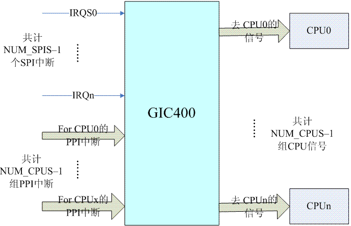
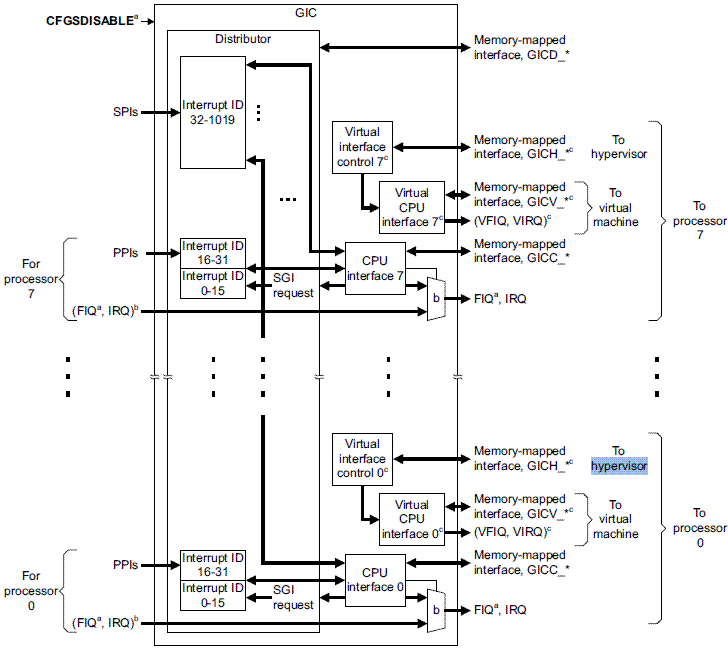
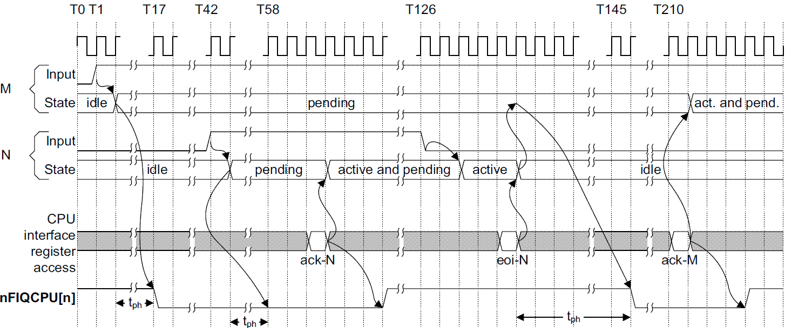

# GIC 驱动

## 前言

GIC（Generic Interrupt Controller） 是 ARM 平台使用的通用中断控制器，目前有 V1-V4 四个版本（V2 最多支持8个 ARM core，V3/V4 支持更多的 ARM core，主要用于 ARM64 服务器系统结构）。

GIC 硬件实现分两种：
- ARM vendor 开发自己的 SOC 时，会向 ARM 公司购买 GIC 的 IP，这些 IP 包括的型号有：PL390，GIC-400，GIC-500 等，其中GIC-500最多支持128个 cpu core，它要求 ARM core 必须是 ARMV8 指令集的（例如Cortex-A57），符合 GIC architecture specification V-3。
- ARM vendor 直接购买 ARM 公司的 Cortex A9 、A15或更高版本内核的 IP，这些内核中包括了 GIC 的实现

## GIC-V2 的硬件描述

### 输入信号

GIC-V2 的输入和输出信号的示意图如下:



输入的中断信号分为两类：

- PPI（Private Peripheral Interrupt）：每个 CPU interface 只连接一组特定的中断信号线，寄存器 GICD_TYPER 用于配置 CPU interface 个数（最多8个），有多少个 CPU interface，输入信号线就提供多少组 PPI 中断信号线。一组 PPI 信号线包括6个信号线：
    
    - nLEGACYIRQ 信号线：对应 interrupt ID 31，nLEGACYIRQ 可以直接连到对应 CPU 的 nIRQCPU 信号线上，此时，该 CPU 只为这这一根中断线服务，不处理其他中断。
    - nCNTPNSIRQ 信号线：对应 interrupt ID 30，传递来自 Non-secure physical timer 的中断事件。
    - nCNTPSIRQ 信号线：对应 interrupt ID 29，传递来自 secure physical timer 的中断事件。
    - nLEGACYFIQ 信号线：对应 interrupt ID 28，功能与 nLEGACYIRQ 信号线基本一致。
    - nCNTVIRQ 信号线：对应 interrupt ID 27，传递 Virtual Timer Event，和虚拟化相关。
    - nCNTHPIRQ 信号线：对应 interrupt ID 26。传递 Hypervisor Timer Event，和虚拟化相关。
    
    >备注：Cortex A15 的 GIC 实现，PPI 中断信号线还包括传递 Virtual Maintenance Interrupt 的信号线，对应 interrupt ID 25
    > Cortex A9 的 GIC 实现，PPI 中断信号线还包括：
    >   - nLEGACYIRQ 信号线和 nLEGACYFIQ 信号线,对应 interrupt ID 31和 interrupt ID 28
    >   - Cortext A9 的每个处理器都有自己的 Private timer 和 watch dog timer，这两个 HW block 分别使用了 ID 29和 ID 30 
    >   - Cortext A9 内嵌一个被系统内的所有 processor 共享的 global timer，对应 interrupt ID 27

- SPI（Shared Peripheral Interrupt），中断信号线被所有 CPU 共享，SPI 中断信号可以传递给所有 CPU，但只能被一个 CPU 处理，寄存器也可以 GICD_TYPER 用于配置 SPI 信号个数（最多480个）

### 输出信号

GIC 将需要根据输入的中断信号，输出用于访问 CPU 的信号，这些信号包括：

- 触发 CPU 中断的信号：nIRQCPU 和 nFIQCPU 信号线传递的信号会触发 ARM CPU 进入 IRQ mode 和 FIQ mode。
- Wake up 信号：nFIQOUT 和 nIRQOUT 信号线传递的信号，通过 ARM CPU 的电源管理模块唤醒 CPU。
- AXI slave interface signals：AXI（Advanced eXtensible Interface）是一种总线协议，属于 AMBA 规范的一部分。通过这些信号线，ARM CPU 可以和 GIC 硬件 block 进行通信（例如寄存器访问）。

### 中断的分配

GIC-V2 支持下面几种类型的中断源：

- 外设中断
- 软件触发的中断：软件可以通过写 GICD_SGIR 寄存器来触发一个中断事件，用于 CPU 之间的通信。
- 虚拟中断和 Maintenance interrupt

为了标识中断源，需要根据输入中断信号类型为中断源分配 interrupt ID，分配规则如下：

- ID 0~ID 31 分配给由特定 CPU 处理的中断源，即 PPI 中断信号。识别这些中断源需要 interrupt ID ＋ CPU interface number，ID0~ID15 分配给 SGI 中断信号，ID16~ID31 用于 PPI 中断信号。SGI 是通过写 GICD_SGIR 寄存器而触发的中断，Distributor 通过 processor source ID、interrupt ID 和 target processor ID 来唯一识别一个 SGI。
- ID32~ID1019 分配给 SPI 中断信号，1019 是 GIC 规范的最大 size，实际上 GIC-400 最大支持480个 SPI，Cortex-A15 和 A9 上的 GIC 最多支持224个 SPI。

### GIC-V2 的内部逻辑

GIC 分为 Distributor block 和 CPU interfuce block 两部分，CPU interface 有两种，一种连接普通物理 CPU，另外一种连接虚拟 CPU，用于虚拟化。

GIC-V2 的 block diagram 如下图所示：



### Distributor block

Distributor 的主要的作用是检测各个中断源的状态，控制中断源的行为，在探测到中断源产生中断事件时，转发给全部或指定的 CPU。

Distributor 可以管理多个中断源，这些中断源用 ID 来标识，被称为 interrupt ID。

Distributor 对中断源的控制包括：

- Enable/Disable 全局中断或指定的中断源，如果 disable 了全局中断（GIC_DIST_CTRL），任何中断源产生的中断事件都不会被转发给 CPU interface；disable 指定的中断源（GIC_DIST_ENABLE_CLEAR），该中断源产生的中断事件不会转发给 CPU interface，不会影响其他中断源。
- 将当前优先级最高的中断事件转发给某个或某些 CPU interface。当一个中断事件分发到多个 CPU interface 时，GIC 的内部逻辑应该保证只 assert 一个 CPU。
- 优先级控制。
- 中断属性设置。
- 中断组的设置。

### CPU interface block

CPU interface block 连接 CPU 和 Distributor，功能包括：

- enable 或者 disable CPU interface，对于 ARM，CPU interface block 和 CPU 之间的中断信号线是 nIRQCPU 和 nFIQCPU，如果 disable 了 CPU interface，Distributor 仍可以转发中断事件，但无法 assert 指定的 nIRQ 或者 nFIQ 通知 CPU。
- ack 中断，中断被 ACK 后，Distributor 就会把该中断的状态从 pending 状态修改成 active 或者 pending and active（这是和该 interrupt source 的信号有关，例如如果是电平中断并且保持了该 asserted 电平，那么就是 pending and active）。processor ack 了中断之后，CPU interface 就会 deassert nIRQCPU 和 nFIQCPU 信号线。
- 中断处理完毕的通知。当 interrupt handler 处理完了一个中断的时候，通过写 CPU interface 的寄存器从而通知 GIC CPU 已经处理完该中断。这个动作会通知 Distributor 将中断状态修改为 deactive，同时 CPU interface 也会丢失优先级，从而允许其他的 pending 的中断事件向 CPU 传递。
- 设置 priority mask。通过 priority mask，可以 mask 掉一些优先级比较低的中断，这些中断不会通知到CPU。
- 设置 preemption 的策略。
- 在多个中断事件同时到来的时候，选择一个优先级最高的通知 CPU。

### GIC 和 CPU 接口交互过程

GIC 和 CPU 接口交互过程如下图所示：



上图中 N 和 M 用来标识两个外设中断，N 的优先级大于 M；两个中断都是 SPI 类型，level trigger，active-high，且都被分配给一个 CPU，都被分配给 group 0，通过 FIQ 触发。

过程描述：

- T0 时刻： Distributor 检测到 M 中断源的有效触发事件。
- T2 时刻： Distributor 将 M 中断源的状态设定为 pending。
- T17 时刻： 大约15个 clock 之后，CPU interface 拉低 nFIQCPU 信号线，向 CPU报告 M 中断源的中断请求。这时候，CPU interface 的 ack 寄存器（GICC_IAR）的内容会修改成 M 中断源对应的ID。
- T42 时刻： Distributor 检测到 N 中断源的有效触发事件。
- T43 时刻： Distributor 将 N 中断源的状态设定为 pending。同时，由于 N 的优先级更高，因此 Distributor 会标记当前优先级最高的中断。
- T58 时刻： 大约15个 clock 之后，CPU interface 拉低 nFIQCPU 信号线，向 CPU 报告 N 中断源的中断请求。当然，由于 T17 时刻已经 assert CPU，因此实际的电平信号仍然保持 asserted 。这时候，CPU interface 的 ack寄存器（GICC_IAR）的内容会被更新成 N 中断源的 ID。
- T61 时刻： 软件通过读取 ack 寄存器的内容，获取了当前优先级最高的，并且状态是 pending 的 interrupt ID（也就是N 中断源对应的ID），通过读该寄存器，CPU 也就 ack 了该中断源 N。这时候，Distributor 将 N 中断源的状态设定为 pending and active（因为是电平触发，只要外部仍然有 asserted 的电平信号，那么一定就是 pending 的，而该中断是正在被 CPU 处理的中断，因此状态是 pending and active）。
    
    注意：T61 标识 CPU 开始执行 ISR
    
- T64 时刻： 3个 clock 之后，由于 CPU 已经 ack 了中断，因此 GIC 中 CPU interface 模块 deassert nFIQCPU 信号线，解除发向该 CPU 的中断请求。
- T126 时刻： 由于 ISR 操作了 N 外设的控制寄存器（ack 外设的中断），因此 N 外设 deassert 了其 interrupt request signal 
- T128 时刻： Distributor 解除 N 外设的 pending 状态，因此 N 中断源的状态设定为 active。
- T131 时刻： 软件操作 End of Interrupt 寄存器（向 GICC_EOIR 寄存器写入 N 对应的 interrupt ID），标识中断处理结束。Distributor 将 N 中断源的状态修改为idle。

    注意：T61～T131是CPU服务N外设中断的的时间区域，这个期间，如果有高优先级的中断pending，会发生中断的抢占（硬件意义的），这时候CPU interface会向CPU assert 新的中断。
    
- T146 时刻： 大约15个 clock 之后，Distributor 向 CPU interface 报告当前 pending 且优先级最高的中断源是 M。CPU interface 拉低 nFIQCPU 信号线，向 CPU 报告 M 外设的中断请求。这时候，CPU interface 的 ack 寄存器（GICC_IAR）的内容会修改成M 中断源对应的ID
- T211 时刻： CPU ack M中断（通过读GICC_IAR寄存器），开始处理低优先级的中断。

## 初始化中断子系统

driver/irqchip 目录下是各种不同的中断控制器的驱动代码，irq-gic*.c 是 GIC 驱动的代码，其中 irq-gic.c 支持 GIC v2， irq-gic-common.c 是 GIC 驱动的通用代码。

从 Linux 3.× 开始，ARM 内核开始使用 Device Tree 机制来初始化所有硬件，包括中断系统，不过仍然保留了 Linux 2.× 的方式，即在定义 Machine 描述符时，通过 init_irq 函数指针来指定中断系统的初始化函数
```c
DT_MACHINE_START(xxx, "xxxxxx")
    ……
    .init_irq    = irqchip_init,
    ……
MACHINE_END 
```

如果 Machine 描述符的 init_irq 函数指针没有指向任何一个函数，ARM 内核默认使用 irqchip_init 函数来初始化中断子系统。
```c
void __init init_IRQ(void)
{
	if (IS_ENABLED(CONFIG_OF) && !machine_desc->init_irq)
		irqchip_init();
	else
		machine_desc->init_irq();
}
```

### Device Tree 中描述中断控制器

以瑞芯微 RK3288 平台为例，gic-400 是其 root 中断控制器
```
	gic: interrupt-controller@ffc01000 {
		compatible = "arm,gic-400"; // 如果系统使用了GIC-400，那么 device node 的 compatible 属性需要配置成 gic-400
		interrupt-controller;
		#interrupt-cells = <3>;
		#address-cells = <0>;

		reg = <0xffc01000 0x1000>,  // Distributor address range
		      <0xffc02000 0x1000>,  // CPU interface address range
		      <0xffc04000 0x2000>,  // Virtual interface control block
		      <0xffc06000 0x2000>;  // Virtual CPU interfaces
		interrupts = <GIC_PPI 9 0xf04>;
	};
```

### 使用 Device Tree 匹配 GIC 的初始化函数

irqchip_init 通过调用 of_irq_init 函数，传入全部的 of_device_id 静态变量，初始化中断子系统
```c
static const struct of_device_id
irqchip_of_match_end __used __section(__irqchip_of_table_end);

extern struct of_device_id __irqchip_of_table[];

void __init irqchip_init(void)
{
	of_irq_init(__irqchip_of_table);
	acpi_probe_device_table(irqchip);
}
```

__irqchip_of_table 是一个 of_device_id 结构体列表，of_irq_init 函数遍历 Device Tree 中定义的所有中断控制器节点，每找到一个节点，就会在这个列表中寻找与之匹配的 of_device_id 结构体，找到后调用该结构体指定的函数来初始化中断控制器

of_device_id 结构体定义如下：
```c
struct of_device_id
{
    char    name[32];           /* 要匹配的 device node 的名字 */
    char    type[32];           /* 要匹配的 device node 的类型 */
    char    compatible[128];    /* 匹配字符串（DT compatible string），用来匹配适合的 device node */
    const void *data;           /* 指定驱动的初始化函数 */
}; 
```

使用 irqchip_init 函数前，所有 irqchip 都需要使用 IRQCHIP_DECLARE 来初始化 of_device_id 结构体，代码如下：
```c
IRQCHIP_DECLARE(gic_400, "arm,gic-400", gic_of_init);
IRQCHIP_DECLARE(cortex_a15_gic, "arm,cortex-a15-gic", gic_of_init);
IRQCHIP_DECLARE(cortex_a9_gic, "arm,cortex-a9-gic", gic_of_init);
IRQCHIP_DECLARE(cortex_a7_gic, "arm,cortex-a7-gic", gic_of_init);
IRQCHIP_DECLARE(msm_8660_qgic, "qcom,msm-8660-qgic", gic_of_init);
IRQCHIP_DECLARE(msm_qgic2, "qcom,msm-qgic2", gic_of_init); 
```

IRQCHIP_DECLARE 宏实际上初始化了一个 struct of_device_id 的静态变量 __of_table_xxx，内核编译时，会把所有用 IRQCHIP_DECLARE 初始化的静态变量放入 __irqchip_of_table 段中，供 of_irq_init 函数使用
```c
typedef int (*of_init_fn_2)(struct device_node *, struct device_node *);

#define IRQCHIP_DECLARE(name, compat, fn) OF_DECLARE_2(irqchip, name, compat, fn)

#define OF_DECLARE_2(table, name, compat, fn) \
		_OF_DECLARE(table, name, compat, fn, of_init_fn_2)
        
#define _OF_DECLARE(table, name, compat, fn, fn_type)			\
	static const struct of_device_id __of_table_##name		\
		__attribute__((unused))					\
		 = { .compatible = compat,				\
		     .data = (fn == (fn_type)NULL) ? fn : fn }
```
- IRQCHIP_DECARE 宏传入的 name、compat、fn 参数分别对应 struct of_device_id 结构体变量的 name、compatible、属性 和 data 函数指针

of_irq_init 函数分为两部分：

1. 首先在 Device Tree 中找到所有中断控制器节点，并将所有节点放入 intc_desc_list 待处理，代码如下：

    ```c
        for_each_matching_node(np, matches) { 
            /* 从匹配成功的节点中找到包含 interrupt-controller 的节点 */
            if (!of_find_property(np, "interrupt-controller", NULL) ||
                    !of_device_is_available(np))
                continue;
            /*
             填充 of_intc_desc 结构体变量 desc，of_intc_desc 结构体表示一个中断控制器的描述符，通过其 interrupt-parent 属性，可以确定各个中断控制器的层次关系
            */
            desc = kzalloc(sizeof(*desc), GFP_KERNEL);
            if (WARN_ON(!desc))
                goto err;

            desc->dev = np;
            desc->interrupt_parent = of_irq_find_parent(np);
            /* 将root interupt 的 parent 置空 */
            if (desc->interrupt_parent == np)
                desc->interrupt_parent = NULL;
            /* 将 dest->list 加入 intc_desc_list */
            list_add_tail(&desc->list, &intc_desc_list);
        }
    ```
    
    ```c
    #define for_each_matching_node(dn, matches) \
        for (dn = of_find_matching_node(NULL, matches); dn; \
            dn = of_find_matching_node(dn, matches))
    ```
    
    ```c    
    static inline struct device_node *of_find_matching_node(
        struct device_node *from,
        const struct of_device_id *matches)
    {
        return of_find_matching_node_and_match(from, matches, NULL);
    }
    ```

    ```c
    struct device_node *of_find_matching_node_and_match(struct device_node *from,
                        const struct of_device_id *matches,
                        const struct of_device_id **match)
    {
        struct device_node *np;
        const struct of_device_id *m;
        unsigned long flags;

        if (match)
            *match = NULL;

        raw_spin_lock_irqsave(&devtree_lock, flags);
        np = from ? from->allnext : of_allnodes;
        /* 遍历指定范围的 device_node，每一个device_node 都用 matches 匹配，获取匹配结果 */
        for (; np; np = np->allnext) {
                /* 取出匹配成功的 matches 数组成员 */
            m = __of_match_node(matches, np);
            if (m && of_node_get(np)) {
                if (match)
                    *match = m; /* match 指向匹配成功的 matches 数组成员 */
                break;  /* 匹配成功后退出循环 */
            }
        }
        of_node_put(from);
        raw_spin_unlock_irqrestore(&devtree_lock, flags);
        return np;  /* 返回匹配成功的 device_node */
    }
    ```

    ```c
    static
    const struct of_device_id *__of_match_node(
        const struct of_device_id *matches,
        const struct device_node *node)
    {
        const struct of_device_id *best_match = NULL;
        int score, best_score = 0;

        if (!matches)
            return NULL;
        /* 每一个 node 都使用所有 matches 匹配 ，得分最高的为最佳结果 */
        for (; matches->name[0] || matches->type[0] || matches->compatible[0]; matches++) {
            score = __of_device_is_compatible(node, matches->compatible,
                            matches->type, matches->name);
            if (score > best_score) {
                best_match = matches;
                best_score = score;
            }
        }
        /* 返回得分最高的 match */
        return best_match;
    }
    ```

    ```c
    static int __of_device_is_compatible(const struct device_node *device,
                        const char *compat, const char *type, const char *name)
    {
        struct property *prop;
        const char *cp;
        int index = 0, score = 0;

        /* 优先匹配 compatible */
        if (compat && compat[0]) {
            /* 获取 device_node 的 compatible 属性 */
            prop = __of_find_property(device, "compatible", NULL);
            
            for (
                    cp = of_prop_next_string(prop, NULL); /* 获取 compatible 属性值数组的首地址 */
                    cp;
                    cp = of_prop_next_string(prop, cp), /* 将指针移动到 compatible 属性值数组的下一个位置 */
                    index++) {
                if (of_compat_cmp(cp, compat, strlen(compat)) == 0) {
                    score = INT_MAX/2 - (index << 2);   /* 计算得分，匹配次数越少，得分越高 */
                    break; /* 匹配成功后直接退出循环 */
                }
            }
            if (!score)
                return 0;   /* 得分为0，直接返回 */
        }

        /* Matching type is better than matching name */
        if (type && type[0]) {
            if (!device->type || of_node_cmp(type, device->type))
                return 0;
            score += 2;
        }

        /* Matching name is a bit better than not */
        if (name && name[0]) {
            if (!device->name || of_node_cmp(name, device->name))
                return 0;
            score++;
        }

        return score;
    }
    ```

    ```c
    struct property {
        char	*name;
        int	length;
        void	*value;
        struct property *next;
        unsigned long _flags;
        unsigned int unique_id;
    };
    ```

    ```c
    static struct property *__of_find_property(
    const struct device_node *np,
    const char *name,
    int *lenp)
    {
        struct property *pp;

        /* np 为空则返回 */
        if (!np)
            return NULL;
        /* 从 *np 的属性集中取出 name 指定的属性 */    
        for (pp = np->properties; pp; pp = pp->next) {
            if (of_prop_cmp(pp->name, name) == 0) {
                if (lenp)
                    *lenp = pp->length;
                break;
            }
        }

        return pp;
    }
    ```

    ```c
    const char *of_prop_next_string(struct property *prop, const char *cur)
    {
        const void *curv = cur;
        /* prop 为空则返回 */
        if (!prop)
            return NULL;
        /* cur 为空则返回 prop->value */
        if (!cur)
            return prop->value;

        curv += strlen(cur) + 1; /* curv 指向 value 数组下一个元素的首位 */
        /* curv 越界，则返回 NULL */
        if (curv >= prop->value + prop->length)
            return NULL;

        return curv;
    }
    ```

    ```c
    struct device_node *of_irq_find_parent(struct device_node *child)
    {
        struct device_node *p;
        const __be32 *parp;

        if (!of_node_get(child))
            return NULL;

        do {
            /* 获取 interrupt-parent 属性*/
            parp = of_get_property(child, "interrupt-parent", NULL);
            if (parp == NULL)
                p = of_get_parent(child);
            else {
                if (of_irq_workarounds & OF_IMAP_NO_PHANDLE)
                    p = of_node_get(of_irq_dflt_pic);
                else
                    /* 根据 parp 属性获取父节点*/
                    p = of_find_node_by_phandle(be32_to_cpup(parp));
            }
            of_node_put(child);
            child = p;
            /* 父节点存在，且父节点没有设置#interrupt-cells属性，则继续循环 */
        } while (p && of_get_property(p, "#interrupt-cells", NULL) == NULL);

        return p;
    }
    ```

2. 然后从 root 节点开始，依次在 __irqchip_of_table 中寻找并调用每一级中断控制器的初始化函数

    ```c
        /*
        * The root irq controller is the one without an interrupt-parent.
        * That one goes first, followed by the controllers that reference it,
        * followed by the ones that reference the 2nd level controllers, etc.
        */
        while (!list_empty(&intc_desc_list)) {
            /*
            * Process all controllers with the current 'parent'.
            * First pass will be looking for NULL as the parent.
            * The assumption is that NULL parent means a root controller.
            * list_for_each_entry_safe 循环中只处理 parent node
            */
            list_for_each_entry_safe(desc, temp_desc, &intc_desc_list, list) {
                const struct of_device_id *match;
                int ret;
                of_irq_init_cb_t irq_init_cb;
                
                /* 先处理 root interupt controller block */
                if (desc->interrupt_parent != parent)
                    continue;
                
                /* 从 intc_desc_list 中删除即将处理的 node */
                list_del(&desc->list);
                match = of_match_node(matches, desc->dev);
                if (WARN(!match->data,
                    "of_irq_init: no init function for %s\n",
                    match->compatible)) {
                    kfree(desc);
                    continue;
                }

                pr_debug("of_irq_init: init %s @ %p, parent %p\n",
                    match->compatible,
                    desc->dev, desc->interrupt_parent);
                irq_init_cb = (of_irq_init_cb_t)match->data;
                /* 通过 irq_init_cb 函数指针调用 match->data 指向的中断控制器驱动的 init 函数*/
                ret = irq_init_cb(desc->dev, desc->interrupt_parent);
                if (ret) {
                    kfree(desc);
                    continue;
                }

                /*
                * This one is now set up; add it to the parent list so
                * its children can get processed in a subsequent pass.
                */
                /* 将处理成功的 node 加入 intc_parent_list */
                list_add_tail(&desc->list, &intc_parent_list);
            }

            /* Get the next pending parent that might have children */
            desc = list_first_entry_or_null(&intc_parent_list,
                            typeof(*desc), list);
            /* 如果没有找到 parent node，直接 break 出 while */
            if (!desc) {
                pr_err("of_irq_init: children remain, but no parents\n");
                break;
            }
            /* 置空 intc_parent_list */
            list_del(&desc->list);
            parent = desc->dev;
            kfree(desc);
        }
    ```

    ```c    
    #define list_for_each_entry_safe(pos, n, head, member)			\
        for (pos = list_first_entry(head, typeof(*pos), member),	\
            n = list_next_entry(pos, member);			\
            &pos->member != (head); 					\
            pos = n, n = list_next_entry(n, member))
    ```
    
## GIC driver 初始化代码

### 入口函数

根据 IRQCHIP_DECLARE 宏的使用的值，GIC driver 的初始化函数是 gic_of_init，代码如下：
```c
int __init gic_of_init(struct device_node *node, struct device_node *parent)
{
    void __iomem *cpu_base;
    void __iomem *dist_base;
    u32 percpu_offset;
    int irq;

    /*irq-gic.c 不支持虚拟化，所以不用映射虚拟化处理相关的寄存器 */
    dist_base = of_iomap(node, 0);  /* 映射 GIC Distributor 的寄存器到I/O 内存，地址为将 reg 数组的第一个元素*/

    cpu_base = of_iomap(node, 1);   /* 映射 GIC CPU interface 的寄存器到I/O 内存，地址为将 reg 数组的第二个元素*/

    if (of_property_read_u32(node, "cpu-offset", &percpu_offset))   /* 处理 cpu-offset 属性 */
        percpu_offset = 0;
    
    /* gic_cnt 全局变量初始值为0，表示当前 gic 为 root GIC */
    gic_init_bases(gic_cnt, -1, dist_base, cpu_base, percpu_offset, node);)) /* 主处理过程 */
    if (!gic_cnt)
        gic_init_physaddr(node);                /* 对于不支持 big.LITTLE switcher（CONFIG_BL_SWITCHER）的系统，该函数为空。 */

    if (parent) {                               /* 处理 interrupt 级联 */
        irq = irq_of_parse_and_map(node, 0);    /* 解析 second GIC 的interrupts 属性，并进行 mapping，返回 IRQ number */
        gic_cascade_irq(gic_cnt, irq);
    }
    gic_cnt++;
    return 0;
} 
```

### 主要的初始化流程

```c
void __init gic_init_bases(unsigned int gic_nr, int irq_start,
               void __iomem *dist_base, void __iomem *cpu_base,
               u32 percpu_offset, struct device_node *node)
{
    irq_hw_number_t hwirq_base;
    struct gic_chip_data *gic;
    int gic_irqs, irq_base, i;

    gic = &gic_data[gic_nr];
    gic->dist_base.common_base = dist_base; /* 省略了 non banked 的情况 */
    gic->cpu_base.common_base = cpu_base; 
    gic_set_base_accessor(gic, gic_get_common_base);


    for (i = 0; i < NR_GIC_CPU_IF; i++)
        gic_cpu_map[i] = 0xff;

    /* irq_start ＝ -1 表示不指定 IRQ number，后续 irq_alloc_descs 时搜索可用的 IRQ number */
    if (gic_nr == 0 && (irq_start & 31) > 0) {
        hwirq_base = 16;    /* 忽略掉 0-15号 SGI 相关的 HW Interrupt ID */
        if (irq_start != -1)
            irq_start = (irq_start & ~31) + 16;
    } else {
        hwirq_base = 32;    /* 对于非 root gic，忽略掉 0-31号 SGI 相关的 HW Interrupt ID */
    }


    gic_irqs = readl_relaxed(gic_data_dist_base(gic) + GIC_DIST_CTR) & 0x1f; /* GIC_DIST_CTR 寄存器的低5位记录当前 GIC 支持的最大中断数 */
    gic_irqs = (gic_irqs + 1) * 32;
    if (gic_irqs > 1020)
        gic_irqs = 1020;
    gic->gic_irqs = gic_irqs;

    gic_irqs -= hwirq_base;     /* root gic 下 gic_irqs 为 PPI + SPI 所有 HW interrupt ID 数，非 root gic 下 gic_irqs 只是 SPI HW interrupt ID 数 */
   

    if (of_property_read_u32(node, "arm,routable-irqs",     /* 读取 gic device_node 的 arm,routable-irq 属性，用于定义那些通过 crossbar/multiplexer HW block 连接 GIC 的外设的 IRQ line 数 */
                 &nr_routable_irqs)) {
        irq_base = irq_alloc_descs(irq_start, 16, gic_irqs,  numa_node_id()); /* 从 16 号开始搜索可用的 IRQ number */
        if (IS_ERR_VALUE(irq_base)) {
            WARN(1, "Cannot allocate irq_descs @ IRQ%d, assuming pre-allocated\n",
                 irq_start);
            irq_base = irq_start;
        }

        gic->domain = irq_domain_add_legacy(node, gic_irqs, irq_base, /* 注册 irq domain */
                    hwirq_base, &gic_irq_domain_ops, gic);  /*gic_chip_data 结构体变量会作为 irqdomain 的 host_data 成员*/
    } else {
        gic->domain = irq_domain_add_linear(node, nr_routable_irqs, /* 注册 irq domain */
                            &gic_irq_domain_ops,
                            gic);   /*gic_chip_data 结构体变量会作为 irqdomain 的 host_data 成员*/
    }

    if (gic_nr == 0) { /* 只对 root GIC 操作，因为设定 callback、注册 Notifier 只需要一次就 OK 了 */
#ifdef CONFIG_SMP
        set_smp_cross_call(gic_raise_softirq); /* 设置多个CPU直接通信的 callback 函数 */
        register_cpu_notifier(&gic_cpu_notifier); /* 设置 CPU 状态变化发生时通知 GIC 的回调函数 */
#endif
        set_handle_irq(gic_handle_irq); /* 设置 arch 相关的 irq handler */
    }

    gic_chip.flags |= gic_arch_extn.flags;
    gic_dist_init(gic); /* 具体的硬件初始代码  */
    gic_cpu_init(gic);
    gic_pm_init(gic);
} 
```

struct gic_chip_data的数据结构，定义如下:
```c
struct gic_chip_data {
    union gic_base dist_base; /* GIC Distributor的基地址空间 */
    union gic_base cpu_base; /* GIC CPU interface的基地址空间 */
#ifdef CONFIG_CPU_PM    /* GIC 电源管理相关的成员 */
    u32 saved_spi_enable[DIV_ROUND_UP(1020, 32)];
    u32 saved_spi_conf[DIV_ROUND_UP(1020, 16)];
    u32 saved_spi_target[DIV_ROUND_UP(1020, 4)];
    u32 __percpu *saved_ppi_enable;
    u32 __percpu *saved_ppi_conf;
#endif
    struct irq_domain *domain; /* 该GIC对应的irq domain数据结构 */
    unsigned int gic_irqs; /* GIC 支持的 IRQ 的数目 */
#ifdef CONFIG_GIC_NON_BANKED
    void __iomem *(*get_base)(union gic_base *);
#endif
};
```

### GIC 硬件初始化

#### Distributor 初始化
```c
static void __init gic_dist_init(struct gic_chip_data *gic)
{
    unsigned int i;
    u32 cpumask;
    unsigned int gic_irqs = gic->gic_irqs;          /* 获取该 GIC 支持的 IRQ 的数目 */
    void __iomem *base = gic_data_dist_base(gic);   /* 获取该 GIC 对应的 Distributor 基地址 */

    writel_relaxed(0, base + GIC_DIST_CTRL);        /* Disable 全局中断 */


    cpumask = gic_get_cpumask(gic);                 /* 获取了8 bit的 cpu mask值，通过这个值可以知道 SGI 和 PPI 通过哪个 CPU interface 送到当前 CPU */
    cpumask |= cpumask << 8;
    cpumask |= cpumask << 16;   /* 将 cpumask 复制3次，使之成为32bit 值 */
    for (i = 32; i < gic_irqs; i += 4)
        writel_relaxed(cpumask, base + GIC_DIST_TARGET + i * 4 / 4); /* 设置所有的 SPI 全部通过 cpumask 指定的 CPU interface 送到当前 CPU */

    gic_dist_config(base, gic_irqs, NULL);  /* 在这里将所有 SPI 都设置成电平触发，设置所有 SPI 的优先级值为 a0，最后禁用所有中断 */

    writel_relaxed(1, base + GIC_DIST_CTRL);    /* 重新 enable 全局中断 */
} 
```
- 在初始化代码中，没有为中断源设置分组（使用 GIC_DIST_IGROUP 寄存器），猜想默认组 ID 为 0

#### CPU interface 初始化
```c
static void gic_cpu_init(struct gic_chip_data *gic)
{
	void __iomem *dist_base = gic_data_dist_base(gic);  /* Distributor 的基地址空间 */
	void __iomem *base = gic_data_cpu_base(gic);        /* CPU interface 的基地址空间 */
	unsigned int cpu_mask, cpu = smp_processor_id();    /* 获取 CPU 的逻辑ID */
	int i;

	/*
	 * 设置当前 cpu 使用的 cpumask
	 */
	cpu_mask = gic_get_cpumask(gic);
	gic_cpu_map[cpu] = cpu_mask;

	/*
	 * 其他 cpu 不能使用当前 cpu 使用的 cpumask
	 */
	for (i = 0; i < NR_GIC_CPU_IF; i++)
		if (i != cpu)
			gic_cpu_map[i] &= ~cpu_mask;

	gic_cpu_config(dist_base, NULL);    /* 设置 SGI 和 PPI 的初始值 */

	writel_relaxed(0xf0, base + GIC_CPU_PRIMASK); /* 设置 CPU interface 可转发中断的最低优先级，该寄存器值越低，优先级越高。所以这里设置所有先前设置优先级为 a0 的中断都可以送到 CPU */
	writel_relaxed(1, base + GIC_CPU_CTRL); /* 设置 CPU interface 的 control register。enable 了 group 0 的中断，disable 了 group 1 的中断 */
}
```

#### GIC 电源管理初始化

GIC 电源管理初始化主要执行两个工作：

- 分配两个 per cpu 内存，这些内存在系统进入 sleep 状态时保存 PPI 的寄存器状态信息
- 为 root GIC，注册一个和电源管理相关的事件通知 callback 函数

```c
static void __init gic_pm_init(struct gic_chip_data *gic)
{
    gic->saved_ppi_enable = __alloc_percpu(DIV_ROUND_UP(32, 32) * 4, sizeof(u32));

    gic->saved_ppi_conf = __alloc_percpu(DIV_ROUND_UP(32, 16) * 4,  sizeof(u32));

    if (gic == &gic_data[0])
        cpu_pm_register_notifier(&gic_notifier_block);
} 
```

### IRQ domain callback 函数分析

在注册 irq domain 时，通过 irq_domain_ops 结构体变量 gic_irq_domain_ops 添加了三个 callback 函数，定义如下：
```c
static const struct irq_domain_ops gic_irq_domain_ops = {
    .map = gic_irq_domain_map,
    .unmap = gic_irq_domain_unmap,
    .xlate = gic_irq_domain_xlate,
};
```

map 和 unmap 函数又分别复用了 gic_default_routable_irq_domain_ops 的代码：
```c
static const struct irq_domain_ops gic_default_routable_irq_domain_ops = {
	.map = gic_routable_irq_domain_map,
	.unmap = gic_routable_irq_domain_unmap,
	.xlate = gic_routable_irq_domain_xlate,
};

const struct irq_domain_ops *gic_routable_irq_domain_ops =
					&gic_default_routable_irq_domain_ops;
```

#### map 函数

创建 IRQ number 和 GIC HW interrupt ID 之间映射关系的时，调用该函数
```c
static int gic_irq_domain_map(struct irq_domain *d, unsigned int irq,
				irq_hw_number_t hw)
{
	if (hw < 32) {                                  /* 设置 SGI 或 PPI 中断 */
		irq_set_percpu_devid(irq);                  /* 中断分配 per cpu 内存 */
		irq_set_chip_and_handler(irq, &gic_chip,
					 handle_percpu_devid_irq);      /* 设置 irq_chip 结构体变量，设置 handle_percpu_devid_irq 为 high level handler  */
		set_irq_flags(irq, IRQF_VALID | IRQF_NOAUTOEN); /* 设定 irq flag 是有效的（因为已经设定好了 chip 和 handler 了），并且 request 后不是 auto enable 的 */
	} else {                                        /* 设置 SPI 中断 */
		irq_set_chip_and_handler(irq, &gic_chip,
					 handle_fasteoi_irq);           /* 设置 irq_chip 结构体变量，设置 handle_fasteoi_irq 为 high level handler  */
		set_irq_flags(irq, IRQF_VALID | IRQF_PROBE); /* 设定 irq flag 是有效的（因为已经设定好了 chip 和 handler 了），并且 request 后不是 auto enable 的 */

		gic_routable_irq_domain_ops->map(d, irq, hw);   /* 为那些外设和GIC 之间有 cross bar的 SOC (如TI的OMAP芯片) 提供映射能力 */
	}
	irq_set_chip_data(irq, d->host_data);   /* 设置 irq chip的私有数据 */
	return 0;
}
```

gic_routable_irq_domain_ops 的 map 函数在 Linux-stable 主线代码中没有具体实现
```c
static int gic_routable_irq_domain_map(struct irq_domain *d, unsigned int irq,
			      irq_hw_number_t hw)
{
	return 0;
}
```

#### unmap 函数

解除IRQ number和GIC hw interrupt ID之间映射关系的时候，需要调用该回调函数。
```c
static void gic_irq_domain_unmap(struct irq_domain *d, unsigned int irq)
{
	gic_routable_irq_domain_ops->unmap(d, irq);
}
```

gic_routable_irq_domain_ops 的 unmap 函数在 Linux-stable 主线代码中没有具体实现

### xlate 函数

xlate 用于翻译中断源信息

外设的中断源信息在 Device Tree 的 interrupts 属性数组中描述，通过 intspec 参数传入，包括

- intspec[0] 表示中断类型，0 表示 SPI，1 表示 PPI
    
- intspec[1] 表示 中断源 ID
    
- intspec[2] 中断触发类型和 cpumask值
    
    - 0-3 bit 是中断触发的类型，1 代表上升沿（low-to-high edge）触发，2 表示下降沿（high-to-low edge）触发（SPI 不可用），4 表示高电平（high level-sensitive）触发，8 表示低电平（low level-sensitive）触发（SPI 不可用）
    - 8-15 bit 是 PPI 中断使用的 cpumask

```c
static int gic_irq_domain_xlate(struct irq_domain *d,
				struct device_node *controller,
				const u32 *intspec,                          
                unsigned int intsize,
				unsigned long *out_hwirq, unsigned int *out_type)
{
	unsigned long ret = 0;

	if (d->of_node != controller)
		return -EINVAL;
	if (intsize < 3)
		return -EINVAL;

	/* 跳过 SGI 中断，HW interrupt ID 至少从 16 开始  */
	*out_hwirq = intspec[1] + 16;

	/* 当 interrupt type 为 SPI 时，HW interrupt ID 至少从 32 开始 */
	if (!intspec[0]) {
		ret = gic_routable_irq_domain_ops->xlate(d, controller,
							 intspec,
							 intsize,
							 out_hwirq,
							 out_type);

		if (IS_ERR_VALUE(ret))
			return ret;
	}

	*out_type = intspec[2] & IRQ_TYPE_SENSE_MASK;  /* 将 低 4 bit 中断触发类型单独取出，并转换成 32-bit 值 */ 

	return ret;
}
```

### IRQ chip 回调函数分析

使用 gic_irq_domain_map 函数创建 IRQ number 和 GIC HW interrupt ID 之间映射关系的时，为 irq 设置 irq_chip 结构体变量 gic_chip

gic_chip 定义如下：
```c
static struct irq_chip gic_chip = {
	.name			= "GIC",
	.irq_mask		= gic_mask_irq,
	.irq_unmask		= gic_unmask_irq,
	.irq_eoi		= gic_eoi_irq,
	.irq_set_type		= gic_set_type,
	.irq_retrigger		= gic_retrigger,
#ifdef CONFIG_SMP
	.irq_set_affinity	= gic_set_affinity,
#endif
	.irq_set_wake		= gic_set_wake,
};
```

#### gic_mask_irq 函数

gic_mask_irq 在 High level interrupt event handler 中用来对 Distributor 进行 mask 操作（通过写指定的 32 bit 寄存器 Interrupt Clear-Enable Registers ( GIC_DIST_ENABLE_CLEAR ) 实现指定的中断信号不转发给 CPU interface，写入 1 表示 Mask 该中断，0 表示 Unmask 该中断）
```c
static void gic_mask_irq(struct irq_data *d)
{
	u32 mask = 1 << (gic_irq(d) % 32);

	raw_spin_lock(&irq_controller_lock);
	writel_relaxed(mask, gic_dist_base(d) + GIC_DIST_ENABLE_CLEAR + (gic_irq(d) / 32) * 4);
	if (gic_arch_extn.irq_mask)
		gic_arch_extn.irq_mask(d);
	raw_spin_unlock(&irq_controller_lock);
}
```
- GIC_DIST_ENABLE_CLEAR 寄存器每一位对应一个 HW interrupt ID
- 不同的 SOC 可能会通过修改 gic_arch_extn.irq_mask 来实现其具体的 Mask/Unmask 中断操作

#### gic_unmask_irq 函数

gic_unmask_irq 通过写指定 32 bit 寄存器 Interrupt Set-Enable Registers（GIC_DIST_ENABLE_SET）实现对指定中断的 Unmask，1 表示 Unmask，0 值无法写入。代码和 gic_mask_irq 基本一致。
```c
static void gic_unmask_irq(struct irq_data *d)
{
	u32 mask = 1 << (gic_irq(d) % 32);

	raw_spin_lock(&irq_controller_lock);
	if (gic_arch_extn.irq_unmask)
		gic_arch_extn.irq_unmask(d);
	writel_relaxed(mask, gic_dist_base(d) + GIC_DIST_ENABLE_SET + (gic_irq(d) / 32) * 4);
	raw_spin_unlock(&irq_controller_lock);
}
```

#### gic_eoi_irq 函数

gic_eoi_irq interrupt handler 中用于通知中断控制器中断处理完成，通过将完成处理的 HW interrupt ID 写入 CPU interface 的 End of Interrupt Register 寄存器 （GIC_CPU_EOI） 寄存器来实现
```c
static void gic_eoi_irq(struct irq_data *d)
{
	if (gic_arch_extn.irq_eoi) {
		raw_spin_lock(&irq_controller_lock);
		gic_arch_extn.irq_eoi(d);
		raw_spin_unlock(&irq_controller_lock);
	}

	writel_relaxed(gic_irq(d), gic_cpu_base(d) + GIC_CPU_EOI);
}
```

对 GIC 而言，中断状态有四种：

- Inactive：中断未触发状态，该中断即没有 Pending 也没有Active 
- Pending：由于外设硬件产生了中断事件（或者软件触发）该中断事件已经通过硬件信号通知到 GIC，等待 GIC 分配 CPU 进行处理 
- Active：CPU 已经 ACK 了该 interrupt 请求，并且正在处理中 
- Active and Pending：当一个中断源处于 Active 状态的时候，同一中断源又触发了中断，后发中断进入 pending 状态 

当对 CPU interface 进行 eoi 操作后，如果没有 pending 的该中断，则 GIC 就会将该中断设置为 Inactive 状态。

#### gic_set_type 函数

gic_set_type 设置一个中断源的触发类型是电平触发还是边缘触发
```c
static int gic_set_type(struct irq_data *d, unsigned int type)
{
	void __iomem *base = gic_dist_base(d);
	unsigned int gicirq = gic_irq(d);

	/* SGI 中断不能设置触发类型 */
	if (gicirq < 16)
		return -EINVAL;

	if (type != IRQ_TYPE_LEVEL_HIGH && type != IRQ_TYPE_EDGE_RISING)    /* GIC 只支持高电平触发和上升沿触发 */
		return -EINVAL;

	raw_spin_lock(&irq_controller_lock);

	if (gic_arch_extn.irq_set_type)
		gic_arch_extn.irq_set_type(d, type);

	gic_configure_irq(gicirq, type, base, NULL);    /* 设置触发类型 */

	raw_spin_unlock(&irq_controller_lock);

	return 0;
}
```

```c
int gic_configure_irq(unsigned int irq, unsigned int type,
		       void __iomem *base, void (*sync_access)(void))
{
	u32 confmask = 0x2 << ((irq % 16) * 2);
	u32 confoff = (irq / 16) * 4;
	u32 val, oldval;
	int ret = 0;

	/*
	 * Read current configuration register, and insert the config
	 * for "irq", depending on "type".
	 */
	val = oldval = readl_relaxed(base + GIC_DIST_CONFIG + confoff);
	if (type & IRQ_TYPE_LEVEL_MASK)
		val &= ~confmask;
	else if (type & IRQ_TYPE_EDGE_BOTH)
		val |= confmask;

	/*
	 * Write back the new configuration, and possibly re-enable
	 * the interrupt. If we tried to write a new configuration and failed,
	 * return an error.
	 */
	writel_relaxed(val, base + GIC_DIST_CONFIG + confoff);
	if (readl_relaxed(base + GIC_DIST_CONFIG + confoff) != val && val != oldval)
		ret = -EINVAL;

	if (sync_access)
		sync_access();

	return ret;
}
```

#### gic_retrigger 函数

gic_retrigger 用来 resend 中断到 CPU，irq-gic.c 没有为该函数提供任何功能，需要由厂商的具体实现。
```c
static int gic_retrigger(struct irq_data *d)
{
	if (gic_arch_extn.irq_retrigger)
		return gic_arch_extn.irq_retrigger(d);

	return 0;
}
```

#### gic_set_affinity 函数

```c
static int gic_set_affinity(struct irq_data *d, const struct cpumask *mask_val,
			    bool force)
{
	void __iomem *reg = gic_dist_base(d) + GIC_DIST_TARGET + (gic_irq(d) & ~3);
	unsigned int cpu, shift = (gic_irq(d) % 4) * 8;
	u32 val, mask, bit;

    /* 根据 force 值来随机选择一个 online 的 CPU 或根据 cpumask 值来选择 CPU */
	if (!force)
		cpu = cpumask_any_and(mask_val, cpu_online_mask);   /* 从 mask_val 中选取一个 online 的 cpu */
	else
		cpu = cpumask_first(mask_val);  /* 从 mask_val 中选取第一个 cpu，不管是否 online */

	if (cpu >= NR_GIC_CPU_IF || cpu >= nr_cpu_ids)  /* 从 mask_val 中选取的 CPU 不能超过 CPU interface 数 和 cpu 总数 */
		return -EINVAL;

	raw_spin_lock(&irq_controller_lock);
	mask = 0xff << shift;
	bit = gic_cpu_map[cpu] << shift;        /* 将 CPU 的逻辑 ID 转换成要设定的 cpu mask */
	val = readl_relaxed(reg) & ~mask;
	writel_relaxed(val | bit, reg);
	raw_spin_unlock(&irq_controller_lock);

	return IRQ_SET_MASK_OK;
}
```

#### gic_set_wake 函数

gic_set_wake 用来设置唤醒 CPU 的中断源，具体逻辑依赖厂商的实现
```c
static int gic_set_wake(struct irq_data *d, unsigned int on)
{
	int ret = -ENXIO;

	if (gic_arch_extn.irq_set_wake)
		ret = gic_arch_extn.irq_set_wake(d, on);

	return ret;
}
```

#### BSP（bootstrap processor）之外，其他 CPU 的 callback 函数

对于 multi processor 系统，不可能初始化代码在所有的 processor 上都执行一遍，实际上，系统的硬件会选取一个 processor 作为引导处理器，我们称之 BSP。这个 processor 会首先执行，其他的 CPU 都是处于 reset 状态，等到 BSP 初始化完成之后，release 所有的 non-BSP，这时候，系统中的各种外设硬件条件和软件条件（例如 per CPU 变量）都就绪，各个 non-BSP 就可以执行自己 CPU specific 的初始化。 

GIC 的 Distributor和 Power management 这两部分是全局性的，只需要 BSP 执行一次初始化； 各个 CPU 仍然需要负责初始化自己连接的哪个 CPU interface block。

假设 CPU x 被选为 BSP，那么 gic_of_init 就由 CPU x 来执行，这时候，被初始化的 GIC 硬件包括：root GIC 的 Distributor、root GIC CPU Interface x（连接BSP的那个 CPU interface）以及其他的级联的非 root GIC。

gic_of_init->gic_init_bases 执行时使用 register_cpu_notifier 注册了一个 notifier_block 结构体变量 gic_cpu_notifier，这是的 irq-gic 模块能够监听其他 CPU 启动时发出的 CPU_STARTING 消息。

BSP 初始化完成之后，其他的 CPU 启动，此时 irq-gic 模块会收到 CPU_STARTING 消息，然后调用 gic_cpu_notifier 内设置的 notifier_call 回调函数。相关代码如下：
```c
static struct notifier_block gic_cpu_notifier = {
	.notifier_call = gic_secondary_init,
	.priority = 100,
};
```

```c
static int gic_secondary_init(struct notifier_block *nfb, unsigned long action,  void *hcpu)
{
    if (action == CPU_STARTING || action == CPU_STARTING_FROZEN)
        gic_cpu_init(&gic_data[0]);         /* 初始化那些非 BSP 的 CPU interface */
    return NOTIFY_OK;
} 
```


