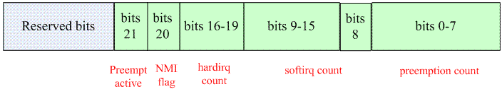

# softirq

## 前言

linux 将中断处理分为两个部分：

- 中断 Handler（top half），全程关闭中断
- deferable task（bottom half）：处理不需要紧急处理的工作

linux 提供了多种 bottom half 执行机制，例如：softirq、tasklet、workqueue 或是直接创建一个 kernel thread来执行 bottom half。

在普通驱动程序中，通常使用 tasklet 执行 boottom half，tasklet 是基于 softirq。softirq 不能动态分配，内核中静态定义多种 softirq number，如：网络数据的收发、block 设备的数据访问（数据量大，通信带宽高），timer 的 boottom half（时间方面要求高）

## 为何有 top half 和 bottom half

如果某一个复杂的、需要大量数据处理的硬件中断（比如从硬盘拷贝数据），如果完全由中断 handler 处理，那么会导致系统需要长时间关闭该中断，并占据 CPU，这样严重系统性能。因此，不能让中断 handler 处理完一切再恢复现场，仅仅需要在其中处理一小部分，包括：

- 有实时性要求的
- 和硬件相关的。例如 ack 中断，读取外设的 FIFO 到 ram 等
- 如果是共享中断，那么获取硬件中断状态以便判断是否是再次发生同一中断

其余工作都放在 bottom half 中处理，从而将需要关闭中断的 top half 被瘦身，可以快速的执行完毕，减少系统关中断的时间，提高系统的性能。

## 为何有 softirq 和 tasklet

workqueue 和 softirq、tasklet 有本质的区别：softirq 和 tasklet 运行在 interrupt context；而 workqueue 运行在 process context，因为在有 sleep 需求的场景中，defering task必须延迟到 kernel thread 中执行。

softirq 和 tasklet 的区别在于 softirq 更倾向于性能，而 tasklet 更倾向于易用性：

- softirq：

    例如使用 softirq 读取网络数据的过程：
    
    - 关闭中断： mask and ack interrupt controller -> ack NIC-> copy FIFO to ram -> raise softirq -> unmask interrupt controller
    - 开启中断： 在 softirq 上下文中进行 handle Data in the ram 的动作
    
    为了性能，同一类型的 softirq 有可能在不同的 CPU 上并发执行，这也导致驱动工程师在写 softirq 回调函数的时候要考虑重入，考虑并发，要引入同步机制。
    
- tasklet：

    使用 tasklet 读取网络数据的过程：
    
    - 关中断：mask and ack interrupt controller -> ack NIC -> copy FIFO to ram -> schedule tasklet -> unmask interrupt controller 
    
    - 开中断：在 softirq 上下文中（一般使用 TASKLET_SOFTIRQ 这个 softirq）进行 handle Data in the ram 的动作
    
    在返回中断现场前，会检查 softirq 的触发情况，因此，在 TASKLET_SOFTIRQ softirq 的 handler 中，获取 tasklet 相关信息并在 CPU A 上执行该 tasklet 的 handler。如果此前 NIC 硬件再次触发中断，中断控制器将该中断分发给 CPU B，虽然 TASKLET_SOFTIRQ softirq 在 CPU B 上可以执行，但是在检查 tasklet 的状态时，如果发现该已经在 tasklet 其他 CPU 上运行，那么该 tasklet 不会被处理，直到其他 CPU 上的 tasklet 执行完。
    
    所以，schedule tasklet 时， 如果一个 tasklet 在 CPU A上被调度执行，那么它永远也不会同时在其他 CPU 上执行，也就是说，tasklet是串行执行的（注：不同的 tasklet 还是会并发的），写 tasklet 回调函数时不需要考虑重入、考虑并发。
    
## 理解 softirq 需要的基础知识

### preempt_count

thread_info 中使用 preempt_count 来判断当前执行单元是否可以被抢占

```c
struct thread_info { 
    ……
    int            preempt_count;    /* 0 => preemptable, <0 => bug */
    ……
}; 
```
- preempt_count 不等于0，说明当前不能进行抢占，等于 0 说明已经具备了抢占的条件，是否需要抢占当前执行单元还要看 thread_info 的 flag 成员是否设定了 _TIF_NEED_RESCHED
- preempt_count 不同的位由不同的用途，其数据格式如下：

    
    
    - preemption count： bit 0-7，用来记录当前被显式的禁止抢占的次数，每调用一次preempt_disable，preemption count就会加一，调用preempt_enable，该区域的数值会减去一，preempt_disable/enable 最大嵌套深度是 255
    - hardirq count： bit 16-19，描述当前硬件中断 handler 嵌套的深度，irq_enter() 和 irq_exit() 函数用于增/减 hardirq count 值，最大嵌套深度为 15，实际上在新内核中，中断 handler 的嵌套已经不会再发生，理论上，hardirq count 要么是 0，要么是 1（处于 IRQ context）。
    
    ```c
    void handle_IRQ(unsigned int irq, struct pt_regs *regs)
    {
        struct pt_regs *old_regs = set_irq_regs(regs);

        irq_enter(); 
        generic_handle_irq(irq);

        irq_exit();
        set_irq_regs(old_regs);
    }   
    ```
    - softirq count 分为两部分： 
    
        - bit 8： 描述当前 softirq handler 的嵌套深度，进入 softirq 前给 softirq count 加一，退出 softirq handler 之后给 softirq count 减一。由于 softirq handler 在一个 CPU 上是不会并发的，总是串行执行，因此，这个场景下只需要一个 bit 。通过该 bit 可以知道当前 task 是否在 sofirq context。
        - bit 9-15：由于内核同步的需求，进程上下文需要使用 local_bh_enable 和 local_bh_disable 函数禁止/重启 softirq，这部分 softirq count 记录 softirq 禁用/启用的嵌套次数

### 一个 task 的各种上下文

Linux 提供了一些宏用来判断当前所处的 context
```c
/*
 * Are we doing bottom half or hardware interrupt processing?
 * Are we in a softirq context? Interrupt context?
 * in_softirq - Are we currently processing softirq or have bh disabled?
 * in_serving_softirq - Are we currently processing softirq?
 */
#define in_irq()        (hardirq_count())
#define in_softirq()        (softirq_count())
#define in_interrupt()        (irq_count())

#define in_serving_softirq()    (softirq_count() & SOFTIRQ_OFFSET) /* 当前是否正在执行 bottom half（包括 softirq、tasklet、timer） */
```

IRQ context：就是 hard irq context，也就是说当前正在执行中断 handler（top half）

softirq context：bottom half（包括 softirq、tasklet、timer） 正在执行时，当然处于 softirq context，不过，在其他环境下（如进程上下文）中调用了 local_bh_disable，则也会进入 softirq context。

interrupt context：就是 IRQ context ＋ softirq context ＋ NMI context（对于 ARM 指进入 FIQ 模式）
>备注：NMI context 就是 preempt_count 的 20 bit 设置为 1

## softirq 机制

softirq 是纯软件的，不需要硬件参与。

### softirq number

linux kernel 用一个 softirq number 唯一标识一个 softirq。

softirq number 定义如下： 
```c
enum
{
    HI_SOFTIRQ=0,           /* 用于高优先级的 tasklet */
    TIMER_SOFTIRQ,          /* Linux 内核计时器（基于系统 tick 实现）软中断 */        
    NET_TX_SOFTIRQ,         /* 用于发送网络数据的软中断 */
    NET_RX_SOFTIRQ,         /* 用于接收网络数据的软中断 */
    BLOCK_SOFTIRQ,          /* 块设备软中断 */
    BLOCK_IOPOLL_SOFTIRQ,   /* 支持 IO 轮询的块设备软中断 */
    TASKLET_SOFTIRQ,        /* 用于普通的 tasklet */
    SCHED_SOFTIRQ,          /* Linux 内核任务调度模块软中断，一般用于多 CPU 负载均衡 */
    HRTIMER_SOFTIRQ,        /* 用于高精度计时器的软中断 */
    RCU_SOFTIRQ,            /* RCU 锁软中断 */

    NR_SOFTIRQS             /* Linux 内核允许注册的最大软中断数 */
}; 
```

### softirq 描述符

softirq 描述符（softirq_action 结构体）是静态定义的，Linux 系统使用一个 softirq_action 结构体数组定义所有的 softirq 描述符，softirq number 就是这个数组的 index。
```c
struct softirq_action
{
    void    (*action)(struct softirq_action *);
};

static struct softirq_action softirq_vec[NR_SOFTIRQS] __cacheline_aligned_in_smp; 
```
- 系统支持多少个软中断，softirq 描述符数组就会有多少个 entry
- ____cacheline_aligned 保证了在 SMP 的情况下，softirq_vec 是对齐到 cache line 的
- 当触发了某个 softirq，通过调用对应 softirq_action entry 的 action 回调函数来处理这个 softirq。
- softirq 只使用软件寄存器 softirq status register，定义如下：
    ```c
    typedef struct {
        unsigned int __softirq_pending;     /* softirq status register 软件寄存器本体 */
    #ifdef CONFIG_SMP
        unsigned int ipi_irqs[NR_IPI];      /* 用于处理器之间的中断 */
    #endif
    } ____cacheline_aligned irq_cpustat_t;

    irq_cpustat_t irq_stat[NR_CPUS] ____cacheline_aligned;  /* 为了性能，irq_stat 中的每一个 entry 被定义对齐到 cache line */
    ```
    
    - 在 SMP 中，哪个 CPU 触发了 softirq，就由该 CPU 负责调用 softirq_action->action，所以 __softirq_pending 应该每个 CPU 拥有一个（叫做 banked register）
    - __softirq_pending 也用于表现 softirq 的优先级，bit 0（对应 HI_SOFTIRQ） 拥有最高的优先级，位数越高，优先级则越低。

### 注册 softirq

open_softirq 函数用于为 softirq 描述符注册 action callback 函数，定义如下
```c
void open_softirq(int nr, void (*action)(struct softirq_action *))
{
    softirq_vec[nr].action = action;
} 
```

### 触发 softirq

raise_softirq 函数用于本地 CPU 上触发 nr 指定的 softirq，代码如下：
```c
void raise_softirq(unsigned int nr)
{
    unsigned long flags;

    local_irq_save(flags);      /* 关闭当前 CPU 上所有中断 */
    raise_softirq_irqoff(nr);   /* 实际处理的函数 */
    local_irq_restore(flags);   /* 重启当前 CPU 上所有中断 */
} 
```
- raise_softirq 大部分使用场景是在中断 handler（关闭本地 CPU 中断）中来执行 softirq 的触发动作，在其他的上下文中也可以调用 raise_softirq。
- 如果触发 softirq 时，已经关闭了本地 CPU 中断，则可以直接使用 raise_softirq_irqoff 函数，定义如下：
    ```c
    inline void raise_softirq_irqoff(unsigned int nr)
    {
        __raise_softirq_irqoff(nr); /* 设定本 CPU 上的 __softirq_pending 寄存器的某个bit（由 nr 指定）等于1，在中断返回的时候就会处理 nr 指定的软中断 */

        /* 如果不在 interrupt context 下（如内核态的进程上下文） 触发 softirq，则需要让 softirq handler 在 softirqd 这个 daemon 进程中调度执行 */
        if (!in_interrupt())
            wakeup_softirqd();
    } 
    ```
    
### disable/enable softirq

linux kernel 使用 local_bh_disable/local_bh_enable 函数 disable/enable bottom half，包括 softirq

在硬件中断的 handler（top half）中，不建议调用 disable/enable bottom half 函数来保护共享数据，因为 bottom half 是不可能抢占 top half。

softirq 也不会抢占该 CPU 上另一个 softirq 的执行。

local_bh_enable/disable 在内核态进程上下文使用，用于防止 bottom half 抢占 local_bh_enable/disable 之间的临界区的。

#### local_bh_disable 函数

local_bh_disable 调用后，该 CPU 上仍然可以再触发 softirq，但是不会被调度执行，直到调用 local_bh_enable。

```c
static inline void local_bh_disable(void)
{
    __local_bh_disable_ip(_THIS_IP_, SOFTIRQ_DISABLE_OFFSET);
}

static __always_inline void __local_bh_disable_ip(unsigned long ip, unsigned int cnt)
{
    preempt_count_add(cnt);     /* 设置 softirq count 的 bit 9-15 加 1 */
    barrier();
} 
```

#### local_bh_enable 函数

local_bh_enable 调用后，会检查当前是否不再处于 interrupt context，并且有 pending 的 softirq handler，上述条件成立则那么调用 do_softirq 函数来处理软中断。

因为 do_softirq 中会无条件打开当前中断，从而无法保证 local_irq_disable/local_irq_enable 保护的临界区的原子性。因此，在硬件中断的 handler（top half）中或当前本地 CPU 已关闭中断的情况下使用 local_irq_disable/local_irq_enable 时，内核会发出警告。

```c
static inline void local_bh_enable(void)
{
    __local_bh_enable_ip(_THIS_IP_, SOFTIRQ_DISABLE_OFFSET);
}

void __local_bh_enable_ip(unsigned long ip, unsigned int cnt)
{
    WARN_ON_ONCE(in_irq() || irqs_disabled());

    preempt_count_sub(cnt - 1); /* 设置 softirq count 的 bit 9-15 减 1 的同时，又保持 premmpt disable（即 preempt_count != 0）,使后续 do_softirq 执行的时候，不能被抢占，就不会导致当前 task 被调度去其他 CPU */

    if (unlikely(!in_interrupt() && local_softirq_pending())) { 
        do_softirq();
    }

    preempt_count_dec(); /* premmpt enable(即 preempt_count = 0) */
    preempt_check_resched();    /* 在 softirq handler 中很可能 wakeup 了高优先级的任务，这里最好要检查一下，看看是否需要进行调度，确保高优先级的任务得以调度执行 */
} 
```

### softirq handler 的执行时机

在 handle_IRQ 的最后，会调用 irq_exit 退出 irq context

在 irq_exit 中会检查当前是否不再处于 interrupt context，并且有 pending 的 softirq handler，上述条件成立则让 softirq handler 执行，这个条件目的有二：

- 中断 handler 是嵌套的。如果本次 irq_exit 是退出到上一个中断 handler，IRQ context 未退出时，则不能调用 softirq handler。当然，在新的内核中，这种情况一般不会发生，因为中断 handler 都是关中断执行的。
- 如果本次 irq_exit 回到上一个 softirq context，则不能调用新的 softirq handler。这一点也保证了在当前本地 CPU 上的 softirq 是串行执行的。
```c
void irq_exit(void)
{
    local_irq_disable();    /* ARM CPU 退出 IRQ 时要关闭中断 */
    ……
    if (!in_interrupt() && local_softirq_pending())
        invoke_softirq();
    ……
}
```
>备注：对于 ARM 处理器，中断状态保存 cpsr 寄存器中。发生中断的时候，硬件上下文保存在内核栈上，当恢复现场的时候就会恢复 cpsr 的值，也就 enable 了中断。

invoke_softirq 函数代码如下：
```c
static inline void invoke_softirq(void)
{
    if (!force_irqthreads) {
#ifdef CONFIG_HAVE_IRQ_EXIT_ON_IRQ_STACK
        __do_softirq();         /* 如果 arch 支持单独的 IRQ STACK，直接调用__do_softirq()处理 */
#else
        do_softirq_own_stack(); /* 如果 arch 不支持单独的 IRQ STACK，调用 do_softirq_own_stack 函数在 softirq 自己的 stack 上执行。对 ARM 而言，softirq 的处理就是在当前的内核栈上执行的，因此 do_softirq_own_stack 的调用就是调用 __do_softirq() */
#endif  
    } else {
        wakeup_softirqd();      /* 如果强制线程化，则系统中所有的软中断都在 softirq 的 daemon 进程被调度执行，使用这个机制可以在用户空间中调试 softirq handler */
    }
} 
```

__do_softirq 代码如下：
```c
asmlinkage void __do_softirq(void)
{
    ……
    
    pending = local_softirq_pending();                  /* 获取 softirq pending 的状态 */

    __local_bh_disable_ip(_RET_IP_, SOFTIRQ_OFFSET);    /* 标识下面的代码是正在处理 softirq */

    cpu = smp_processor_id();
restart:
    set_softirq_pending(0);                     /* 清除 pending 标志 */

    local_irq_enable();                         /* 重新打开中断，softirq handler 是开中断执行的 */

    h = softirq_vec;                            /* 获取软中断描述符指针 */

    while ((softirq_bit = ffs(pending))) {      /* 寻找 pending 中第一个被设定为1的 bit */
        unsigned int vec_nr;
        int prev_count;

        h += softirq_bit - 1;                   /* h 指向 pending 的那个软中断描述符 */

        vec_nr = h - softirq_vec;               /* 获取 softirq number */

        h->action(h);                           /* 指向 softirq handler */

        h++;
        pending >>= softirq_bit;                /* 清除当前的 pending bit  */
    }

    local_irq_disable();                        /* 关闭本地中断 */

    pending = local_softirq_pending();          /* 再次检查 softirq pending，因为有可能在上面代码执行时过程中又 raise 了 softirq */
    if (pending) {
        /*
         * 跳转回 restart 需要同时满足下面的条件：
         * - 当前 softirq 的处理时间超过 2 ms；
         * - 上次的 softirq 中没有设定 TIF_NEED_RESCHED，也就是说没有高优先级任务需要调度；
         * - loop 的次数小于 10次;
         * 
         * 设置这三个条件的目的有二：
         * - 条件2、3照顾了调度延迟：本来，发生一个中断，系统期望在限定的时间内调度某个进程来处理这个中断，如果 softirq handler 不断触发，其实 linux kernel 是无法保证调度延迟时间的。
         * - 条件1照顾了硬件的吞吐量：已经预留了一定的时间来处理 softirq
         */
        if (time_before(jiffies, end) && !need_resched() &&
            --max_restart)                      
            goto restart;                       /* 跳转会 restart 处再处理一遍 softirq */

        wakeup_softirqd();  /* 如果不满足跳转回 restart 的条件（即1. 系统太繁忙，不断产生中断；2. BH 优先级高，这两种情况会导致其他进程无法被调度），让 sofirq daemon 进程调度 softirq，以随遇而安的方式调度 softirq。*/
    }
    
    __local_bh_enable(SOFTIRQ_OFFSET);          /* 标识 softirq 处理完毕 */

} 
```
    

    

