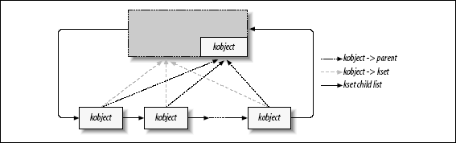

# Linux 设备模型

Linux2.6 内核引入了 sysfs 文件系统。 sysfs 被看成是与 proc 同类别的文件系统。 sysfs 把连接在系统上的设备和总线组织成分级的文件,使其从用户空间可以访问到。

Sysfs 被加载在 /sys/ 目录下,它的子目录包括:

- Block :在系统中发现的每个块设备在该目录下对应一个子目录。每个子目录中又包含一些属性文件,它们描述了这个块设备的各方面属性,如:设备大小。( loop 块设备是使用文件来模拟的)
- Bus :在内核中注册的每条总线在该目录下对应一个子目录,如: ide pci scsi usb pcmcia 其中每个总线目录内又包含两个子目录: devices 和 drivers , devices 目录包含了在整个系统中发现的属于该总线类型的设备,drivers 目录包含了注册到该总线的所有驱动。
- Class :将设备按照功能进行的分类,如 /sys/class/net 目录下包含了所有网络接口。
- Devices :包含系统所有的设备。
- Kernel :内核中的配置参数
- Module :系统中所有模块的信息
- Firmware :系统中的固件
- Fs :描述系统中的文件系统
- Power :系统中电源选项

## Kobject, Kset 和 Subsystem 

### Kobject

Kobject 实现了基本的面向对象管理机制,是构成 Linux2.6 设备模型的核心结构。它与 sysfs 文件系统紧密相连,在内核中注册的每个 kobject 对象对应 sysfs 文件系统中的一个目录。

类似于 C++ 中的基类, Kobject 常被嵌入于其他类型(即:容器)中。如 bus,devices,drivers 都是典型的容器。这些容器通过 kobject 连接起来,形成了一个树状结构。

Kobject 结构体(定义于 linux/kobject.h):
```c
struct kobject {
	const char		*name;          // sysfs 文件系统的入口
	struct list_head	entry;
	struct kobject		*parent;    //指向父对象
	struct kset		*kset;
	struct kobj_type	*ktype;
	struct kernfs_node	*sd;
	struct kref		kref;           //对象引用计数
#ifdef CONFIG_DEBUG_KOBJECT_RELEASE
	struct delayed_work	release;
#endif
	unsigned int state_initialized:1;
	unsigned int state_in_sysfs:1;
	unsigned int state_add_uevent_sent:1;
	unsigned int state_remove_uevent_sent:1;
	unsigned int uevent_suppress:1;
};
```

Kobject 初始化:
```c
void kobject_init(struct kobject *kobj);
int kobject_set_name(struct kobject *kobj, const char *format, ...);
```
- kobject_init 初始化 kobject 结构
- kobject_set_name 命名 kobject 结构

管理 Kobject 引用计数:
```c
struct kobject *kobject_get(struct kobject *kobj);
void kobject_put(struct kobject *kobj);
```
- kobject_get 将 kobject 对象的引用计数加 1 ,同时返回该对象指针。
- kobject_put 将 kobject 对象的引用计数减 1,如果引用计数降为 0,则调用 release 方法释放该 kobject 对象。

Kobject 操作:
```c
int kobject_add(struct kobject *kobj);
int kobject_init_and_add(struct kobject *kobj, struct kobj_type*ktype,struct kobject *parent, const char *fmt, ...)
void kobject_del(struct kobject *kobj);
```
- kobject_add 将 kobject 对象注册到 Linux 系统
- kobject_init_and_add 初始化 kobject ,并将其注册到 linux 系统
- kobject_del 从 Linux 系统中删除 kobject 对象

### Kset

kset 是具有相同类型的 kobject 的集合，在 sysfs 中体现成一个目录

kset 结构体:
```c
struct kset {
	struct list_head list;                      // 连接该kset中所有kobject的链表头
	spinlock_t list_lock;
	struct kobject kobj;                        // 内嵌的kobject
	const struct kset_uevent_ops *uevent_ops;   // 处理热插拔事件的操作集合
};
```

kset 操作
```c
void kset_init(struct kset *kset);              // 初始化 kset 结构
int kset_register(struct kset *kset)            // 在内核中注册一个 kset
extern struct kset * __must_check kset_create_and_add(const char *name,
						const struct kset_uevent_ops *u,
						struct kobject *parent_kobj);   //   创建并注册 kset， 并返回 kset 指针  
void kset_unregister(struct kset *kset)         // 从内核中注销一个 kset
```
- 这些函数只是调用 kobject_* 函数操作kset内嵌的kobject

管理 kset 的引用计数
```c
struct kset *kset_get(struct kset *kset);
void kset_put(struct kset *kset);
```

可以通过为 kset 内嵌的 kobject 命名来为 kset 命名
```c
kobject_set_name(&my_set->kobj, "The name");
```

一个 kset 在一个标准内核链表中维护其子元素, 大部分情况下, 被包含的 kobjects 也指向这个 kset



```c
kset = kset_create_and_add("kset",&uevent_ops,NULL);    // 创建并注册 kset
ret = kobject_init_and_add(&kobj,&ktype,&kset->kobj,"kobject"); // 将 kobj 添加到 kset
if(ret)
    kset_unregister(kset)
```

kset 中也可以包含 kset
```c
/* 创建并注册 kset_p */
kset_p = kset_create_and_add("kset_p",&uevent_ops,NULL);

/* 添加 kset_c 到 kset_p */
kobject_set_name(&kset_c.kobj,"kset_c");
kset_c.kobj.kset = kset_p;

/* 对于较新版本的内核，在注册 kset 之前，需要填充 kset.kobj 的 ktype 成员，否则注册不会成功 */
kset_c.kobj.ktype = &ktype;
ret = kset_register(&kset_c);

if(ret)
   kset_unregister(kset_p); 
```

## 低级 sysfs 操作

### 默认属性

Kobject 的 ktype 成员是一个指向 kobj_type 结构的指针, 该结构中指定了 kobject 对象的默认属性

kobj_type 结构体：
```c
struct kobj_type {
	void (*release)(struct kobject *kobj);
	const struct sysfs_ops *sysfs_ops;
	struct attribute **default_attrs;       
	const struct kobj_ns_type_operations *(*child_ns_type)(struct kobject *kobj);
	const void *(*namespace)(struct kobject *kobj);
};
```
- release 是用于释放 kobject 占用的资源,当 kobject 的引用计数为 0 时被调用
- sysfs_ops 指定一组用于处理对 Kobject 进行 show 和 store 操作的函数
- default_attrs 指针数组通过指定多个 attribute 结构体来指定多个属性文件

attribute 结构体描述 kobject 所表示的目录下的一个属性文件
```c
struct attribute {
	const char		*name;
	mode_t			mode;
#ifdef CONFIG_DEBUG_LOCK_ALLOC
	bool			ignore_lockdep:1;
	struct lock_class_key	*key;
	struct lock_class_key	skey;
#endif
};
```
- name 指定文件名
- mode 指定文件读写权限

sysfs_ops 结构体指定用于处理对属性文件进行 show 和 store 操作的函数
```c
struct sysfs_ops {
	ssize_t	(*show)(struct kobject *, struct attribute *, char *);
	ssize_t	(*store)(struct kobject *, struct attribute *, const char *, size_t);
};
```
- show 用户空间读取属性文件时, 调用此函数, 函数的属性值存入 buffer 返回给用户空间
- store 用户空间写属性文件时调用次函数, 用于存储用户传入的属性值

### 非默认属性

sysfs 也可以使用 sysfs_create_file 和 sysfs_remove_file 任意添加/删除属性文件
```c
static inline int __must_check sysfs_create_file(struct kobject *kobj, const struct attribute *attr)

static inline void sysfs_remove_file(struct kobject *kobj, const struct attribute *attr)
```

### 二进制属性文件

sysfs 也可以建立二进制属性文件, 一般用于在内核空间和设备驱动之间传输二进制数据

bin_attribute 结构体(定义于 sysfs.h)用来描述二进制属性文件
```c
struct bin_attribute {
	struct attribute	attr;
	size_t			size;
	void			*private;
	ssize_t (*read)(struct file *, struct kobject *, struct bin_attribute *,
			char *, loff_t, size_t);
	ssize_t (*write)(struct file *, struct kobject *, struct bin_attribute *,
			 char *, loff_t, size_t);
	int (*mmap)(struct file *, struct kobject *, struct bin_attribute *attr,
		    struct vm_area_struct *vma);
};
```

二进制属性文件必须明确创建, 使用 sysfs_create_bin_file 和 sysfs_remove_bin_file 函数创建和删除
```c
int sysfs_create_bin_file(struct kobject *kobj, struct bin_attribute *attr)
int sysfs_remove_bin_file(struct kobject *kobj, struct bin_attribute *attr)
```

### 符号链接

符号链接用于引用 sysfs 中不同路径的文件, 比如 /sys/devices 中的文件表示系统中已知的设备, /sys/bus 中的文件表示总线驱动, 符号链接可以在两个路径间建立关系

sysfs_create_link 和 sysfs_remove_link 用于创建和删除符号链接
```c
int sysfs_create_link(struct kobject *kobj, struct kobject *target, char *name);
void sysfs_remove_link(struct kobject *kobj, char *name); 
```

## 热插拔事件产生

在 Linux 系统中，当系统配置发生变化时,如:添加 kset 到系统；移动 kobject , 一个通知会从内核空间发送到用户空间,这就是热插拔事件。热插拔事件会导致用户空间中相应的处理程序(如 udev,mdev )被调用, 这些处理程序会通过加载驱动程序, 创建设备节点等来响应热插拔事件。

### kset_uevent_ops 结构体

kset_uevent_ops 结构体用来定义热插拔事件操作集合

当该 kset 所管理的 kobject 和 kset 状态发生变化时（如被加入，移动），kset_uevent_ops 中指定的三个函数将被调用
```c
struct kset_uevent_ops {
	int (* const filter)(struct kset *kset, struct kobject *kobj);
	const char *(* const name)(struct kset *kset, struct kobject *kobj);
	int (* const uevent)(struct kset *kset, struct kobject *kobj,
		      struct kobj_uevent_env *env);
};

```
- filter 函数决定是否将事件传递到用户空间。如果filter返回0,将不传递事件
```c
static int kset_filter(struct kset *kset,struct kobject *kobj){
    printk("Filter: kobj %s.\n",kobj->name);
    return 1;
}
```
- name 函数用于将字符串传递给用户空间的热插拔处理程序
```c
static const char *kset_name(struct kset *kset,struct kobject *kobj){
    static char buf[20];
    printk("Name kobj %s.\n",kobj->name);
    sprintf(buf,"%s","kset_name");
    return buf;
}
```
- uevent 函数将用户空间需要的参数添加到环境变量中
```c
static int kset_uevent(struct kset *kset,struct kobject *kobj, struct kobj_uevent_env *env)
{
    int i = 0;
    printk("uevent: kobj %s.\n",kobj->name);

    while(i < env->envp_idx){   /* 打印环境变量 */
        printk("%s.\n",env->envp[i]);
        i++;
    }

    return 0;
}
```

Linux 系统中, 科执行文件的执行, 依赖于环境变量. kobj_uevent_env 结构体可用于传递环境变量到用户空间
```c
struct kobj_uevent_env {
	char *envp[UEVENT_NUM_ENVP];    //指针数组，用于保存每个环境变量的地址，最多可支持的环境变量数量为UEVENT_NUM_ENVP
	int envp_idx;   // 用于访问环境变量指针数组的index
	char buf[UEVENT_BUFFER_SIZE];   // 保存环境变量的buffer，最大为UEVENT_BUFFER_SIZE
	int buflen; //访问buf的变量
};
```

热插拔事件的产生常常用于总线驱动

## Linux 设备驱动模型

总线是处理器和设备之间的通道,在 Linux 设备模型中, 所有的设备都通过总线相连, 甚至是内部虚拟的"平台总线"

总线负责在新设备或驱动被加入时, 判断指定的驱动程序能否处理指定设备

设备加入总线时, 需要指定其所属的总线, 并将父设备也指定为总线设备

驱动加入总线时, 需要指定其所属的总线, 并需要判断驱动是否可以处理找到的设备

### 总线

在 Linux 设备模型中, 总线由 bus_type 结构体(定义于 linux/device.h)表示
```c
struct bus_type {
	const char		*name;
	const char		*dev_name;
	struct device		*dev_root;
	struct bus_attribute	*bus_attrs;
	struct device_attribute	*dev_attrs;
	struct driver_attribute	*drv_attrs;

	int (*match)(struct device *dev, struct device_driver *drv);
	int (*uevent)(struct device *dev, struct kobj_uevent_env *env);
	int (*probe)(struct device *dev);
	int (*remove)(struct device *dev);
	void (*shutdown)(struct device *dev);

	int (*suspend)(struct device *dev, pm_message_t state);
	int (*resume)(struct device *dev);

	const struct dev_pm_ops *pm;

	struct iommu_ops *iommu_ops;

	struct subsys_private *p;
};
```
- name 总线名称
- bus_groups 总线属性
- dev_groups 设备属性
- drv_groups 驱动属性
- match 当一个新设备或者驱动被添加到这个总线时,该函数被调用。用于判断指定的驱动程序是否能处理指定的设备。若可以,则返回非零值
```c
static int my_match(struct device *dev, struct device_driver *driver)
{
        return !strncmp(dev->kobj.name, driver->name, strlen(driver->name));
}
```
- uevent 在为用户空间产生热插拔事件之前, 这个方法允许总线添加环境变量。
```c
static int my_uevent(struct device *dev, struct kobj_uevent_env *env)
{
    int i = 0;
    printk("uevent: dev %s.\n",dev->name);

    while(i < env->envp_idx){   /* 打印环境变量 */
        printk("%s.\n",env->envp[i]);
        i++;
    }

    return 0;
}
```
- p 指向 subsys_private 结构体

bus 和 class 结构体使用 subsys_private 结构体(定义于 drivers/base/base.h)描述子系统信息, 在子系统中包含了各种设备或驱动, 子系统的表现形式就是 /sys/bus 或 /sys/class 下的子目录, 每一个子目录就是一个子系统
```c
struct subsys_private {
	struct kset subsys;
	struct kset *devices_kset;
	struct list_head interfaces;
	struct mutex mutex;

	struct kset *drivers_kset;
	struct klist klist_devices;
	struct klist klist_drivers;
	struct blocking_notifier_head bus_notifier;
	unsigned int drivers_autoprobe:1;
	struct bus_type *bus;

	struct kset glue_dirs;
	struct class *class;
};
```
- subsys 代表当前bus
- devices_kset 和 drivers_kset 是bus下面的两个kset devices 和 device_driver
- klist_devices和klist_drivers是两个链表，分别保存了本bus下所有的device和device_driver的指针，以方便查找。
- drivers_autoprobe 用于控制该bus下的drivers或者device是否自动probe, 默认为1, 即自动probe, bus  将它开放到 sysfs 中，因而可在用户空间修改，进而控制 probe 行为
- bus 和 class 指针 分别保存上层的bus或者class指针

总线注册/删除
```c
extern int __must_check bus_register(struct bus_type *bus);
extern void bus_unregister(struct bus_type *bus);
```
- 总线的注册使用:bus_register(struct bus_type * bus)
- 若成功,新的总线将被添加进系统,并可在sysfs 的 /sys/bus 下看到
- 总线的删除使用:void bus_unregister(struct bus_type *bus)

总线属性文件使用 bus_attribute 结构体描述
```c
struct bus_attribute {
	struct attribute	attr;
	ssize_t (*show)(struct bus_type *bus, char *buf);
	ssize_t (*store)(struct bus_type *bus, const char *buf, size_t count);
};
```
BUS_ATTR 用于初始化 bus_attribute 结构体
```c
BUS_ATTR(name, mode, show, store);
```

bus_create_file 和 bus_remove_file 用于创建/删除属性文件
```c
int bus_create_file(struct bus_type *bus, struct bus_attribute *attr)
void bus_remove_file(struct bus_type *bus, struct bus_attribute *attr)
```

### 设备

Linux 系统中的每个设备由一个 struct device 描述
```c
struct device {
	struct device		*parent;

	struct device_private	*p;

	struct kobject kobj;
	const char		*init_name; /* initial name of the device */
	const struct device_type *type;

	struct mutex		mutex;	/* mutex to synchronize calls to
					 * its driver.
					 */

	struct bus_type	*bus;		/* type of bus device is on */
	struct device_driver *driver;	/* which driver has allocated this
					   device */
	void		*platform_data;	/* Platform specific data, device
					   core doesn't touch it */
	void		*driver_data;	/* Driver data, set and get with
					   dev_set/get_drvdata */
	struct dev_pm_info	power;
	struct dev_pm_domain	*pm_domain;

#ifdef CONFIG_PINCTRL
	struct dev_pin_info	*pins;
#endif

#ifdef CONFIG_NUMA
	int		numa_node;	/* NUMA node this device is close to */
#endif
	u64		*dma_mask;	/* dma mask (if dma'able device) */
	u64		coherent_dma_mask;/* Like dma_mask, but for
					     alloc_coherent mappings as
					     not all hardware supports
					     64 bit addresses for consistent
					     allocations such descriptors. */
	unsigned long	dma_pfn_offset;

	struct device_dma_parameters *dma_parms;

	struct list_head	dma_pools;	/* dma pools (if dma'ble) */

	struct dma_coherent_mem	*dma_mem; /* internal for coherent mem
					     override */
#ifdef CONFIG_DMA_CMA
	struct cma *cma_area;		/* contiguous memory area for dma
					   allocations */
#endif
	/* arch specific additions */
	struct dev_archdata	archdata;

	struct device_node	*of_node; /* associated device tree node */
	struct fwnode_handle	*fwnode; /* firmware device node */

	dev_t			devt;	/* dev_t, creates the sysfs "dev" */
	u32			id;	/* device instance */

	spinlock_t		devres_lock;
	struct list_head	devres_head;

	struct klist_node	knode_class;
	struct class		*class;
	const struct attribute_group **groups;	/* optional groups */

	void	(*release)(struct device *dev);
	struct iommu_group	*iommu_group;

	bool			offline_disabled:1;
	bool			offline:1;
};
```
- init_name 设备名
- bus 设备所在总线
- driver 设备对应的驱动
- driver_data 该设备驱动使用的私有数据成员
- platform_data 平台相关数据
- power pm_domain 电源管理相关的逻辑
- devt Major 和 Minor 设备号, 在 sysfs 中, 为每个具有设备号的device，在/sys/dev/char 或 /sys/dev/block 下根据设备号创建符号链接
- class 设备属于哪个 class
- groups 设备默认的属性文件集合, 在设备注册时自动在 sysfs 中创建属性文件

device_create 函数用来初始化 device 结构体, 并将其注册到内核
```c
struct device *device_create(struct class *cls, struct device *parent, dev_t devid, void *drvdata, const char *fmt, ...);
struct device *device_create_vargs(struct class *cls, struct device *parent, dev_t devid, void *drvdata, const char *fmt, va_list vargs);
struct device *device_create_with_groups(struct class *cls, struct device *parent, dev_t devid, void *drvdata, const struct attribute_group **groups, const char *fmt, ...);
```

device_destroy 函数用来销毁 device 结构体
```c
void device_destroy(struct class *cls, dev_t devid);
```

device_register 和 device_unregister 函数用于注册/注销设备
```c
int device_register(struct device *dev)
void device_unregister(struct device *dev)
```

device_rename 函数可以重命名设备
```c
int device_rename(struct device *dev, const char *new_name);
```

设备属性文件使用 device_attribute 结构体描述
```c
struct device_attribute {
	struct attribute	attr;
	ssize_t (*show)(struct device *dev, struct device_attribute *attr,
			char *buf);
	ssize_t (*store)(struct device *dev, struct device_attribute *attr,
			 const char *buf, size_t count);
};
```

DEVICE_ATTR 宏用于初始化 device_attribute 结构体
```c
DEVICE_ATTR(_name, _mode, _show, _store) 
```

device_create_file 和 device_remove_file 函数用于创建/删除属性文件
```c
int device_create_file(struct device *device, struct device_attribute * entry)
void device_remove_file(struct device * dev, struct device_attribute * attr)
```

### 驱动

驱动用 device_driver 结构体描述
```c
struct device_driver {
	const char		*name;
	struct bus_type		*bus;

	struct module		*owner;
	const char		*mod_name;	/* used for built-in modules */

	bool suppress_bind_attrs;	/* disables bind/unbind via sysfs */
	enum probe_type probe_type;

	const struct of_device_id	*of_match_table;
	const struct acpi_device_id	*acpi_match_table;

	int (*probe) (struct device *dev);
	int (*remove) (struct device *dev);
	void (*shutdown) (struct device *dev);
	int (*suspend) (struct device *dev, pm_message_t state);
	int (*resume) (struct device *dev);
	const struct attribute_group **groups;

	const struct dev_pm_ops *pm;

	struct driver_private *p;
};
```
- name 驱动的名字(体现在 sysfs 中)
- bus 驱动程序所在的总线
- probe 当驱动找到对应的设备时会执行该函数
- remove 当移除设备时执行次函数
- shutdown suspend resume pm 是电源管理相关的内容
- groups 设备默认的属性文件集合, 在驱动注册时自动在 sysfs 中创建属性文件

driver_register 和 driver_unregister 注册/注销驱动
```c
int driver_register(struct device_driver *drv)
void driver_unregister(struct device_driver *drv)
```

driver_attribute 结构体描述驱动属性文件
```c
struct driver_attribute {
	struct attribute attr;
	ssize_t (*show)(struct device_driver *driver, char *buf);
	ssize_t (*store)(struct device_driver *driver, const char *buf,
			 size_t count);
};
```

DRIVER_ATTR 宏用于初始化 driver_attribute 结构体
```c
DRIVER_ATTR(_name, _mode, _show, _store)
```

driver_create_file 和 driver_remove_file 创建/删除属性文件
```c
int driver_create_file(struct device_driver * drv, struct driver_attribute * attr)
void driver_remove_file(struct device_driver * drv, struct driver_attribute * attr)
```

## 类

类是虚拟出来的，目的是为了抽象设备的共性, 向用户空间提供相似的接口, 比如在驱动层次，SCSI 设备和 ATA 设备的工作方式不同, 但在类的级别, 它们都是磁盘, 类将对磁盘的操作抽象出来提供给用户空间, 而不需要关注对 SCSI 设备或 ATA 设备的操作如何实现

Linux 设备模型中, 类的意义还在于可以自动创建设备节点(这依赖于udev系统), 使用 device_create 函数创建 device 结构体时指定类, udev daemon 就会根据指定的父设备、设备ID等信息自动在 /dev 下创建设备节点, 从而取代了使用 mknod 命令

类使用 class 结构体描述
```c
struct class {
	const char		*name;
	struct module		*owner;

	struct class_attribute		*class_attrs;
	struct device_attribute		*dev_attrs;
	struct bin_attribute		*dev_bin_attrs;
	struct kobject			*dev_kobj;

	int (*dev_uevent)(struct device *dev, struct kobj_uevent_env *env);
	char *(*devnode)(struct device *dev, umode_t *mode);

	void (*class_release)(struct class *class);
	void (*dev_release)(struct device *dev);

	int (*suspend)(struct device *dev, pm_message_t state);
	int (*resume)(struct device *dev);

	const struct kobj_ns_type_operations *ns_type;
	const void *(*namespace)(struct device *dev);

	const struct dev_pm_ops *pm;

	struct subsys_private *p;
};
```
- name class 子系统的名称
- class_atrrs 该class的默认属性文件, 注册 class 时, 自动在 sysfs 中创建属性文件
- dev_attrs class 所属的每个设备的默认属性文件, 注册设备时, 会在设备的 sysfs 中创建属性文件
- dev_bin_attrs 所属的每个设备的默认二进制属性文件
- dev_kobj 当前 class 的 kobject, 用于在 sysfs 中创建目录
- dev_uevent 当该class下有设备发生变化时，会调用class的uevent回调函数。
- class_release 当释放 class 所在的 sysfs 资源时, release class_release 会被调用
- dev_release 当 class 所属的设备被注销时, dev_release 会被调用. 默认被设置为 device_release 函数, 会依次检查 device device_type device->class 是否注册了 release 函数, 如果有则调用 release 释放对应的结构体
- p 指向 subsys_private 结构体, 描述 class 子系统

class_create 宏用于初始化 class 结构体, 并返回指针
```c
class_create(owner, name)
struct class * __must_check __class_create(struct module *owner, const char *name, struct lock_class_key *key);
```

class_destroy 销毁 class 结构体
```c
void class_destroy(struct class *cls)
```

class_register 注册 class, 注册成功后会在 /sys/class 目录下创建 class 子系统目录
```c
class_register(class)
int __must_check __class_register(struct class *class, struct lock_class_key *key);
```

class_unregister 注销 class
```c
void class_unregister(struct class *cls)
```

class_attribute 结构体描述 class 下的属性文件
```c
struct class_attribute {
	struct attribute attr;
	ssize_t (*show)(struct class *class, struct class_attribute *attr, char *buf);
	ssize_t (*store)(struct class *class, struct class_attribute *attr, const char *buf, size_t count);
};
```

CLASS_ATTR 初始化 class_attribute 结构体
```c
CLASS_ATTR(name, mode, show, store);
```

class_create_file 和 class_remove_file 函数创建/删除 class 属性文件
```c
int class_create_file(struct class *cls, const struct class_attribute *attr);
void class_remove_file(struct class *cls, const struct class_attribute *attr);
```

class_interface 结构体
```c
struct class_interface {
	struct list_head	node;
	struct class		*class;

	int (*add_dev)		(struct device *, struct class_interface *);
	void (*remove_dev)	(struct device *, struct class_interface *);
};
```

class_interface 结构体功能： 当 设置了 class_interface 的 class 所属的设备被添加或移除时, 会调用对应的 add_dev 或 remove_dev 方法

class_interface_register 和 class_interface_unregister 用于注册/注销 class_interface 结构体
```c
int class_interface_register(struct class_interface *intf);
void class_interface_unregister(struct class_interface *intf);
```

## Linux 设备模型的生命周期

### 总线的注册

1. 初始化 bus_type 结构体, 设置 name match uevent suspend resume dev_attrs 等属性

2. 使用 bus_register 函数注册 bus_type 结构体变量

3. bus_register 会执行以下步骤:
    
    - 为 bus_type 中struct subsys_private 类型的指针分配空间, 并更新 priv->bus 和 bus->p 两个指针为正确的值
    - 初始化 priv->subsys.kobj 的 name kset ktype 等字段，name 就是该 bus 的 name（它会体现在sysfs中），kset 和 ktype 由 bus 模块实现，分别为 bus_kset和 bus_ktype
    - 调用 kset_register 将 priv->subsys 注册到内核中，该接口同时会向 sysfs 中添加对应的目录（如/sys/bus/spi）
    - 调用 bus_create_file 向 bus 目录下添加一个 uevent 属性文件（如/sys/bus/spi/uevent）
    - 调用 kset_create_and_add 分别向内核添加 devices 和 device_drivers kset，同时会体现在sysfs中添加对应目录(如在/sys/bus/spi下创建两个路径: devices 和 drivers)
    - 初始化 priv 指针中的 mutex klist_devices 和 klist_drivers 等变量
    - 调用 add_probe_files 接口，在 bus 下添加 drivers_probe 和 drivers_autoprobe 两个属性文件 （如/sys/bus/spi/drivers_probe 和 /sys/bus/spi/drivers_autoprobe），其中 drivers_probe 允许用户空间程序主动触发指定 bus 下的 device_driver 的 probe 动作，而 drivers_autoprobe 控制是否在 device 或 device_driver 添加到内核时，自动执行 probe
    - 调用 bus_add_attrs，添加由 bus_attrs 指针定义的 bus 的默认 attribute，这些 attributes 最终会体现在/sys/bus/xxx目录下

### 设备的注册

1. bus 模块初始化 device 结构体, 然后使用 device_register 函数将其注册到 driver core
    
    device_initialize (初始化) device_create (初始化+注册) 其他函数可以用于该操作
    
2. device_register 函数会将设备加入到所属总线的设备表

3. bus 模块会将设备表中的设备逐一交给 device 所属总线的 match 函数

4. match 函数应检查已注册的驱动是否匹配此设备, 如果不匹配, match 应返回 0 给 driver core, 让 driver core 检查下一个设备; 如果匹配, 则应返回 1, 让 driver core 将 device 结构体的 driver 指针指向匹配的 device_driver 结构体， 并调用该 device_driver 结构体的 probe 函数

5. probe 函数应再匹配一遍 device 和 device_driver (可以和 match 函数逻辑相同), 匹配失败则返回一个负值错误码, 让 driver core 继续寻找能匹配该设备的驱动程序; 如果匹配成功, 则执行必要的设备初始化程序, 然后返回 0, 让 driver core 将设备加入到驱动程序的支持列表中, 以便系统后续访问, 并在 sysfs 文件系统的 /sys/bus/xxx 的 /devices 和 /drivers 下建立符号链接, 指向 sysfs 的 /sys/devices 下的实际路径

### 设备的注销

1. 如果有必要, 先作一些清理工作, 然后调用 device_unregister 函数

2. device_unregister 函数会解除 sysfs 中设备和驱动之间的关联关系, 将设备移除出总线的设备表, 调用 kobject_del 清理掉 device 结构体内嵌的 kobject， 然后会对用户空间发出一个 hotplug 事件, 最后会删除该 kobject 在 sysfs 下的所有文件

    kobject_del 函数本身也会移除设备的 kobject 引用, 如果引用计数已经为1, 则调用 device 结构体的 release 函数, release 函数应释放 device  结构体所占用的内存

### 驱动的注册

1. bus 模块执行一些必要的初始化工作, 如将驱动加入所属总线内部的驱动清单, 初始化 device_driver 结构体等

2. 使用 driver_register 函数将 device_driver 结构体注册进 driver core

3. driver_register 函数会初始化 device_driver 结构体内的几个锁, 然后调用 bus_add_driver 函数

4. bus_add_driver 函数会执行以下步骤:

    - 找出驱动程序所属的总线, 如果没找到总线, driver_register 会立即返回 -EINVAL
    - 将 driver 的 kset（priv->kobj.kset） 设置为 bus 的 drivers kset（bus->p->drivers_kset），这就意味着所有 driver 的 kobject 都位于 bus->p->drivers_kset 之下（即 /sys/bus/xxx/drivers 目录下） ，参照驱动的name以及所属总线, 在 /sys/bus/xxx/drivers 下创建目录，并将驱动注册进内核
    - 将 driver 添加进 bus 的内部链表中，并根据 drivers_autoprobe 的值选择是否调用 driver_attach 进行 probe
    - 调用 driver_create_file 接口，在 sysfs 的该 driver 的目录下，创建 uevent attribute
    - 调用 driver_add_attrs 接口，在 sysfs 的该 driver 的目录下，创建由 bus->drv_attrs 指针定义的默认 attribute
    - 同时根据 suppress_bind_attrs 标志，决定是否在 sysfs 的该 driver 的目录下，创建 bind 和 unbind attribute

### 驱动的注销

1. 使用 driver_unregister 注销 device_driver 结构体

2. driver_unregister 函数会清除驱动在 sysfs 里所产生的属性文件, 接着遍历驱动所支持的每一个设备, 让每个设备都经过驱动的 release 处理

3. 获得信号量, 如果信号量没有获得, 驱动模块就不能被安全卸载, 只有成功获得信号量后, 内核才能安全的卸载驱动模块

## 热插拔

### Uevent 内部逻辑解析

kobject 使用 kobject_action 枚举体描述 kobject 事件
```c
enum kobject_action {
	KOBJ_ADD,
	KOBJ_REMOVE,
	KOBJ_CHANGE,
	KOBJ_MOVE,
	KOBJ_ONLINE,
	KOBJ_OFFLINE,
	KOBJ_MAX
};
```
- ADD/REMOVE Kobject（或上层数据结构）的添加/移除事件
- ONLINE/OFFLINE Kobject（或上层数据结构）的上线/下线事件，上线则可用
- CHANGE Kobject（或上层数据结构）的状态或者内容发生改变
- MOVE Kobject（或上层数据结构）更改名称或者更改Parent（意味着在sysfs中更改了目录结构）
- CHANGE 如果设备驱动需要上报的事件不再上面事件的范围内，或者是自定义的事件，可以使用该event，并携带相应的参数

Uevent 模块提供下列 API, 共总线处理热插拔事件
```c
int kobject_uevent(struct kobject *kobj, enum kobject_action action);
int kobject_uevent_env(struct kobject *kobj, enum kobject_action action, char *envp[]);
int add_uevent_var(struct kobj_uevent_env *env, const char *format, ...);
int kobject_action_type(const char *buf, size_t count, enum kobject_action *type);
```
- kobject_uevent 函数用于向用户空间上报事件, kobject_uevent_env 函数可以传递环境变量

    - 查找kobj本身或者其parent是否从属于某个kset，如果不是，则报错返回
    - 查看kobj->uevent_suppress是否设置，如果设置，则忽略所有的uevent上报并返回
    - 如果所属的kset有uevent_ops->filter函数，则调用该函数，过滤此次上报
    - 判断所属的kset是否有合法的名称（称作subsystem，和前期的内核版本有区别），否则不允许上报uevent
    - 分配一个用于此次上报的、存储环境变量的buffer（结果保存在env指针中），并获得该Kobject在sysfs中路径信息（用户空间软件需要依据该路径信息在sysfs中访问它）
    - 调用add_uevent_var接口（下面会介绍），将Action、路径信息、subsystem等信息，添加到env指针中
    - 如果传入的envp不空，则解析传入的环境变量中，同样调用add_uevent_var接口，添加到env指针中
    - 如果所属的kset存在uevent_ops->uevent接口，调用该接口，添加kset统一的环境变量到env指针
    - 根据ACTION的类型，设置kobj->state_add_uevent_sent和kobj->state_remove_uevent_sent变量，以记录正确的状态 
    - 调用add_uevent_var接口，添加格式为"SEQNUM=%llu”的序列号
    - 如果定义了"CONFIG_NET”，则使用netlink发送该uevent
    - 以uevent_helper、subsystem以及添加了标准环境变量（HOME=/，PATH=/sbin:/bin:/usr/sbin:/usr/bin）的env指针为参数，调用kmod模块提供的call_usermodehelper函数，上报uevent。

    > 其中uevent_helper的内容是由内核配置项CONFIG_UEVENT_HELPER_PATH(位于./drivers/base/Kconfig)决定的(可参考lib/kobject_uevent.c, line 32)，该配置项指定了一个用户空间程序（或者脚本），用于解析上报的uevent，例如"/sbin/hotplug”。
    
    > call_usermodehelper的作用，就是fork一个进程，以uevent为参数，执行uevent_helper
    
- add_uevent_var，以格式化字符的形式（类似printf、printk等），将环境变量copy到env指针中
- kobject_action_type，将enum kobject_action类型的Action，转换为字符串

### udev

udev (user-space dev) 是用户空间工具, 根据内核传出的 sysfs 传递出的环境变量等信息, 按照一定的规则动态建立设备节点

常用规则包括:

- SUBSYSTEM 描述设备所属的子系统, 格式如：SUBSYSTEM=="usb", 常见的子系统包括 tty, misc, usb, input, scsi, block, i2c, network,  frame buffer
- ATTR 描述一些附加的其他信息, 格式如：ATTR {idVendor}=="1ebf"
- MODE GROUP 描述设备访问权限

## 处理固件

有些硬件设备需要固件才能工作, 但是未必所有厂商都为硬件制作EEPROM, 这就需要设备驱动将固件写入硬件

## 固件处理接口

linux 推荐的方式是使用 request_firmware 函数(定义于 linux/firmware.h)加载固件, 这个函数会在用户空间寻找指定路径的固件, 然后传递给内核
```c
int request_firmware(const struct firmware **fw, char *name, struct device *device);
int request_firmware_nowait(struct module *module, char *name,struct device *device, void *context, void (*cont)(const struct firmware *fw, void *context)); 
```
- name 指定固件路径
- 返回 0 表示成功传入内核, 并将固件填充进 firmware 结构体中, 传入失败则返回负的错误码
- request_firmware 需要进入用户空间, 会导致驱动程序休眠
- request_firmware_nowait 以异步的形式加载固件, 调用后会立即返回
- module 参数一般指定为 THIS_MODULE, context 可以为空
- 固件传入内核后, cont 函数会被自动调用, 该函数负责将固件烧写到设备
- 如果 user-space 无法传递固件, fw 就会为空, 所以需要 count 检查 fw, 然后再决定是否烧写固件

firmware 结构体
```c
struct firmware {
	size_t size;
	const u8 *data;
	struct page **pages;

	/* firmware loader private fields */
	void *priv;
};
```

固件加载前有可能已经损坏, 因此需要检查文件的完整性, 比如使用 md5sum、shasum等

固件写入后, 就可以使用 release_firmware 释放 firmware 结构体了
```c
void release_firmware(struct firmware *fw);
```

### 固件子系统的工作原理

固件子系统的工作需要与 sysfs 和 热插拔机制配合

1. request_firmware 调用时, 会以设备的名称在 /sys/class/firmware 下创建一个新路径, 并包含下列属性文件:

    - loading
    
        负责将固件镜像传入到内核的用户空间进程需要将此属性文件的内容设置为1, 当传入完毕, 则将属性文件改为 0, 如果传入因故终止, 则设置为 -1
    
    - data
    
        保存完整的固件镜像文件, 在传入完毕后写入此文件
        
    - device
    
        这时一个符号链接, 指向目标设备在 /sys/devices 下对应的文件

2. 之后内核会为目标设备发出一个热插拔事件, 然后 /sbin/hotplug 会获得一个 FIRMWARE 环境变量, 变量值是 request_firmware 所指定的固件镜像名, 并负责将固件写入 sysfs. 如果用户空间十秒内没有响应, 内核就会放弃

>备注: 没有厂商的许可, 固件不能随驱动程序发布