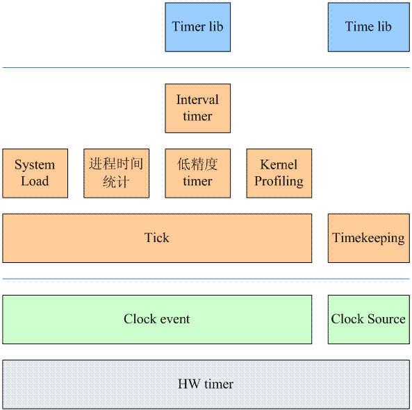
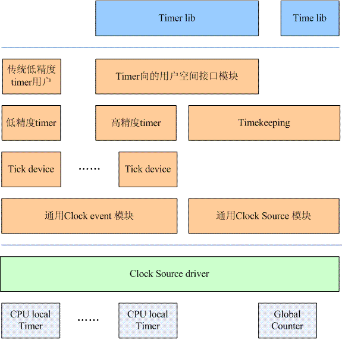

# 时间子系统软件架构

## 早期架构

传统时间子系统软件架构图：



- 早期单核心系统，一般只有一个 HW timer block
- clock event 通过 HW timer 的中断处理完成
- tick 模块在 clock event 的基础上构建，发送系统的 tick 。
- timekeeping 模块 由 tick 模块驱动，每次系统 tick 到来的时候， timekeeping 模块就累加系统时间。
- tick 周期一般为 10 ms ，如果有更高精度需求， clock source 模块提供的接口函数处理 tick 之间的 offset 时间信息。

由此可见，早期的 Linux 内核只支持低精度的 。

在内核空间中，各个模块使用低精度 timer 实现自己的定时功能，基于低精度 timer 统计各个进程的时间，用于进程调度，也使用低精度 timer 计算系统负荷以及分析内核性能。

在用户空间中，提供获取或设置当前系统时间的接口函数，如 time stime gettimeofday 等，以及提供 timer 相关接口函数，如 settimer alarm 等。

## 现行架构

随着计数的发展，出现了两种新需求：

- 嵌入式设备需要较好的电源管理策略。传统的 linux 会有一个周期性的时钟，即便是系统无事可做的时候也要醒来，这样导致系统不断的从低功耗（ idle ）状态进入高功耗的状态。这样的设计不符合电源管理的需求。 
- 多媒体的应用程序需要非常精确的 timer ，例如为了避免视频的跳帧、音频回放中的跳动，这些需要系统提供足够精度的 timer。

在新需求的推动下， Linux 时间子系统演化成现在的架构。

现行时间子系统软件架构图：



### 各个层次说明

#### HW timer 层

由于 multi-core 系统的引入， HW timer 分成两个部分：

- free running 的 system counter ，是全局的，不属于任何一个 CPU ，被称为 GLOBAL counter 。
- 嵌入到各个 cpu core 中，产生定时事件的 HW block ，被称为 CPU local Timer ，这些 timer 都是基于 Global counter 运作。

#### clock source chip driver 层

在驱动层，我们提供一个 clock source chip driver 的模块来驱动硬件，这是模块是和硬件体系结构有关的。如果系统内存在多个 HW timer 和 counter block ，那么系统中可能会存在多个 clock source chip driver 。

#### 通用 clock event 模块和通用 clock source 模块

面对形形色色的 timer 和 counter 硬件， linux kernel 抽象出了通用 clock event 模块和通用 clock source 模块，这两个模块和硬件无关。底层的 clock source chip driver 会调用通用 clock event 和 clock source 模块的接口函数注册 clock source 和 clock event 设备。

- clock source 设备对应硬件的 system counter ，提供了一个基础的时间线 。

    >备注：对于内核而言，其时间线是构建在 system counter 之上的，因此 clock source 对应的时间线存在溢出问题，目前使用 64 bit 的 counter ， 而且输入频率不是很高，所以溢出时间可能会长达50年，所以目前时间溢出的问题还可以接受。

- clock event 设备负责在时间线上指定的点产生 clock event ， 它基于中断子系统， clock source chip driver 会申请中断并调用 clock event 模块的 callback 函数来通知这样的异步事件。

#### tick device 层

tick device 层基于 clock event 设备工作：

- 系统中有多少个 timer 硬件就注册多少个 clock event device ， 有多少个 cpu ，就会有多少个 tick device ，被称为 local tick device ，各个 cpu 的 tick device 会选择自己适合的那个 clock event 设备。
- tick device 可以根据系统高配置工作在周期性触发模式（ periodic mode ） 或者 单触发模式（ one shot mode ）
- 系统会在一个 local tick device 选择一个用来维护整个系统的 jiffies 、更新 wall clock 、计算整个系统的负荷，这个 tick deivce 被称为 global tick device 。

#### 低/高精度 timer

高精度的 timer 基于 one shot mode 的 tick device 所提供高精度的 clock event 实现， 系统各个模块高精度timer的接口来完成定时服务。

Linux 内核仍然保留低精度 timer 机制。

当系统处于高精度 timer 的时候（ tick device 处于 one shot mode ），系统会设置一个特别的高精度 timer （ 可以称之 sched timer ），该高精度 timer 会周期性的触发，以模拟的传统的 periodic tick ，从而推动了传统低精度 timer 的运转。因此，一些传统的内核模块仍然可以调用经典的低精度 timer 模块的接口。 

### 源码说明

linux kernel 时间子系统的源文件位于 linux/kernel/time/ 目录下，整理如下：

| 文件名 | 描述 |
| :-- | :-- |
| time.c | time.c 文件是一个向用户空间提供时间接口的模块。具体包括： time, stime , gettimeofday , settimeofday ,adjtime 。除此之外，该文件还提供一些时间格式转换的接口函数（其他内核模块使用），例如 jiffes 和微秒之间的转换，日历时间（ Gregorian date ）和 xtime 时间的转换。xtime 的时间格式就是到 linux epoch 的秒以及纳秒值。 |
| timer.c  | 传统的低精度 timer 模块，基本 tick 的。 |
| time_list.c timer_status.c | 向用户空间提供的调试接口。在用户空间，可以通过 /proc/timer_list 接口可以获得内核中的时间子系统的相关信息。例如：系统中的当前正在使用的 clock source 设备、clock event 设备和 tick device 的信息。通过 /proc/timer_stats 可以获取 timer 的统计信息。 |
| hrtimer.c | 高精度 timer 模块 |
| posix-timers.c <br> posix-cpu-timers.c <br> posix-clock.c | interval timer 模块 |
| alarmtimer.c | alarmtimer 模块 |
|  clocksource.c <br> jiffies.c | clocksource.c 是通用 clocksource driver 。其实也可以把 system tick 也看成一个特定的 clocksource ，其代码在 jiffies.c 文件中 |
|  timekeeping.c <br> timekeeping_debug.c | timekeeping 模块 |
|  ntp.c | NTP 模块 |
|  clockevent.c | clockevent 模块 |
| tick-common.c <br> tick-oneshot.c <br> tick-sched.c |这三个文件属于 tick device layer ：<br>tick-common.c 文件是 periodic tick 模块，用于管理周期性 tick 事件。<br> tick-oneshot.c 文件是 for 高精度 timer 的，用于管理高精度 tick 时间。<br> tick-sched.c 是用于 dynamic tick 的。 |
|  tick-broadcast.c <br> tick-broadcast-hrtimer.c | broadcast tick 模块 |
| sched_clock.c | 通用 sched clock 模块。这个模块主要是提供一个 sched_clock 的接口函数，调用该函数可以获取当前时间点到系统启动之间的纳秒值。<br>底层的 HW counter 其实是千差万别的，有些平台可以提供 64-bit 的 HW counter ，因此，在那样的平台中，我们可以不使用这个通用 sched clock 模块（不配置 CONFIG_GENERIC_SCHED_CLOCK 这个内核选项），而在自己的 clock source chip driver 中直接提供 sched_clock 接口。<br>使用通用 sched clock 模块的好处是：该模块扩展了 64-bit 的 counter，即使底层的 HW counter 比特数目不足（有些平台 HW counter 只有 32 个 bit ）。 |

## 和时间子系统相关的内核配置

### clock source 和 clock event

CONFIG_GENERIC_CLOCKEVENTS 和 CONFIG_GENERIC_CLOCKEVENTS_BUILD ：使用新的时间子系统的构架，不配置就使用传统时间子系统。

CONFIG_ARCH_USES_GETTIMEOFFSET ：需要兼容传统 timekeeping 接口，就设置该选项

### tick deivce 层

如果选择了新的时间子系统的软件架构（配置了 CONFIG_GENERIC_CLOCKEVENTS ），那么内核会打开 Timers subsystem 的配置选项，主要是和 tick 以及高精度 timer 配置相关。和 tick 相关的配置有三种，包括： 

- 无论何时，都启用用周期性的 tick ，即便是在系统 idle 的时候。这时候要配置 CONFIG_HZ_PERIODIC 选项。
- 系统 idle 的时候，停掉周期性 tick 。对应的配置项是 CONFIG_NO_HZ_IDLE 。配置 tickless idle system 也会同时 enable NO_HZ_COMMON 的选项。 
- Full dynticks system 。即便在非 idle 的状态下，也就是说 cpu 上还运行在 task ，也可能会停掉 tick 。这个选项和实时应用相关。对应的配置项是 CONFIG_NO_HZ_FULL 。配置 Full dynticks system 也会同时 enable NO_HZ_COMMON 的选项。

上面的三个选项只能是配置其一。上面描述的是新的内核配置方法，对于旧的内核，CONFIG_NO_HZ 用来配置 dynamic tick 或者叫做 tickless idle system（非 idle 时有周期性 tick，idle 状态，timer 中断不再周期性触发，只会按照需要触发），为了兼容旧的系统，新的内核仍然支持了这个选项。 

### timer 模块

和高精度 timer 相关的配置比较简单，只有一个 CONFIG_HIGH_RES_TIMERS 的配置项。如果配置了高精度 timer，或者配置了 NO_HZ_COMMON 的选项，那么一定需要配置 CONFIG_TICK_ONESHOT ，表示系统支持支持 one-shot 类型的 tick device 。

## 时间子系统的数据流和控制流

### 使用低精度 timer + 周期tick

周期性 tick 基于 clock source chip driver ， 该 driver 会调用注册 clock event 的接口函数（ clockevents_config_and_register 或者 clockevents_register_device ）， clock event device 就绪后，需要通知 tick deivce 层有新的 clock event device 可用（ 通过调用 tick_check_new_device 函数实现 ）。

要是这个 clock event device 被某个 tick device 接收（要么该 tick device 之前没有匹配的 clock event device ，要么新的 clock event device 更适合该 tick device ），那么就启动对该 tick device 的配置（ 参考 tick_setup_device ）。

根据当前系统的配置情况（周期性 tick ），会调用 tick_setup_periodic 函数，这时候，该 tick device 对应的 clock event device 的 clock event handler 被设置为 tick_handle_periodic 。底层硬件会周期性的产生中断，从而会周期性的调用 tick_handle_periodic 从而驱动整个系统的运转。

需要注意的是：即便是配置了 CONFIG_NO_HZ 和 CONFIG_TICK_ONESHOT ，系统中没有提供 one shot 的 clock event device ，这种情况下，整个系统仍然是运行在周期性 tick 的模式下。

低精度 time 模式下，内核也会将高精度模块编译进内核：
```c
obj-y += time.o timer.o hrtimer.o itimer.o posix-timers.o posix-cpu-timers.o 
```

高精度 timer 总是会被编入最后的内核中。在这种构架下，各个内核模块也可以调用 linux 内核中的高精度 timer 模块的接口函数来实现高精度 timer ，但是，这时候高精度 timer 模块是运行在低精度的模式，也就是说这些 hrtimer 虽然是按照高精度 timer 的红黑树进行组织，但是系统只是在每一周期性 tick 到来的时候调用 hrtimer_run_queues 函数，来检查是否有 expire 的 hrtimer 。毫无疑问，这里的高精度 timer 也就是没有意义了。

由于存在周期性tick，低精度timer的运作和传统时间子系统一样。 

### 低精度 timer + Dynamic Tick

系统开始的时候并不是直接进入 Dynamic tick mode 的，而是经历一个切换过程。开始的时候，系统运行在周期 tick 的模式下，各个 cpu 对应的 tick device 的（ clock event device 的）event handler 是 tick_handle_periodic 。

在 timer 的软中断上下文中，会调用 tick_check_oneshot_change 进行是否切换到 one shot 模式的检查，如果系统中有支持 one-shot 的 clock event device ，并且没有配置高精度 timer 的话，那么就会发生 tick mode 的切换（调用 tick_nohz_switch_to_nohz ），这时候， tick device 会切换到 one shot 模式，而 event handler 被设置为 tick_nohz_handler 。

由于这时候的 clock event device 工作在 one shot 模式，因此当系统正常运行的时候，在 event handler 中每次都要 reprogram clock event ，以便正常产生 tick。当 cpu 运行 idle 进程的时候， clock event device 不再 reprogram 产生下次的 tick 信号，这样，整个系统的周期性的 tick 就停下来。

高精度timer和低精度timer的工作原理同上。 

### 高精度 timer + Dynamic Tick

同样的，系统开始的时候并不是直接进入 Dynamic tick mode 的，而是经历一个切换过程。系统开始的时候是运行在周期 tick 的模式下，event handler 是 tick_handle_periodic 。在周期 tick 的软中断上下文中（参考 run_timer_softirq ），如果满足条件，会调用 hrtimer_switch_to_hres 将 hrtimer 从低精度模式切换到高精度模式上。这时候，系统会有下面的动作：

1. Tick device 的 clock event 设备切换到 oneshot mode（参考 tick_init_highres 函数）
2. Tick device 的 clock event 设备的 event handler 会更新为 hrtimer_interrupt （参考 tick_init_highres 函数）
3. 设定 sched timer （也就是模拟周期 tick 那个高精度 timer ，参考 tick_setup_sched_timer 函数）

这样，当下一次 tick 到来的时候，系统会调用 hrtimer_interrupt 来处理这个 tick （该 tick 是通过 sched timer 产生的）。

在 Dynamic tick 的模式下，各个 cpu 的 tick device 工作在 one shot 模式，该 tick device 对应的 clock event 设备也工作在 one shot 的模式，这时候，硬件 Timer 的中断不会周期性的产生，但是 linux kernel 中很多的模块是依赖于周期性的 tick 的，因此，在这种情况下，系统使用 hrtime 模拟了一个周期性的 tick 。在切换到 dynamic tick 模式的时候会初始化这个高精度 timer ，该高精度 timer 的回调函数是 tick_sched_timer 。这个函数执行的函数类似周期性 tick 中 event handler 执行的内容。不过在最后会 reprogram 该高精度 timer ，以便可以周期性的产生 clock event 。当系统进入 idle 的时候，就会 stop 这个高精度 timer ，这样，当没有用户事件的时候， CPU 可以持续在 idle 状态，从而减少功耗。

### 高精度 timer + 周期性 Tick

这种配置不多见，多半是由于硬件无法支持 one shot 的 clock event device ，这种情况下，整个系统仍然是运行在周期 tick 的模式下。 