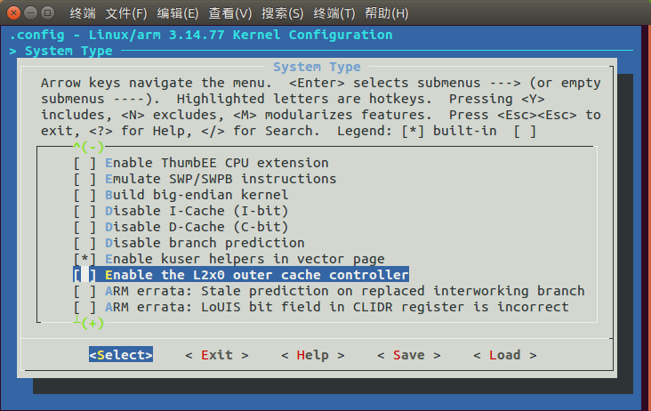
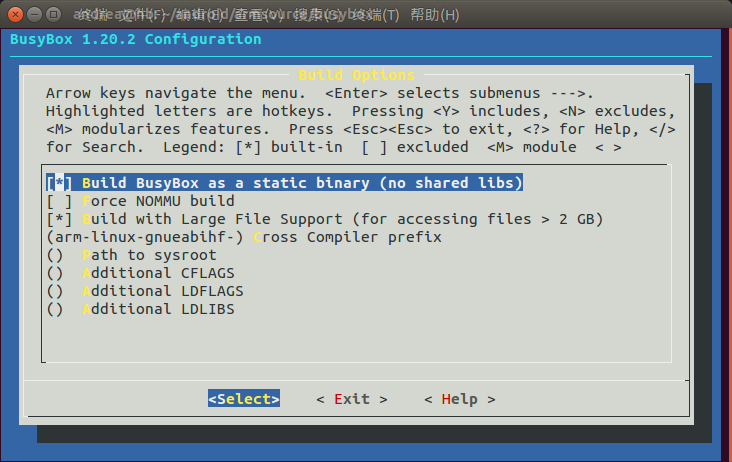

# 使用 Qemu 设置 Linux kernel 运行环境

## 设置环境

主机：Ubuntu 15.10

安装 Qemu
```sh
sudo apt-get install qemu qemu-kvm qemu-user qemu-system qemu-system-arm
```
>备注：目前 apt-get install 安装的 qemu-system-arm 是 2.3 版本

Linux kernel： linux-3.14.y

busybox 版本：1_20_stable

u-boot 版本：2016.11-rc1

交叉编译工具链：gcc-linaro-6.1.1-2016.08-x86_64_arm-linux-gnueabihf

设置环境变量：
```sh
export ARCH=arm
export CROSS_COMPILE=arm-linux-gnueabihf-
export ENV_HOME=/absolute/path/to/gcc-root
export PATH=${ENV_HOME}/bin:$PATH
export GCCLIB_PATH=${ENV_HOME}/arm-linux-gnueabihf/libc/lib
```

创建相关路径
```
mkdir -pv ~/armsource/{kernel,uboot,rootfs,busybox，etc}
```
- 所有文件都存放在 armsource 下
- kernel 存放内核代码
- uboot 存放 u-boot 代码
- busybox 存放 busybox 代码
- etc 下存放 root 文件系统必备的一些文件 
- rootfs 准备用来存放 root 文件系统

## 编译 Linux kernel

qemu 模拟得最好的 arm 芯片，要数 ARM 公司的 vexpress A9 开发板了，当然对于 qemu 模拟的其他芯片，只要内核对它有成熟的支持就可以。

Linux 源码树中， vexpress A9 芯片对应的配置是 vexpress_defconfig 。
```sh
make vexpress_defconfig
```

此时还需要调整内核配置，进入 menuconfig ， 取消 System Type  ---> Enable the L2x0 outer cache controller 选项



然后开始编译：
```sh
make -j4
```

## 测试 qemu 是否可以引导内核启动

qemu 命令如下：
```sh
qemu-system-arm \
-M vexpress-a9 \
-m 512M \
-kernel kernel/linux-stable/arch/arm/boot/zImage \
-serial stdio \
-append "console=ttyAMA0"
```
- -M vexpress-a9 指定模拟 vexpress-a9 单板。
>备注：通过 qemu-system-arm -M ? 命令可以查看当前 qemu 版本支持的所有单板
- -m 512M 单板运行物理内存 512M
- -kernel kernel/linux-stable/arch/arm/boot/zImage 告诉 qemu 单板运行内核镜像路径
- serial stdio 启动一个图形界面，并将串口输出重定向到 stdio
- -append "console=ttyAMA0" 内核启动参数，这里指定内核 vexpress 单板运行使用的串口设备为 ttyAMA0 。
>备注：不同的单板，串口驱动类型可能不同，对应创建的 tty 设备也不尽相同。这个 tty 设备在内核配置文件的 CONFIG_CONSOLE 选项中设置， console 参数的值需要与之匹配。

如果看到在 stdio 中打印如下内容，说明内核以及 qemu 的设置是成功的
```
pulseaudio: set_sink_input_volume() failed
pulseaudio: Reason: Invalid argument
pulseaudio: set_sink_input_mute() failed
pulseaudio: Reason: Invalid argument
Booting Linux on physical CPU 0x0
Initializing cgroup subsys cpuset
Linux version 3.14.77+ (andrea@hb) (gcc version 6.1.1 20160711 (Linaro GCC 6.1-2016.08) ) #2 SMP Mon Nov 7 11:24:42 CST 2016
CPU: ARMv7 Processor [410fc090] revision 0 (ARMv7), cr=10c53c7d
CPU: PIPT / VIPT nonaliasing data cache, VIPT nonaliasing instruction cache
Machine: ARM-Versatile Express
Memory policy: Data cache writeback
CPU: All CPU(s) started in SVC mode.
sched_clock: 32 bits at 24MHz, resolution 41ns, wraps every 178956969942ns
PERCPU: Embedded 7 pages/cpu @9fbed000 s7232 r8192 d13248 u32768
Built 1 zonelists in Zone order, mobility grouping on.  Total pages: 130048
Kernel command line: console=ttyAMA0
PID hash table entries: 2048 (order: 1, 8192 bytes)
Dentry cache hash table entries: 65536 (order: 6, 262144 bytes)
Inode-cache hash table entries: 32768 (order: 5, 131072 bytes)
Memory: 513396K/524288K available (4506K kernel code, 184K rwdata, 1252K rodata, 227K init, 145K bss, 10892K reserved)
Virtual kernel memory layout:
    vector  : 0xffff0000 - 0xffff1000   (   4 kB)
    fixmap  : 0xfff00000 - 0xfffe0000   ( 896 kB)
    vmalloc : 0xa0800000 - 0xff000000   (1512 MB)
    lowmem  : 0x80000000 - 0xa0000000   ( 512 MB)
    modules : 0x7f000000 - 0x80000000   (  16 MB)
      .text : 0x80008000 - 0x805a7d7c   (5760 kB)
      .init : 0x805a8000 - 0x805e0c40   ( 228 kB)
      .data : 0x805e2000 - 0x806102a0   ( 185 kB)
       .bss : 0x806102a8 - 0x806348c4   ( 146 kB)
SLUB: HWalign=64, Order=0-3, MinObjects=0, CPUs=1, Nodes=1
Hierarchical RCU implementation.
	RCU restricting CPUs from NR_CPUS=8 to nr_cpu_ids=1.
RCU: Adjusting geometry for rcu_fanout_leaf=16, nr_cpu_ids=1
NR_IRQS:16 nr_irqs:16 16
GIC CPU mask not found - kernel will fail to boot.
GIC CPU mask not found - kernel will fail to boot.
smp_twd: clock not found -2
Console: colour dummy device 80x30
Calibrating local timer... 95.59MHz.
Calibrating delay loop... 466.94 BogoMIPS (lpj=2334720)
pid_max: default: 32768 minimum: 301
Mount-cache hash table entries: 1024 (order: 0, 4096 bytes)
Mountpoint-cache hash table entries: 1024 (order: 0, 4096 bytes)
CPU: Testing write buffer coherency: ok
missing device node for CPU 0
CPU0: thread -1, cpu 0, socket 0, mpidr 80000000
Setting up static identity map for 0x6044ddf0 - 0x6044de48
Brought up 1 CPUs
SMP: Total of 1 processors activated (466.94 BogoMIPS).
CPU: All CPU(s) started in SVC mode.
devtmpfs: initialized
VFP support v0.3: implementor 41 architecture 3 part 30 variant 9 rev 0
regulator-dummy: no parameters
NET: Registered protocol family 16
DMA: preallocated 256 KiB pool for atomic coherent allocations
cpuidle: using governor ladder
cpuidle: using governor menu
hw-breakpoint: debug architecture 0x4 unsupported.
Serial: AMBA PL011 UART driver
mb:uart0: ttyAMA0 at MMIO 0x10009000 (irq = 37, base_baud = 0) is a PL011 rev1
console [ttyAMA0] enabled
mb:uart1: ttyAMA1 at MMIO 0x1000a000 (irq = 38, base_baud = 0) is a PL011 rev1
mb:uart2: ttyAMA2 at MMIO 0x1000b000 (irq = 39, base_baud = 0) is a PL011 rev1
mb:uart3: ttyAMA3 at MMIO 0x1000c000 (irq = 40, base_baud = 0) is a PL011 rev1
bio: create slab <bio-0> at 0
fixed-dummy: no parameters
SCSI subsystem initialized
usbcore: registered new interface driver usbfs
usbcore: registered new interface driver hub
usbcore: registered new device driver usb
Advanced Linux Sound Architecture Driver Initialized.
Switched to clocksource v2m-timer1
NET: Registered protocol family 2
TCP established hash table entries: 4096 (order: 2, 16384 bytes)
TCP bind hash table entries: 4096 (order: 3, 32768 bytes)
TCP: Hash tables configured (established 4096 bind 4096)
TCP: reno registered
UDP hash table entries: 256 (order: 1, 8192 bytes)
UDP-Lite hash table entries: 256 (order: 1, 8192 bytes)
NET: Registered protocol family 1
RPC: Registered named UNIX socket transport module.
RPC: Registered udp transport module.
RPC: Registered tcp transport module.
RPC: Registered tcp NFSv4.1 backchannel transport module.
CPU PMU: probing PMU on CPU 0
hw perfevents: enabled with ARMv7 Cortex-A9 PMU driver, 1 counters available
futex hash table entries: 256 (order: 2, 16384 bytes)
squashfs: version 4.0 (2009/01/31) Phillip Lougher
jffs2: version 2.2. (NAND) © 2001-2006 Red Hat, Inc.
9p: Installing v9fs 9p2000 file system support
msgmni has been set to 1002
io scheduler noop registered (default)
clcd-pl11x ct:clcd: PL111 rev2 at 0x10020000
clcd-pl11x ct:clcd: CT-CA9X4 hardware, XVGA display
Console: switching to colour frame buffer device 128x48
physmap platform flash device: 04000000 at 40000000
physmap-flash: Found 2 x16 devices at 0x0 in 32-bit bank. Manufacturer ID 0x000000 Chip ID 0x000000
Intel/Sharp Extended Query Table at 0x0031
Using buffer write method
physmap platform flash device: 04000000 at 44000000
physmap-flash: Found 2 x16 devices at 0x0 in 32-bit bank. Manufacturer ID 0x000000 Chip ID 0x000000
Intel/Sharp Extended Query Table at 0x0031
Using buffer write method
Concatenating MTD devices:
(0): "physmap-flash"
(1): "physmap-flash"
into device "physmap-flash"
smsc911x: Driver version 2008-10-21
smsc911x smsc911x (unregistered net_device): couldn't get clock -2
libphy: smsc911x-mdio: probed
smsc911x smsc911x eth0: attached PHY driver [Generic PHY] (mii_bus:phy_addr=smsc911x-fffffff:01, irq=-1)
smsc911x smsc911x eth0: MAC Address: 52:54:00:12:34:56
isp1760 isp1760: NXP ISP1760 USB Host Controller
isp1760 isp1760: new USB bus registered, assigned bus number 1
isp1760 isp1760: Scratch test failed.
isp1760 isp1760: can't setup: -19
isp1760 isp1760: USB bus 1 deregistered
isp1760: Failed to register the HCD device
usbcore: registered new interface driver usb-storage
mousedev: PS/2 mouse device common for all mice
rtc-pl031 mb:rtc: rtc core: registered pl031 as rtc0
mmci-pl18x mb:mmci: mmc0: PL181 manf 41 rev0 at 0x10005000 irq 41,42 (pio)
ledtrig-cpu: registered to indicate activity on CPUs
usbcore: registered new interface driver usbhid
usbhid: USB HID core driver
input: AT Raw Set 2 keyboard as /devices/mb:kmi0/serio0/input/input0
aaci-pl041 mb:aaci: ARM AC'97 Interface PL041 rev0 at 0x10004000, irq 43
aaci-pl041 mb:aaci: FIFO 512 entries
oprofile: using arm/armv7-ca9
TCP: cubic registered
NET: Registered protocol family 17
9pnet: Installing 9P2000 support
regulator-dummy: incomplete constraints, leaving on
rtc-pl031 mb:rtc: setting system clock to 2016-11-07 05:09:55 UTC (1478495395)
ALSA device list:
  #0: ARM AC'97 Interface PL041 rev0 at 0x10004000, irq 43
input: ImExPS/2 Generic Explorer Mouse as /devices/mb:kmi1/serio1/input/input2
VFS: Cannot open root device "(null)" or unknown-block(0,0): error -6
Please append a correct "root=" boot option; here are the available partitions:
1f00          131072 mtdblock0  (driver?)
Kernel panic - not syncing: VFS: Unable to mount root fs on unknown-block(0,0)
CPU: 0 PID: 1 Comm: swapper/0 Not tainted 3.14.77+ #2
[<8001434c>] (unwind_backtrace) from [<8001145c>] (show_stack+0x10/0x14)
[<8001145c>] (show_stack) from [<804499c0>] (dump_stack+0x84/0x98)
[<804499c0>] (dump_stack) from [<80447a58>] (panic+0xa0/0x1e4)
[<80447a58>] (panic) from [<805a9148>] (mount_block_root+0x1c8/0x25c)
[<805a9148>] (mount_block_root) from [<805a92e8>] (mount_root+0x10c/0x114)
[<805a92e8>] (mount_root) from [<805a9440>] (prepare_namespace+0x150/0x194)
[<805a9440>] (prepare_namespace) from [<805a8d58>] (kernel_init_freeable+0x22c/0x23c)
[<805a8d58>] (kernel_init_freeable) from [<80445f84>] (kernel_init+0xc/0xe0)
[<80445f84>] (kernel_init) from [<8000e280>] (ret_from_fork+0x14/0x34)
```

## 制作简易的 root 文件系统

上面的输出信息中看到内核报了一个 panic ，因为内核找不到 root 文件系统，无法启 init 进程。

```
VFS: Cannot open root device "(null)" or unknown-block(0,0): error -6
Please append a correct "root=" boot option; here are the available partitions:
1f00          131072 mtdblock0  (driver?)
Kernel panic - not syncing: VFS: Unable to mount root fs on unknown-block(0,0)
CPU: 0 PID: 1 Comm: swapper/0 Not tainted 3.14.77+ #2
```

在制作 root 文件系统之前，需要清楚以下几个概念：

- root 文件系统的内容

    对于嵌入式系统， root 文件系统就是简单的几个命令集和态动态，不像其他 Linux 发行版本那样的复杂（详情参考[《Linux From Scratch》](http://www.linuxfromscratch.org/lfs/view/stable/)）。使用 busybox (包含基础的Linux命令) + 运行库 + 几个字符设备就可以实现。

- 根文件系统放在哪里

    root 文件系统的存储路径依赖于每个嵌入式设备支持的存储设备，比如 NAND Flash ， SD card ，hdd 等。最关键的一点是需要清楚知道开发板有什么存储设备。

### 编译、安装 busybox

busybox 配置如下：

执行 make menuconfig，进入Busybox Settings  --->  Build Options ， 设置 Build BusyBox as a static binary (no shared libs) 和 Cross Compiler prefix 。



然后执行编译、安装
```sh
make
make install
```
安装完成后，会在 busybox 目录下生成 _install 目录，该目录下的程序就是单板运行所需要的命令。

### 生成 root 文件系统目录结构

1. 创建 rootfs 目录，root 文件系统内的文件全部放到这里
```sh
mkdir rootfs
```

2. 拷贝 busybox/_install 下的命令文件到 rootfs 目录下
```sh
cp busybox/_install/*  rootfs/ -raf
```

3. 从工具链中拷贝运行库到 lib 目录下，并使用 arm-linux-gnueabihf-strip 裁剪这些 lib 文件
```sh
cp -arf $GCCLIB_PATH rootfs/
${CROSS_COMPILE}strip rootfs/lib/*
```

4. 创建 root 文件系统中的其他路径
```sh
mkdir -p rootfs/proc/
mkdir -p rootfs/sys/
mkdir -p rootfs/tmp/
mkdir -p rootfs/root/
mkdir -p rootfs/var/
mkdir -p rootfs/mnt/
```

5. 创建 5 个 tty 终端设备
```sh
mkdir -p rootfs/dev/
sudo mknod rootfs/dev/tty1 c 4 1
sudo mknod rootfs/dev/tty2 c 4 2
sudo mknod rootfs/dev/tty3 c 4 3
sudo mknod rootfs/dev/tty4 c 4 4
sudo mknod rootfs/dev/console c 5 1
sudo mknod rootfs/dev/null c 1 3
```

6. 将 etc 的文件复制到 rootfs/etc 下。

    etc 下的文件包括：
    
    - etc/init.d/rcS 脚本，内容如下：
        ```sh
        #!/bin/sh

        PATH=/sbin:/bin:/usr/sbin:/usr/bin
        runlevel=S
        prevlevel=N
        umask 022
        export PATH runlevel prevlevel

        mount -a
        mkdir -p /dev/pts
        mount -t devpts devpts /dev/pts
        #mount -n -t usbfs none /proc/bus/usb
        echo /sbin/mdev > /proc/sys/kernel/hotplug
        mdev -s
        mkdir -p /var/lock

        ifconfig lo 127.0.0.1
        #ifconfig eth0 10.238.233.5

        /bin/hostname -F /etc/sysconfig/HOSTNAME
        ```

    - sysconfig/HOSTNAME，用来设置主机名
    ```
    vexpress
    ```

    - fstab 文件，用于初始化文件系统。
        ```
        #device		mount-point	type	options		dump	fsck order
        proc		/proc		proc	defaults		0	0
        tmpfs		/tmp		tmpfs	defaults		0	0
        sysfs		/sys		sysfs	defaults		0	0
        tmpfs		/dev		tmpfs	defaults		0	0
        var		/dev		tmpfs	defaults		0	0
        ramfs		/dev		ramfs	defaults		0	0
        debugfs		/sys/kernel/debug	debugfs		defaults	0	0
        ```
        
    - inittab 文件，用来设置系统 init 进程（即 1 号进程）

        ```
        # /etc/inittab
        ::sysinit:/etc/init.d/rcS
        console::askfirst:-/bin/sh
        ::ctrlaltdel:/sbin/reboot
        ::shutdown:/bin/umount -a -r
        ::restart:/sbin/init
        ```
        
    - profile 文件，用来设置系统环境变量。
        ```
        USER="root"
        LOGNAME=$USER
        export HOSTNAME=`/bin/hostname`
        export USER=root
        export HOME=/root
        export PS1="[$USER@$HOSTNAME \W]\# "
        PATH=/bin:/sbin:/usr/bin:/usr/sbin
        LD_LIBRARY_PATH=/lib:/usr/lib:$LD_LIBRARY_PATH
        export PATH LD_LIBRARY_PATH
        ```

### 打包 root 文件系统

如果 root 文件系统存储在 NAND Flash ，一般将其打包成 ramdisk，将其烧写入 NADA Flash。系统启动时，将其加载入内存执行。

可以使用 find 检索 rootfs 下的目录结构，然后将检索到的文件交给 cpio 命令打包，命令如下：
```
cd rootfs
find . | cpio -o --format=newc | gzip > ../rootfs.img.gz
```

如果 root 文件系统存储在 SD 卡，直接将 rootfs 下的内容复制到 SD 所在的文件系统即可。

对于 qemu-system-arm ,可以 -sd 参数指定虚拟的 SD 卡文件系统。

创建 SD card 和复制 rootfs 内容的命令如下：
```
dd if=/dev/zero of=a9rootfs.ext3 bs=1M count=32
mkfs.ext3 a9rootfs.ext3

mkdir -p tmpfs
sudo mount -t ext3 a9rootfs.ext3 tmpfs/ -o loop
sudo cp -r rootfs/*  tmpfs/
sudo umount tmpfs
```

## 启动运行

完成上述所有步骤后，可以启动 qemu 来模拟 vexpress-a9 开发板启动 Linux 系统

通过下面的命令仿真 root 文件系统存储在 NAND Flash：
```sh
qemu-system-arm \
-M vexpress-a9 \
-serial stdio \
-m 512M \
-kernel kernel/linux-stable/arch/arm/boot/zImage \
-initrd rootfs.img.gz \
-append "root=/dev/ram rdinit=/sbin/init console=ttyAMA0 console=tty0"
```

也可以通过下面的命令仿真 root 文件系统存储在 SD card：
```
qemu-system-arm \
-M vexpress-a9 \
-serial stdio \
-m 512M \
-kernel kernel/linux-stable/arch/arm/boot/zImage \
-append "root=/dev/mmcblk0  console=ttyAMA0 console=tty0" \
-sd a9rootfs.ext3
```
