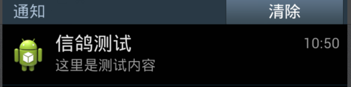

#txpushlib使用说明
txpushlib基于[腾讯信鸽](http://xg.qq.com/)Android SDK开发,使用腾讯信鸽推送平台实现消息推送功能.本文档介绍如何使用txpushlib接入腾讯信鸽推送平台.

#注册应用
在[腾讯信鸽](http://xg.qq.com/)首页,使用QQ号码登陆(集成环境使用2961922941/Itic123456登陆).打开接入推送应用页面，填写“应用名称”和“应用包名”（必须要跟APP一致），选择“操作系统”和“分类”，最后点击“创建应用”。
应用创建成功后，点击“应用配置”即可看到APP专属的AccessId和AccessKey等信息。


#工程配置
1. 创建 app module(如demotxpush),依赖txpushlib
2. 编辑Androidmanifest.xml,添加下面授权声明:

	```xml
    <uses-permission android:name="android.permission.INTERNET" />
    <uses-permission android:name="android.permission.READ_PHONE_STATE" />
    <uses-permission android:name="android.permission.ACCESS_WIFI_STATE" />
    <uses-permission android:name="android.permission.ACCESS_NETWORK_STATE" />
    <uses-permission android:name="android.permission.RECEIVE_BOOT_COMPLETED" />
    <uses-permission android:name="android.permission.RESTART_PACKAGES" />
    <uses-permission android:name="android.permission.BROADCAST_STICKY" />
    <uses-permission android:name="android.permission.WRITE_SETTINGS" />
    <uses-permission android:name="android.permission.RECEIVE_USER_PRESENT" />
    <uses-permission android:name="android.permission.WRITE_EXTERNAL_STORAGE" />
    <uses-permission android:name="android.permission.WAKE_LOCK" />
    <uses-permission android:name="android.permission.KILL_BACKGROUND_PROCESSES" />
    <uses-permission android:name="android.permission.GET_TASKS" />
    <uses-permission android:name="android.permission.READ_LOGS" />
    <uses-permission android:name="android.permission.VIBRATE" />
    <uses-permission android:name="android.permission.BLUETOOTH" />
    <uses-permission android:name="android.permission.BATTERY_STATS" />
	```
3. 启动并接入信鸽推送平台
创建App类,继承Application,重载onCreate方法为下面内容,AccessId和AccessKey分别填写为信鸽推送平台分配的AccessId和AccessKey;然后再AndroidManifest中修改application元素的androiid:name为App类

	```java
	    @Override
	    public void onCreate() {
	        super.onCreate();
	        XGPushConfig.enableDebug(getApplicationContext(), true);
	        //设置为信鸽推送平台分配的AccessId和AccessKey
	        XGPushConfig.setAccessId(getApplicationContext(), 2100141006);
	        XGPushConfig.setAccessKey(getApplicationContext(), "A72ZJE521IRN");
	        XGPushManager.registerPush(getApplicationContext());
	        if (isMainProcess()) {
	            XGPushManager.setNotifactionCallback(new XGPushNotifactionCallback() {
                        @Override
                        public void handleNotify(XGNotifaction xGNotifaction) {
                            xGNotifaction.doNotify();
	                }
	            });
		    }
	    }
	```

	```xml
	    <application
        android:name=".App"
        android:allowBackup="true"
        android:icon="@mipmap/ic_launcher"
        android:label="@string/app_name"
        android:theme="@style/AppTheme" />
	```
	
#验证
在[应用管理页](http://xg.qq.com/xg/notice/ctr_notice/push_android?app_id=2100141006),选择“创建通知”,输入“标题”和“内容”,点击“确认推送”.稍等几秒后,如果顺利的话,终端设备应该能够收到这条通知.




# 功能说明
## 注册/反注册
- 注册: XGPushManager.registerPush(Context context)
- 注册时与账号绑定: XGPushManager.registerPush(Context context,String account)将设备与指定的account绑定,这样就可以根据指定的account发送推送消息
- 解绑设备: XGPushManager.registerPush(Context context,String account)的account参数为 * 时,解绑账号
- 反注册: XGPushManager.unRegisterPush(Context context)
- 接收注册/反注册结果
	- 使用XGIOperateCallback接口监听,适用于临时接收,示例如下:
		```java
		XGPushManager.registerPush(context, new XGIOperateCallback() {
			@Override
			public void onSuccess(Object data, int flag) {
				Log.d("TPush", "注册成功，设备token为：" + data);
			}
	
			@Override
			public void onFail(Object data, int errCode, String msg) {
				Log.d("TPush", "注册失败，错误码：" + errCode + ",错误信息：" + msg);
			}
		});
		```
		```java
		XGPushManager.unRegisterPush(context, new XGIOperateCallback() {
			@Override
			public void onSuccess(Object data, int flag) {
				Log.d("TPush", "注册成功，设备token为：" + data);
			}
	
			@Override
			public void onFail(Object data, int errCode, String msg) {
				Log.d("TPush", "注册失败，错误码：" + errCode + ",错误信息：" + msg);
			}
		});
		```
	- 使用BroadcastReceiver监听注册/反注册结果,适用于持续监听,示例如下:
		1. 实现BroadcastReceiver
	```java
	public class RegistReceiver extends BroadcastReceiver{
	    @Override
	    public void onReceive(Context context, Intent intent) {
	        if (intent.getIntExtra(MessageReceiver.KEY_ERROR_CODE, XGPushBaseReceiver.SUCCESS) 
		        == XGPushBaseReceiver.SUCCESS)	{
	            if (intent.getStringExtra(MessageReceiver.KEY_TAG).equals(MessageReceiver.KEY_REGISTE)){
	                //注册成功逻辑
	                ...
	            }if (intent.getStringExtra(MessageReceiver.KEY_TAG).equals(MessageReceiver.KEY_UNREGISTE)){
	                //反注册成功逻辑
	                ...
	            }
	        }else {
	            if (intent.getStringExtra(MessageReceiver.KEY_TAG).equals(MessageReceiver.KEY_REGISTE)){
	                //注册失败
	                ...
	            }
	            if (intent.getStringExtra(MessageReceiver.KEY_TAG).equals(MessageReceiver.KEY_UNREGISTE)){
	                //反注册失败
	                ...
	            }
	        }
	    }
	}
	```
		2. 注册BroadcastReceiver,监听的 Action为 MessageReceiver.REGISTER_ACTION
	```java
	RetisteReceiver registReceiver = new RegistReceiver();
	IntentFilter regIntentFilter = new IntentFilter();
    regIntentFilter.addAction(MessageReceiver.REGISTER_ACTION);
    getApplicationContext().registerReceiver(registeReceiver,regIntentFilter);
	```

## 设置/删除标签
不同的设备可以设置为用一个TAG,这样信鸽推送平台就可以通过给这个TAG推送消息的方式实现给某一群设备推送.

- 设置TAG: XGPushManager.setTag(Context context,String tagname);
- 删除TAG: XGPushManager.deleteTag(Context context,String tagname);
- 监听设置状态
	1. 实现BroadcastReceiver
	```java
	public class SetDeleteTagReceiver extends BroadcastReceiver{
	    @Override
	    public void onReceive(Context context, Intent intent) {
	        if (intent.getIntExtra(MessageReceiver.KEY_ERROR_CODE, XGPushBaseReceiver.SUCCESS) == XGPushBaseReceiver.SUCCESS){
	            if (intent.getStringExtra(MessageReceiver.KEY_TAG).equals(MessageReceiver.KEY_DELETE_TAG)){
	                //删除tag成功
					...
	            }if (intent.getStringExtra(MessageReceiver.KEY_TAG).equals(MessageReceiver.KEY_SET_TAG)){
	                //设置tag成功
					...
	            }
	        }else{
	            if (intent.getStringExtra(MessageReceiver.KEY_TAG).equals(MessageReceiver.KEY_DELETE_TAG)){
	                //删除tag失败
					...
	            }
	            if (intent.getStringExtra(MessageReceiver.KEY_TAG).equals(MessageReceiver.KEY_SET_TAG)){
	                //设置tag失败
	                ...
	            }
	        }
	    }
	}
	```
	
	2. 注册BroadcastReceiver,监听的Action为MessageReceiver.TAG_ACTION
	```java
	SetDeleteTagReceiver setDeleteTagReceiver = new SetDeleteTagReceiver();
	IntentFilter tagIntentFilter = new IntentFilter();
    tagIntentFilter.addAction(MessageReceiver.TAG_ACTION);
    getApplicationContext().registerReceiver(setDeleteTagReceiver,tagIntentFilter);
	```

## 获取通知内容
- 通知中包含如下内容:
	- MSG_ID,KEY_NOTIFICATION_ID由信鸽推送平台生成,唯一的
	- 通知标题,内容展示在通知UIshang
	- MessageReceiver.KEY_NOTIFICATION_ACTION_TYPE: 点击通知要执行的动作类型: 
		- XGPushShowedResult.NOTIFICATION_ACTION_ACTIVITY: 通知点击后打开的是指定的Activity
		- XGPushShowedResult.NOTIFICATION_ACTION_URL: 通知点击后执行的是URL
		- XGPushShowedResult.NOTIFICATION_ACTION_INTENT: 通知点击后执行的Intent
		- XGPushShowedResult.NOTIFICATION_ACTION_PACKAGE: 通知点击后调起其他app
	- MessageReceiver.KEY_NOTIFICATION_ACTIVITY: 点击通知要执行的动作内容
		- KEY_NOTIFICATION_ACTION_TYPE为 XGPushShowedResult.NOTIFICATION_ACTION_ACTIVITY时, 内容为Actiivty的全路径名
		- KEY_NOTIFICATION_ACTION_TYPE为 XGPushShowedResult.NOTIFICATION_ACTION_URL时, 内容为URL,如果URL描述的是某个Activity,则打开该Activity
		- KEY_NOTIFICATION_ACTION_TYPE为 XGPushShowedResult.NOTIFICATION_ACTION_INTENT时,内容为Intent中描述的内容
		- KEY_NOTIFICATION_ACTION_TYPE为 XGPushShowedResult.NOTIFICATION_ACTION_PACKAGE时, 内容为app的包名,如手机QQ,的包名为 com.tencent.mobileqq
		
- 获取通知内容
	1. 实现BroadcastReceiver
	```java
	public class NotificationReceiver extends BroadcastReceiver {
	
	    @Override
	    public void onReceive(Context context, Intent intent) {
	        intent.getLongExtra(MessageReceiver.KEY_MSG_ID, 0);
	        intent.getIntExtra(MessageReceiver.KEY_NOTIFICATION_ID, 0);
	        intent.getStringExtra(MessageReceiver.KEY_NOTIFICATION_TITLE);
	        intent.getStringExtra(MessageReceiver.KEY_NOTIFICATION_CONTENT);
	        intent.getIntExtra(MessageReceiver.KEY_NOTIFICATION_ACTION_TYPE, 5);
	        intent.getStringExtra(MessageReceiver.KEY_NOTIFICATION_ACTIVITY);
	    }
	}	
	```
	2. 注册BroadcastReceiver,监听的Action为MessageReceiver.NOTIFICATION_ACTION
	```java
	NotificationReceiver notificationReceiver = new NotificationReceiver();
	IntentFilter notificationIntentFilter = new IntentFilter();
    notificationIntentFilter.addAction(MessageReceiver.NOTIFICATION_ACTION);
    getApplicationContext().registerReceiver(notificationReceiver,notificationIntentFilter);
	```

## 透传消息
透传消息指的是由开发者通过前台或后台脚本下发的文本消息，信鸽只负责将消息传递给APP，APP完全自主负责消息体的处理。
透传消息具有灵活性强和高度定制性特点，因此更适合APP自主处理个性化业务需求，比如下发APP配置信息、自定义处理消息的存储和展示等。

- 获取透传消息内容
	1. 实现BroadcastReceiver
	```java
	public class MsgReceiver extends BroadcastReceiver{
	
	    @Override
	    public void onReceive(Context context, Intent intent) {
	        intent.getStringExtra(MessageReceiver.KEY_MSG_CONTENT)
	    }
	}	
	```
	2. 注册BroadcastReceiver,监听的Action为MessageReceiver.MESSAGE_ACTION
	```java
	MsgReceiver msgReceiver = new MsgReceiver();
	IntentFilter msgIntentFilter = new IntentFilter();
    msgIntentFilter.addAction(MessageReceiver.MESSAGE_ACTION);
    getApplicationContext().registerReceiver(msgIntentFilter,msgIntentFilter);
	```

## 通知点击/清除审计
如果业务需要审计通知点击或者通知清除按照下面步骤进行
1. 实现BroadcastReceiver
	```java
	public class MsgReceiver extends BroadcastReceiver{
	
	    @Override
	    public void onReceive(Context context, Intent intent) {
	        intent.getIntExtra(MessageReceiver.KEY_NOTIFICATION_CLICK_ACTION_TYPE,7)
	    }
	}	
	```
	- 当MessageReceiver.KEY_NOTIFICATION_CLICK_ACTION_TYPE 为 XGPushClickedResult.NOTIFACTION_CLICKED_TYPE时,该通知被点击
	- 当MessageReceiver.KEY_NOTIFICATION_CLICK_ACTION_TYPE 为 XGPushClickedResult.NOTIFACTION_DELETED_TYPE时,该通知被清除
	- 除了没有NOTIFICATION_ID,其他的数据和获取通知内容部分的说明一致

2. 注册BroadcastReceiver,监听的Action为MessageReceiver.NOTIFICATION_CLICK_ACTION
		
	```java
	NotificationClickReceiver notificationClickIntentFilter = new NotificationClickReceiver();
	IntentFilter notificationClickIntentFilter = new IntentFilter();
    notificationClickIntentFilter.addAction(MessageReceiver.NOTIFICATION_CLICK_ACTION);
    getApplicationContext().registerReceiver(notificationClickReceiver,notificationClickIntentFilter);
	```