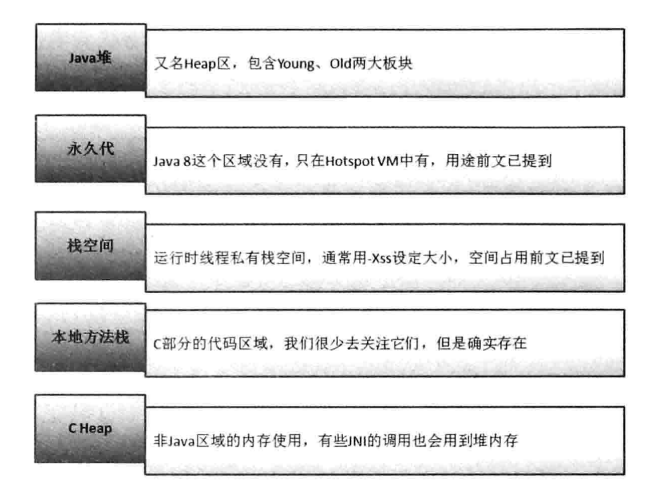
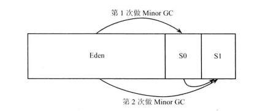
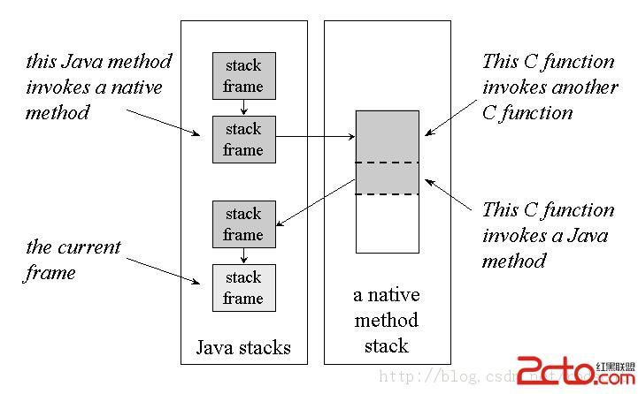

# 内存管理

JVM 内存模型：

- Java 堆，包括 young 和 old 两个部分
- PermGen 区（Java 8 已经取消）
- 线程私有栈空间
- C stack ： 底层 C 使用
- C Heap : 底层 C 使用，有些 JNI 会调用到这个堆



## Java 堆内存分配和垃圾回收

young 空间比 old 空间小许多（一般是 old 的 1/4 -- 1/3 ），young 空间会被细分为 1 个 Eden 区 和 2 个 Survior 区， Java 创建 1 kb 大小的对象时在 Eden 空间中分配内存，这种类型的对象一般不需要长期存在。

当 Eden 区内存耗尽， 会触发 Minor GC ， 之后将未被释放的对象迁移到  Survios 0 区域。下一次 Minor GC 会清理 Eden 和 Survios 0 区，将剩余对象迁移到 Survios 1 ，以后每一次 Minor GC 都如此。
> 备注 Survios 区如果耗尽，就放到 old 区。


当对象经历的 Minor 次数达到 -XX:MaxTenuringThreshold 设定（一般是 15 ），就将这些对象放入 old 区。

如果 old 区耗尽，会触发 FULL GC 以清理 old 内存。

相对 Minor GC ， FULL GC 的系统开销更大

## PermGen 内存分配

以下三种情况会使用 PermGen 内存：

- 加载 Class
- 调用 String.interm 函数时或直接定义 String 常量因为用到常量池而也会大量占用 PermGen
- 静态数据存放在方法区内部，Class 初始化时，这部分也会被分配。

PermGen 内存在 Class 卸载后释放

## C stack 和 C heap

Java 调用 native 方法时，就进入不受 JVM 限制的空间，此时 native 方法就使用 C stack 和 C heap 。

JVM 线程调用 java 方法时，一般会创建一个帧并把它 push 到 java stack ，在调用 native 方法时，则只会动态链接到 native 方法然后调用它。

native 方法也可以调用 java 方法，这种情况下，线程会离开 C stack 进入 Java 栈中，如下图所示：



## 常见的 OOM

### HeapSize OOM

Java 堆内存中的 old 区域空间不足

一般会出现下面异常信息： 
```
java.lang.OutOfMemoryError: Java heap space
```

- 代码问题：

    -  list 操作只有 add ，没有 remove
    -  内存泄露
    -  死循环写入数据。
    
- 并发导致很多对象被引用

    - 代码提速
    - 对于 KB 级别以上的对象，使用完成后将引用置空
    - 考虑修改配置，将堆空间设置的足够大

还有一种情况， old 区未被耗尽，但是因占用过多导致系统不断的进行 FULL GC
    
    一般会出现下面异常信息： 
    ```
    java.lang.OutOfMemoryError: GC over head limit exceeded
    ```
      
    old 区中大量对象没有释放，这时需要查看是否有内存泄露
    

### PermGen OOM

PermGen 即永久代 ( 方法区 )，它还有一个名字，叫非堆，主要用来存储由 jvm 加载的类文件信息、常量、静态变量等。

PermGen 区满后，就会 FULL GC，对应 FULL GC 会回收常量池里面的内容。频繁 FULL GC 的话，就发生
```
java.lang.OutOfMemoryError: PermGen space
```

解决办法：

- 避免过度使用静态变量、常量（尤其是 String 常量）、interm 和字节码增强计数
- 不在业务代码中大量使用动态代理
- 框架中使用动态代理时控制 classloader 可创建子类的数量

### DirectBuffer OOM

DirectBuffer 是 C Heap 的一部分，通常在 FULL GC 时回收。当 DirectBuffer 的分配超出大小限制时，会发生 DirectBuffer OOM
```
java.lang.OutOfMemoryError: Direct buffer memory
```

解决办法：

- 每次分配 DirectBuffer 不要超过限制
- 使用 -XX:MaxDirectMemorySize 修改 DirectBuffer 区大小限制
- 通过反射获取 DirectBuffer 接口的 cleaner 对象再做 clean 操作

### StackOverflowError

线程栈空间使用超出 -Xss 的设置，会导致 StackOverflowError
```
java.lang.StackOverflowError
```

常见因为死递归导致问题出现

解决办法：
- 控制递归层数
- 设置 -XX:ThreadStackSize 参数

### 其他内存溢出

- unable to create new native thread

    通常因为物理内存不够用，或操作系统限制了单个进程使用的最大内存，导致分配线程时出错
    ```
    unable to create new native thread
    ```

- request {} byte for {} out of swap

    通常因地址空间不够用导致，很极端的 OOM
    
- IOException: Too many open files

    可能打开太多文件，也可能开了太多 Socket
    
## 分析 OOM

加上 -XX:HeapDumpOnOutOfMemoryError 参数，设定参数后， JVM 通常在 OOM 时 dump 一份内存拷贝文件。

也可以加上 -XX:HeapDumpBeforeFullGC 和 -XX:HeapDumpAfterFullGC 让系统在 FULL GC 前后 dump 内存拷贝

用 MAT 工具分析内存拷贝。

***

## 常见问题

1. OOM 是怎么出现的，有哪几块 JVM 区域会产生 OOM ，如何解决？

    - Java 堆：
    
        HeapSize OOM
        
            - 代码问题：

                -  list 操作只有 add ，没有 remove
                -  内存泄露
                -  死循环写入数据。
            
            - 并发导致很多对象被引用

                - 代码提速
                - 对于 KB 级别以上的对象，使用完成后将引用置空
                - 考虑修改配置，将堆空间设置的足够大
            
        GC over head limit exceeded:
        
            old 区中大量对象没有释放，这时需要查看是否有内存泄露
    
    - Java 栈：StackOverflowError
    
        常见因为死递归导致问题出现

            - 控制递归层数
            - 设置 -XX:ThreadStackSize 参数
    
    - PermGen OOM
    
        PermGen 区中有大量对象没有释放导致频繁 FULL GC

            - 避免过度使用静态变量、常量（尤其是 String 常量）、interm 和字节码增强计数
            - 不在业务代码中大量使用动态代理
            - 框架中使用动态代理时控制 classloader 可创建子类的数量
        
    - C heap： DirectBuffer OOM

        DirectBuffer 的分配超出大小限制
        
            - 每次分配 DirectBuffer 不要超过限制
            - 使用 -XX:MaxDirectMemorySize 修改 DirectBuffer 区大小限制
            - 通过反射获取 DirectBuffer 接口的 cleaner 对象再做 clean 操作    
    
2. 垃圾回收机制

    解释 young old 分区的比例分配以及为什么要这样分区回收
    
3. 内存泄露

    - C 无用、引用被释放、内存未被释放
    - java 无用、引用未被释放

4. 对象分配、堆栈相关问题，一般涉及方法区、堆、程序计数器、本地方法栈、虚拟机栈

    从String a,new String("")开始

    