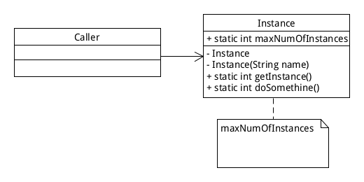

# 单例模式

## 经典单例模式

### 饿汉模式

```java
public class Singleton{
    
    private static final Singleton singleton = new Single();
    
    // 限制产生多个对象
    private Singleton(){
    }
    
    通过 static 函数获得实例对象
    public static Singleton getInstance(){
        return singleton;
    }
    
    // 类中其他方法
    public static void doSomething(){
    }
}
```

### 懒汉模式

```java
public class Singleton{
    
    private static final Singleton singleton = null;
    
    // 限制产生多个对象
    private Singleton(){
    }
    
    //通过 static 函数获得实例对象
    public static synchronized Singleton getInstance(){
        if(singleton == null){
            singleton = new singleton();
        }
        return singleton;
    }
    
    // 类中其他方法
    public static void doSomething(){
    }
}
```

## 扩展

### Enum

推荐使用这种方式

```java
public enum Singleton {
    INSTANCE {

        @Override
        protected void doSomething() {
            ...
        }

    };
    protected abstract void doSomething();
}

public class caller{
    
    public static void main(String args[]){
        Singleton.INSTANCE.doSomething();
    }
}
```

使用 Enum 实现单例好处有三点：

- 线程安全，因为默认枚举实例的创建是线程安全的.(创建枚举类的单例在JVM层面也是能保证线程安全的)
- 不会因为序列化而产生新实例，因为 Enum 类自己实现了 readResolve() 方法解决这个问题
    ```java
    //readResolve to prevent another instance of Singleton
    private Object readResolve(){
        return INSTANCE;
    } 
    ```
- 防止反射攻击，Enum 中单例类是 abstract 的，不能被实例化


### DCL singleton

jdk1.5开始提供用 volatile 关键字来为变量加锁，可以通过 DCL( double checked locking ) 实现同步

```c
/**
* Singleton pattern example with Double checked Locking
*/
public class DoubleCheckedLockingSingleton{
     private volatile DoubleCheckedLockingSingleton INSTANCE;

     private DoubleCheckedLockingSingleton(){}

     public DoubleCheckedLockingSingleton getInstance(){
         if(INSTANCE == null){
            synchronized(DoubleCheckedLockingSingleton.class){
                //double checking Singleton instance
                if(INSTANCE == null){
                    INSTANCE = new DoubleCheckedLockingSingleton();
                }
            }
         }
         return INSTANCE;
     }
}
```

### 固定数量多实例



```java
public class Instance{

    private static int maxNumOfInstances = 2;
    
    private static ArrayList<String> instanceNameList = new ArrayList<String>();
    
    private static ArrayList<Multi> instanceLists = new ArrayList<Instance>();
    
    private static int countNumOfInstance = 0;
    
    static{
        for(int i=0; i<maxNumOfInstances;i++){
            instanceLists.add(new Instance("Instance" + (i+1));
        }
    }
    
    private MultiInstances(){
    }
    
    private Instance(String){
        instanceNameList.add(name);
    }
    
    public static Instance getInstance(){
        Ramdon ramdon = new Ramdon();
        
        countNumOfInstance = ramdon.nextInt(maxNumOfInstances);
        return instanceLists.get(countNumOfInstance);
    }
    
    public static void doSomething(){
    }
}
```